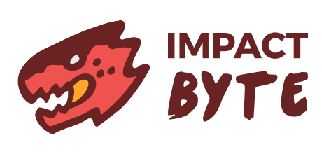

  <h1>IMPACT BYTE - FULL STACK WEB</h1>
  

**Hello, participants!** Welcome to the main learning course of Impact Byte, the full
stack web application development course. We expect the learning process to be
dictated yet still flexible to achieve using best practices, while being
explained with relatable concepts and analogies. The primary goal's success criteria is that participant can build various kind of applications.

---

## TABLE OF CONTENTS

### [SYLLABUS](SYLLABUS.md)

Read the complete syllabus that hints about the overall program agenda.

### [AGENDA](AGENDA.md)

Read the daily and weekly agenda that will run through in our onsite class.

### [PROJECT IDEAS](PROJECT_IDEAS.md)

Read the possible ideas of various projects we can create for inspiration.

### [REFERENCES](REFERENCES.md)

Read and check out some references recommended to know today and tomorrow.

### [TOPICS](TOPICS.md)

Read the possible topics we can learn.

### [CHAPTERS](CHAPTERS.md)

Follow the lesson units, by onsite and online. It contains list of materials that must be learned.

- [Chapter 0: Preparation](chapters/CHAPTER-0.md)
- [Chapter 1: Frontend Web Design](chapters/CHAPTER-1.md)
- [Chapter 2: Frontend Web Application](chapters/CHAPTER-2.md)
- [Chapter 3: Frontend Web Application](chapters/CHAPTER-3.md)
- [Chapter 4: Interactive Web Application](chapters/CHAPTER-4.md)
- [Chapter 5: Modern Web Application](chapters/CHAPTER-5.md)
- [Chapter 6: Data and Backend API](chapters/CHAPTER-6.md)
