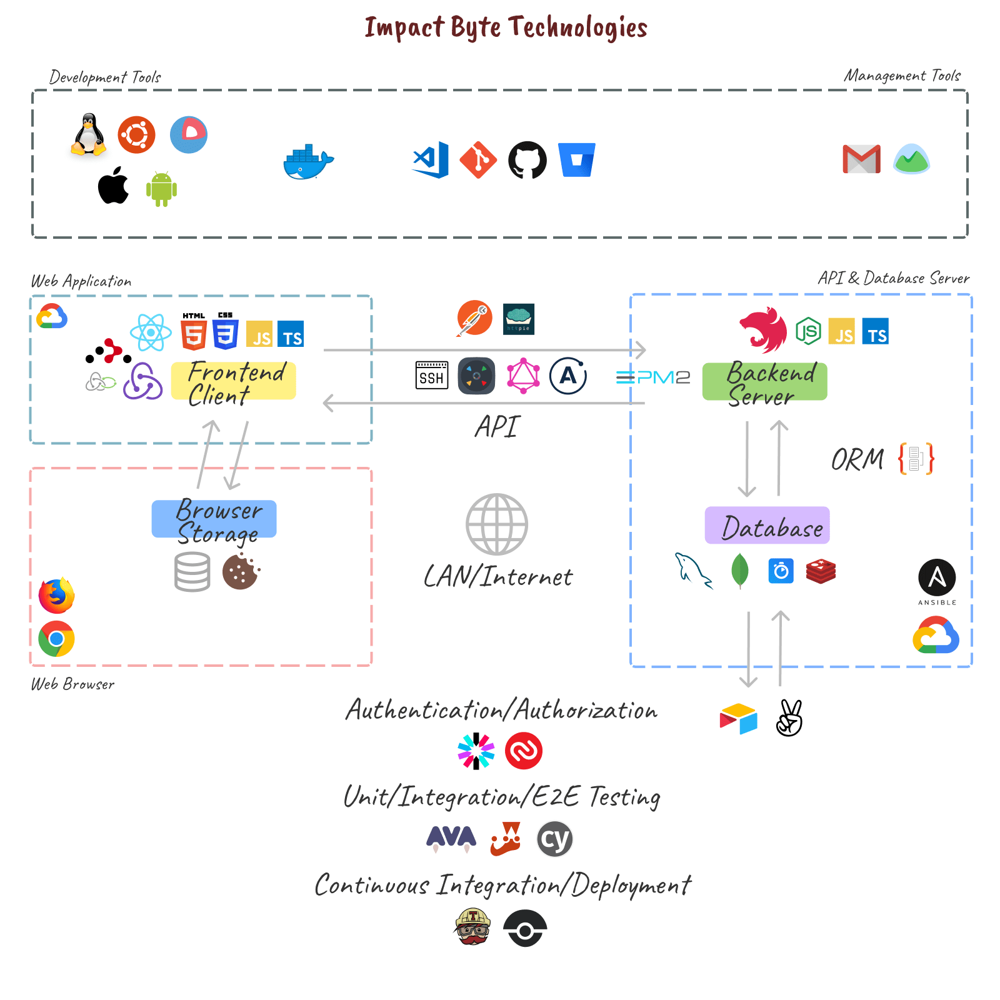

# REFERENCES

## Example Repositories

- Impact Byte Learn: https://github.com/impactbyte-learn :star:

## Documentations

- [MarkSheet: a free HTML and CSS tutorial - Free tutorial to learn HTML and CSS](https://marksheet.io)
- [JavaScript.info - The Modern Javascript Tutorial](https://javascript.info)
- [DevDocs API Documentation](https://devdocs.io)
- [MDN Web Docs](https://developer.mozilla.org)

## Guides

- 🗺️ [Getting Real: The smarter, faster, easier way to build a successful web application](https://basecamp.com/books/getting-real) :star:
- 🗺️ [Roadmap to becoming a web developer in 2018](https://github.com/kamranahmedse/developer-roadmap)
- 🗺️ [Front-End Developer Handbook 2018](https://frontendmasters.com/books/front-end-handbook/2018)
- 🗺️ [Front-End Developer Handbook 2017](https://frontendmasters.com/books/front-end-handbook/2017)
- 🗺️ [Front-End Developer Handbook 2016](https://www.frontendhandbook.com)
- 🗺️ [The Modern Javascript Tutorial on JavaScript.info](https://javascript.info)
- 🗺️ [Hard Coding Concepts Explained with Simple Real-life Analogies](https://medium.freecodecamp.org/hard-coding-concepts-explained-with-simple-real-life-analogies-280635e98e37)
- 🗺️ [Super Full Stack Web Developer in Modern Expectation](https://medium.com/impactbyte/b11ba12423c0)
- 🗺️ [Flashcards for Developers](https://www.flashcardsfordevelopers.com)

## Questions

- [`h5bp/Front-end-Developer-Interview-Questions`](https://github.com/h5bp/Front-end-Developer-Interview-Questions)
  - [`yangshun/front-end-interview-handbook`](https://github.com/yangshun/front-end-interview-handbook)
- [`yangshun/tech-interview-handbook`](https://github.com/yangshun/tech-interview-handbook)

## Directory of Apps

- [Product Hunt](http://producthunt.com) :star:
- [Siftery - Share products you use at work, explore what others are using](https://siftery.com)
- [StackShare - Software and technology stacks used by top companies](https://stackshare.io)
- [LibHunt - Find The Software You Need](https://www.libhunt.com)

## Tutorials

- [freeCodeCamp](https://www.freecodecamp.org)
- [Codecademy](https://www.codecademy.com)
- [iLoveCoding](https://ilovecoding.org)

## Communities

- [Medium](https://medium.com)
  - [Hacker Noon](https://hackernoon.com)
  - [codeburst](https://codeburst.io)
- [DEV.to](https://dev.to)
- [Hashnode](https://hashnode.com)
  - [Devblog](https://hashnode.com/devblog)
- [Spectrum](https://spectrum.chat)

## Special

