# Coding Challenge Websites

These are the best coding challenge sites to learn or compete in programming. Find coding challenges for frontend, backend, or fullstack and become a better developer.

Because practicing your coding and programming skills are important to being a developer. Whether you are looking for the best way to prepare for an interview or learn a new programming language. Choose from JavaScript for now; while C, C++, Python, Ruby, TypeScript, Golang, Java, Kotlin, Objective-C, Swift, or any other languages are later to be learnt only after you've mastered JavaScript.

---

## Beginner Friendly

### [Coderbyte](https://coderbyte.com)

[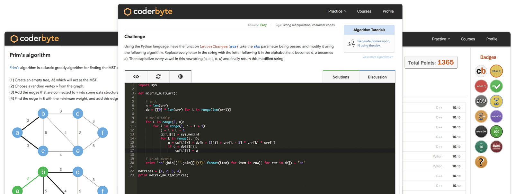](https://coderbyte.com)

### [Codewars](https://codewars.com)

[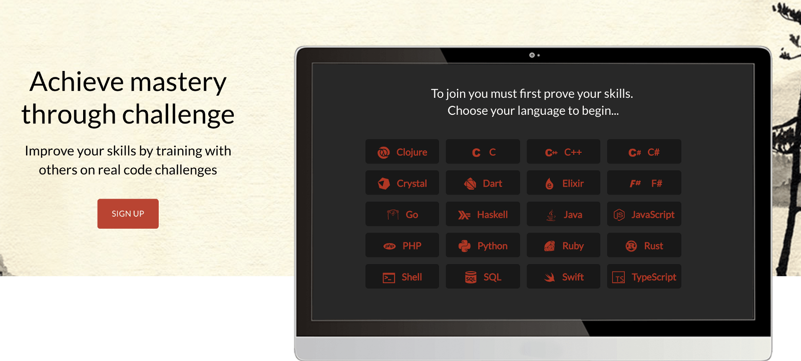](https://codewars.com)

### [CodinGame](https://codingame.com)

[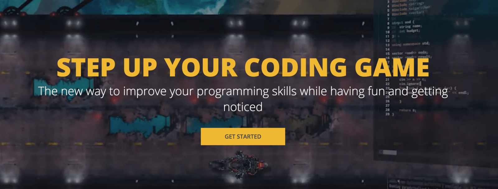](https://codingame.com)

### [TopCoder](https://topcoder.com)

[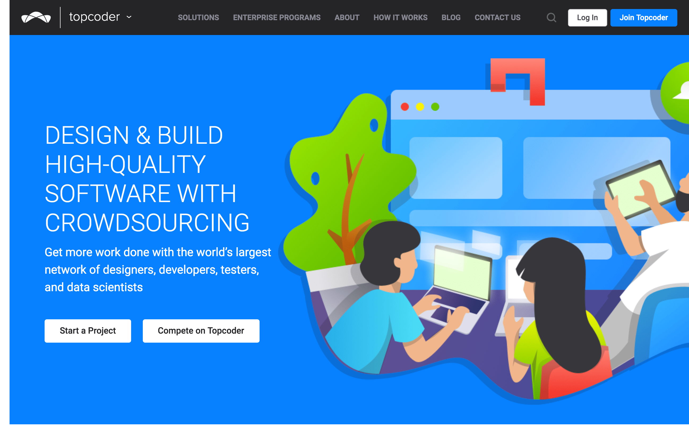](https://topcoder.com)

### [HackerRank](https://hackerrank.com)

[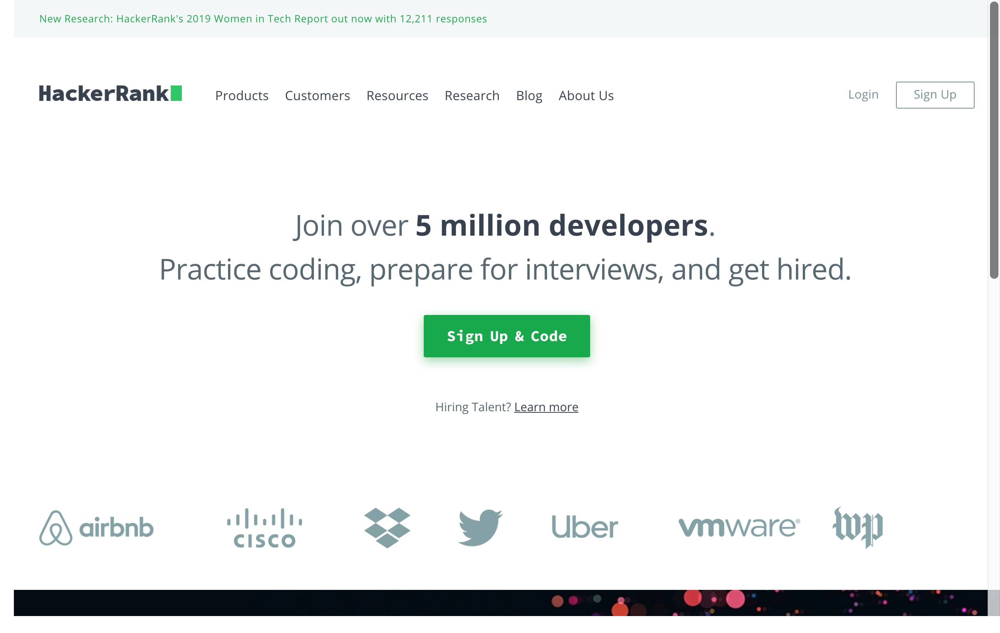](https://hackerrank.com)

### [Challenge Rocket](https://challengerocket.com)

[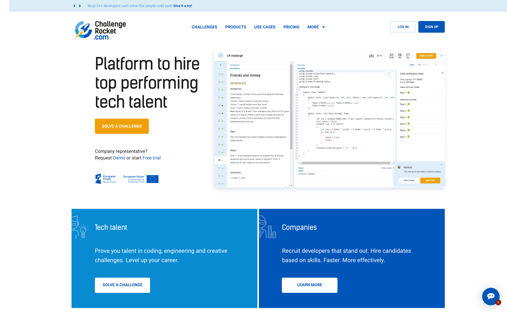](https://challengerocket.com)

### [CodeSignal](https://codesignal.com)

[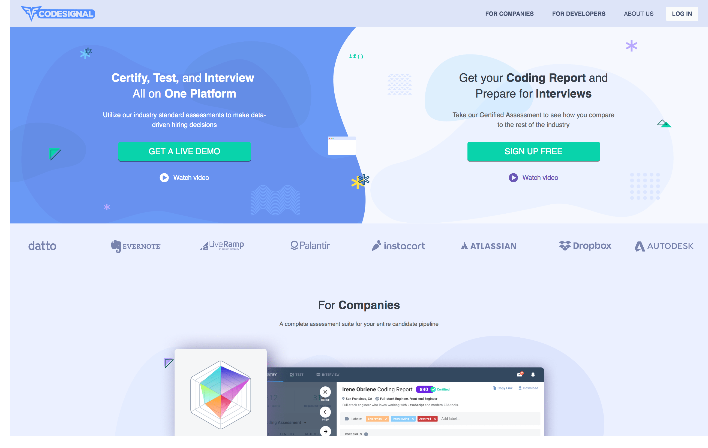](https://codesignal.com)

### [LeetCode](https://leetcode.com)

[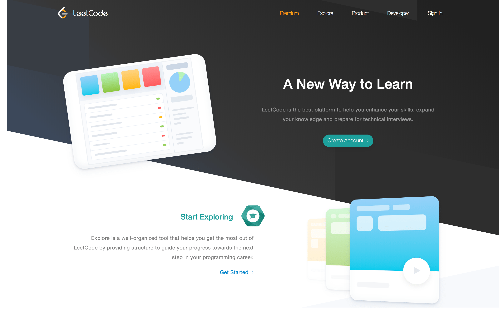](https://leetcode.com)

### [freeCodeCamp](https://freecodecamp.org)

[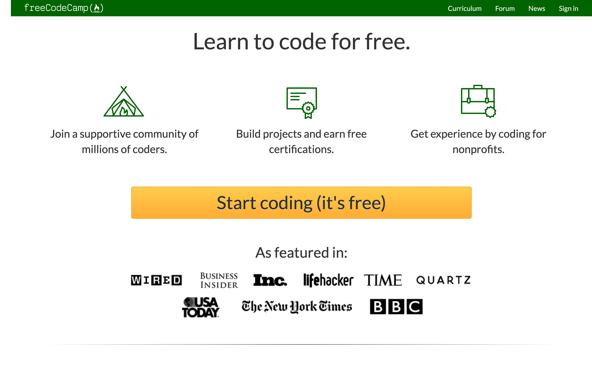](https://freecodecamp.org)

---

## Advanced Competition

### [Project Euler](https://projecteuler.net)

[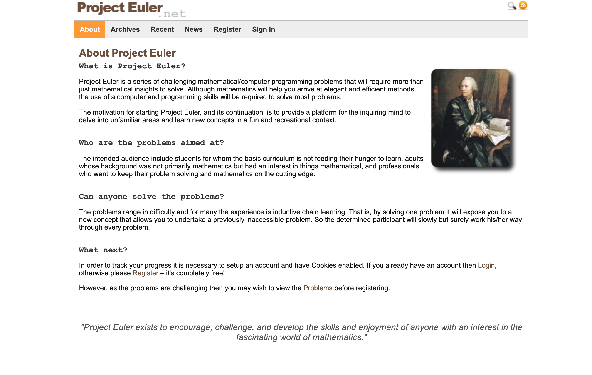](https://projecteuler.net)

### [CodeChef](https://codechef.com)

[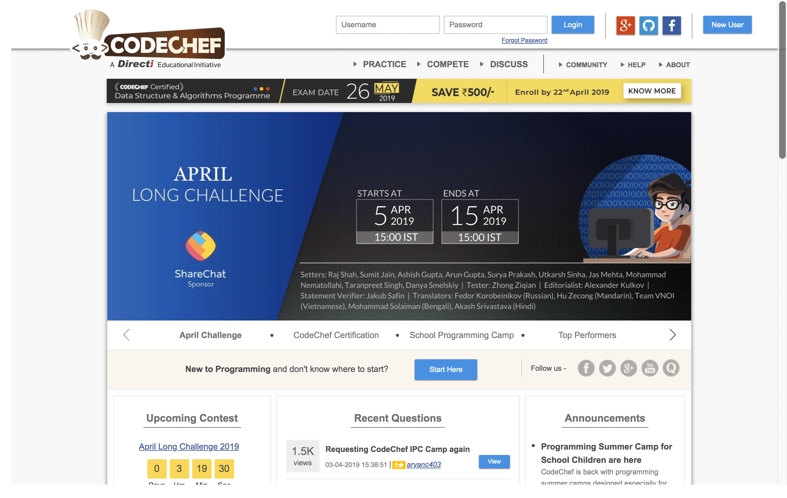](https://codechef.com)

### [GeeksforGeeks](https://geeksforgeeks.org)

[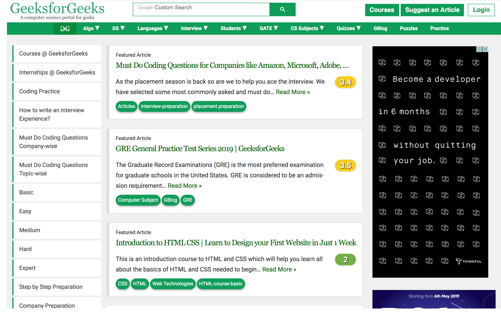](https://geeksforgeeks.org)

### [Codeforces](http://codeforces.com)

[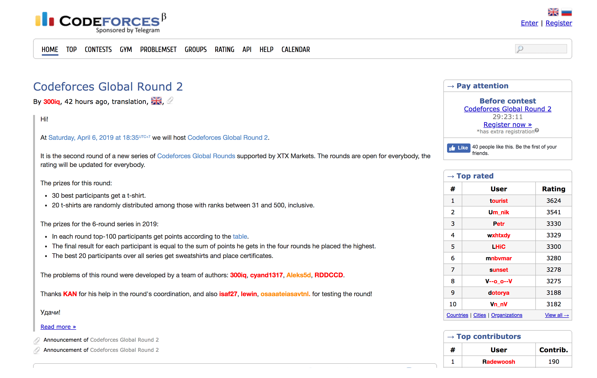](http://codeforces.com)

### [Edabit](https://edabit.com)

[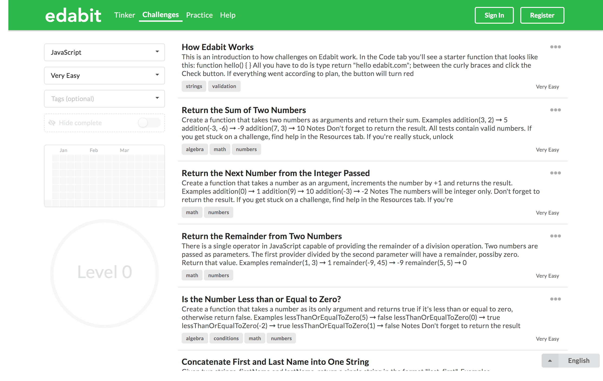](https://edabit.com)

### [HackerEarth | Hackathons, Innovation Management, and Technical Recruitment software](https://hackerearth.com)

[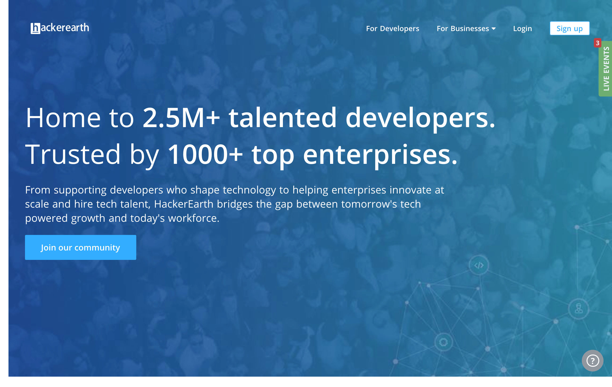](https://hackerearth.com)

### [Code Jam - Google’s Coding Competitions](https://codingcompetitions.withgoogle.com/codejam)

[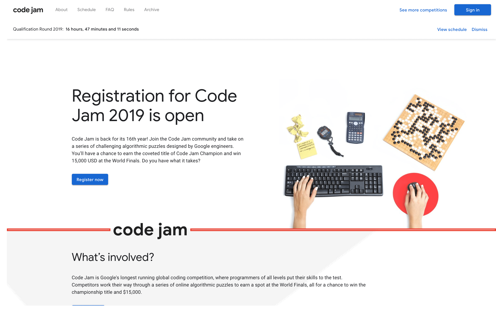](https://codingcompetitions.withgoogle.com/codejam)

---

## Coding Challenge Websites References

- [The 10 Best Coding Challenge Websites for 2018 – Coderbyte – Medium](https://medium.com/coderbyte/the-10-best-coding-challenge-websites-for-2018-12b57645b654)
- [Top Coding Challenge Websites of 2019 – Level Up Your Code](https://levelup.gitconnected.com/top-coding-challenge-websites-of-2018-72d5a9dec6fd)
- [What are good coding challenges websites? - Quora](https://www.quora.com/What-are-good-coding-challenges-websites)
