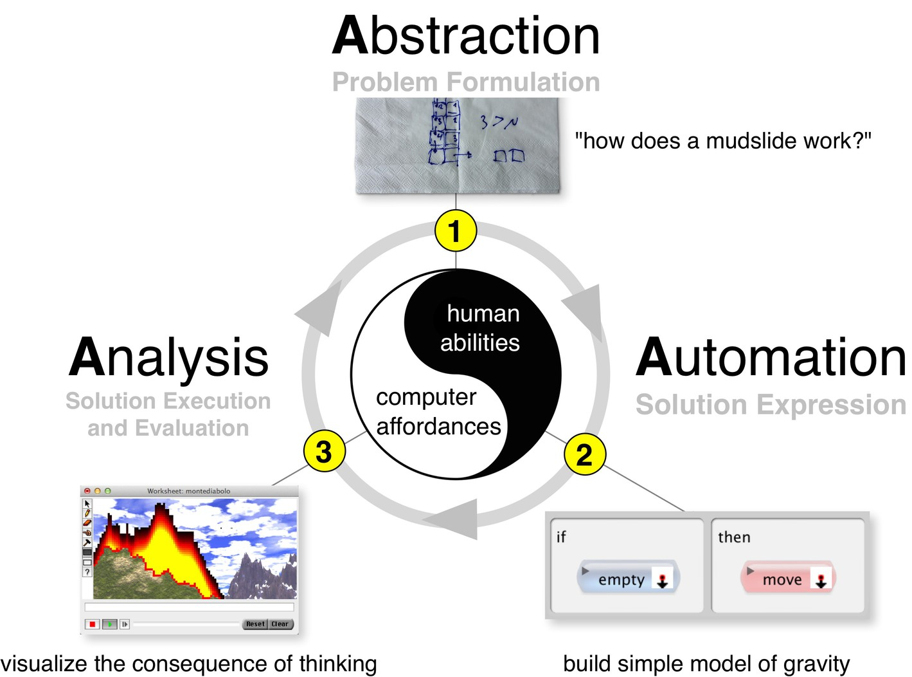
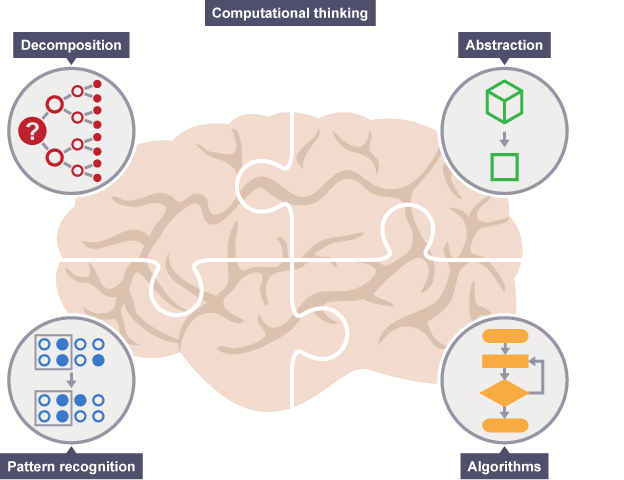

# Computational Thinking

_Computational thinking_ (CT) is a set of problem-solving methods that involve expressing problems and their solutions in ways that a computer could execute.

Simply put, _computational thinking_ is using a set of techniques and approaches to help to solve problems.

The goal is o help us solve complex problems more easily.

The history of _computational thinking_ dates back at least to the 1950s but most ideas are much older. The term _computational thinking_ was first used by Seymour Papert in 1980 and again in 1996. Computational thinking can be used to algorithmically solve complicated problems of scale, and is often used to realize large improvements in efficiency.

The phrase _computational thinking_ was brought to the forefront of the computer science community as a result of an ACM (Association for Computing Machinery) Communications essay on the subject by Jeannette Wing. The essay suggested that thinking computationally was a fundamental skill for everyone, not just computer scientists, and argued for the importance of integrating computational ideas into other disciplines.

## Three A's

The "three A's" of Computational Thinking Process describes computational thinking as a set of three steps:

1. **Abstraction**: Problem formulation
2. **Automation**: Solution expression
3. **Analyses**: Solution execution and evaluation

The four Cs of 21st century learning are _communication_, _critical thinking_, _collaboration_, and _creativity_. The fifth C could be _computational_ thinking which entails the capability to resolve problems algorithmically and logically.

## Thinking Process

1. Identify the problem you need to solve
2. Break the problem down into smaller problems
3. Figure out how to solve each small problem
4. Assemble your tiny solutions into the final solution

## Key Techniques (Cornerstones)

1. **Decomposition**: _Breaking_ down a complex problem, data, process, or system into smaller and more manageable parts.
2. **Pattern Recognition**: Looking for _similarities_ among and within problems. Observing patterns, trends, and regularities in data.
3. **Abstraction**: _Generalization_ by focusing on the _important information_ only, ignoring irrelevant detail. Identifying the general principles that generate these patterns.
4. **Algorithms**: Developing a _step by step solution_ to the problem or the _rules to follow_ to solve the problem or similar problems.

## Computational Thinking in Practice

A complex problem is one that, at first glance, we don't know how to solve easily.

Computational thinking involves taking that complex problem and breaking it down into a series of small, more manageable problems (**decomposition**). Each of these smaller problems can then be looked at individually, considering how similar problems have been solved previously (**pattern recognition**) and focusing only on the important details, while ignoring irrelevant information (**abstraction**). Next, simple steps or rules to solve each of the smaller problems can be designed (**algorithms**).

Finally, these simple steps or rules are used to program a computer to help solve the complex problem in the best way.

## Thinking Computationally

Thinking computationally is not **coding** or **programming**. It is not even thinking like a computer, as computers do not, and cannot, think.

Simply put, programming tells a computer what to do and how to do it. **Computational thinking enables you to work out exactly what to tell the computer to do**.

**The planning part is like computational thinking** and **following the directions is like programming**.

## Computational Thinking References

- [Computational thinking - Wikipedia](https://en.wikipedia.org/wiki/Computational_thinking)
- [What is Computational Thinking? - YouTube](https://www.youtube.com/watch?v=sxUJKn6TJOI) 📺
- [Computational thinking - KS3 Computing - BBC Bitesize](https://www.bbc.com/bitesize/topics/z7tp34j)
- [Introduction to computational thinking - Revision 1 - KS3 Computer Science - BBC Bitesize](https://www.bbc.com/bitesize/guides/zp92mp3/revision/1)
- [Computational Thinking for Educators](https://computationalthinkingcourse.withgoogle.com)
  - [`g.co/computationalthinking`](http://g.co/computationalthinking)
