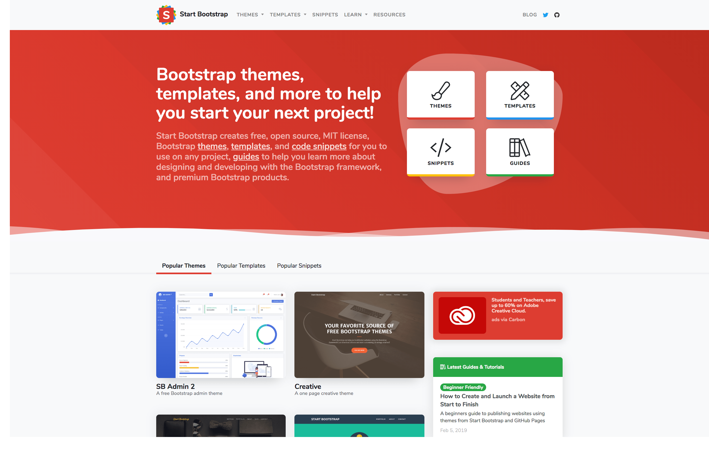

# CSS Design System

## Why

- CSS can be designed through a variety of Style Guide, Library, Framework, System, Language, Tools, Patterns, Components, and Blocks.
- Building the best styling for a website is like a building a real construction (house, tower, hotel, etc).
- A design system is a collection of documentation on principles and best practices, that helps guide a team to build digital products. They are often embodied in UI libraries and pattern libraries, but can extend to include guides on other areas such as "Voice and Tone".
  - Components: Contains coded patterns and examples.
  - Voice & Tone: Provides guidance on how language should be used.
  - Designers Kit: Includes a Sketch/Photoshop/Figma/etc, file for designers.
- Although "design systems", "ui libraries", and "pattern libraries" are different things, they are often used interchangeably.
- Most of the time, we don't have to touch the CSS anymore when using a CSS library or framework.
- Avoid dealing with JavaScript and jQuery when we're learning the library or framework in the first time.

---

## CSS Frameworks

### [Bootstrap](https://getbootstrap.com)

Build responsive, mobile-first projects on the web with the world’s most popular front-end component library.

Bootstrap is an open source toolkit for developing with HTML, CSS, and JS. Quickly prototype your ideas or build your entire app with our Sass variables and mixins, responsive grid system, extensive prebuilt components, and powerful plugins built on jQuery.


#### [Get started with Bootstrap](https://getbootstrap.com/docs/4.3/getting-started/introduction)

Copy-paste the stylesheet `<link>` into your `<head>` before all other stylesheets to load our CSS.

```html
<head>
  <link
    rel="stylesheet"
    href="https://stackpath.bootstrapcdn.com/bootstrap/4.3.1/css/bootstrap.min.css"
    integrity="sha384-ggOyR0iXCbMQv3Xipma34MD+dH/1fQ784/j6cY/iJTQUOhcWr7x9JvoRxT2MZw1T"
    crossorigin="anonymous"
  />
</head>
```

Ignore the JavaScript for now. Also avoid using Carousel, Popper.js, and everything else that involves JavaScript.

You can use the starter template if you want.

```html
<!DOCTYPE html>
<html lang="en">
  <head>
    <!-- Required meta tags -->
    <meta charset="utf-8" />
    <meta
      name="viewport"
      content="width=device-width, initial-scale=1, shrink-to-fit=no"
    />

    <!-- Bootstrap CSS -->
    <link
      rel="stylesheet"
      href="https://stackpath.bootstrapcdn.com/bootstrap/4.3.1/css/bootstrap.min.css"
      integrity="sha384-ggOyR0iXCbMQv3Xipma34MD+dH/1fQ784/j6cY/iJTQUOhcWr7x9JvoRxT2MZw1T"
      crossorigin="anonymous"
    />

    <title>Hello, world!</title>
  </head>
  <body>
    <h1>Hello, world!</h1>

    <!-- Optional JavaScript -->
    <!-- jQuery first, then Popper.js, then Bootstrap JS -->
    <script
      src="https://code.jquery.com/jquery-3.3.1.slim.min.js"
      integrity="sha384-q8i/X+965DzO0rT7abK41JStQIAqVgRVzpbzo5smXKp4YfRvH+8abtTE1Pi6jizo"
      crossorigin="anonymous"
    ></script>
    <script
      src="https://cdnjs.cloudflare.com/ajax/libs/popper.js/1.14.7/umd/popper.min.js"
      integrity="sha384-UO2eT0CpHqdSJQ6hJty5KVphtPhzWj9WO1clHTMGa3JDZwrnQq4sF86dIHNDz0W1"
      crossorigin="anonymous"
    ></script>
    <script
      src="https://stackpath.bootstrapcdn.com/bootstrap/4.3.1/js/bootstrap.min.js"
      integrity="sha384-JjSmVgyd0p3pXB1rRibZUAYoIIy6OrQ6VrjIEaFf/nJGzIxFDsf4x0xIM+B07jRM"
      crossorigin="anonymous"
    ></script>
  </body>
</html>
```

#### Themes




#### Layout

##### Container


```html
<div class="container">
  <div class="row">
    <div class="col-sm">
      One of three columns
    </div>
    <div class="col-sm">
      One of three columns
    </div>
    <div class="col-sm">
      One of three columns
    </div>
  </div>
</div>
```

##### Grid


```html
<div class="container">
  <div class="row">
    <div class="col">
      1 of 2
    </div>
    <div class="col">
      2 of 2
    </div>
  </div>
  <div class="row">
    <div class="col">
      1 of 3
    </div>
    <div class="col">
      2 of 3
    </div>
    <div class="col">
      3 of 3
    </div>
  </div>
</div>
```

#### Components

##### Alerts


```html
<div class="alert alert-primary" role="alert">
  A simple primary alert—check it out!
</div>
<div class="alert alert-secondary" role="alert">
  A simple secondary alert—check it out!
</div>
<div class="alert alert-success" role="alert">
  A simple success alert—check it out!
</div>
<div class="alert alert-danger" role="alert">
  A simple danger alert—check it out!
</div>
<div class="alert alert-warning" role="alert">
  A simple warning alert—check it out!
</div>
<div class="alert alert-info" role="alert">
  A simple info alert—check it out!
</div>
<div class="alert alert-light" role="alert">
  A simple light alert—check it out!
</div>
<div class="alert alert-dark" role="alert">
  A simple dark alert—check it out!
</div>
```

##### Buttons


```html
<button type="button" class="btn btn-primary">Primary</button>
<button type="button" class="btn btn-secondary">Secondary</button>
<button type="button" class="btn btn-success">Success</button>
<button type="button" class="btn btn-danger">Danger</button>
<button type="button" class="btn btn-warning">Warning</button>
<button type="button" class="btn btn-info">Info</button>
<button type="button" class="btn btn-light">Light</button>
<button type="button" class="btn btn-dark">Dark</button>
<button type="button" class="btn btn-link">Link</button>
```

##### Cards


```html
<div class="card" style="width: 18rem;">
  
  <div class="card-body">
    <h5 class="card-title">Card title</h5>
    <p class="card-text">
      Some quick example text to build on the card title and make up the bulk of
      the card's content.
    </p>
    <a href="#" class="btn btn-primary">Go somewhere</a>
  </div>
</div>
```

##### Forms


```html
<form>
  <div class="form-group">
    <label for="exampleInputEmail1">Email address</label>
    <input
      type="email"
      class="form-control"
      id="exampleInputEmail1"
      aria-describedby="emailHelp"
      placeholder="Enter email"
    />
    <small id="emailHelp" class="form-text text-muted"
      >We'll never share your email with anyone else.</small
    >
  </div>
  <div class="form-group">
    <label for="exampleInputPassword1">Password</label>
    <input
      type="password"
      class="form-control"
      id="exampleInputPassword1"
      placeholder="Password"
    />
  </div>
  <div class="form-group form-check">
    <input type="checkbox" class="form-check-input" id="exampleCheck1" />
    <label class="form-check-label" for="exampleCheck1">Check me out</label>
  </div>
  <button type="submit" class="btn btn-primary">Submit</button>
</form>
```

##### Jumbotron


```html
<div class="jumbotron">
  <h1 class="display-4">Hello, world!</h1>
  <p class="lead">
    This is a simple hero unit, a simple jumbotron-style component for calling
    extra attention to featured content or information.
  </p>
  <hr class="my-4" />
  <p>
    It uses utility classes for typography and spacing to space content out
    within the larger container.
  </p>
  <a class="btn btn-primary btn-lg" href="#" role="button">Learn more</a>
</div>
```

##### Navbar


```html
<nav class="navbar navbar-expand-lg navbar-light bg-light">
  <a class="navbar-brand" href="#">Navbar</a>
  <button
    class="navbar-toggler"
    type="button"
    data-toggle="collapse"
    data-target="#navbarSupportedContent"
    aria-controls="navbarSupportedContent"
    aria-expanded="false"
    aria-label="Toggle navigation"
  >
    <span class="navbar-toggler-icon"></span>
  </button>

  <div class="collapse navbar-collapse" id="navbarSupportedContent">
    <ul class="navbar-nav mr-auto">
      <li class="nav-item active">
        <a class="nav-link" href="#"
          >Home <span class="sr-only">(current)</span></a
        >
      </li>
      <li class="nav-item">
        <a class="nav-link" href="#">Link</a>
      </li>
      <li class="nav-item dropdown">
        <a
          class="nav-link dropdown-toggle"
          href="#"
          id="navbarDropdown"
          role="button"
          data-toggle="dropdown"
          aria-haspopup="true"
          aria-expanded="false"
        >
          Dropdown
        </a>
        <div class="dropdown-menu" aria-labelledby="navbarDropdown">
          <a class="dropdown-item" href="#">Action</a>
          <a class="dropdown-item" href="#">Another action</a>
          <div class="dropdown-divider"></div>
          <a class="dropdown-item" href="#">Something else here</a>
        </div>
      </li>
      <li class="nav-item">
        <a class="nav-link disabled" href="#" tabindex="-1" aria-disabled="true"
          >Disabled</a
        >
      </li>
    </ul>
    <form class="form-inline my-2 my-lg-0">
      <input
        class="form-control mr-sm-2"
        type="search"
        placeholder="Search"
        aria-label="Search"
      />
      <button class="btn btn-outline-success my-2 my-sm-0" type="submit">
        Search
      </button>
    </form>
  </div>
</nav>
```

---

### [Semantic UI](https://semantic-ui.com)

- User Interface is the language of the web.
- Design Beautiful Websites Quickly.
- Semantic is a development framework that helps create beautiful, responsive layouts using human-friendly HTML.
- Semantic UI treats words and classes as exchangeable concepts.
- Classes use syntax from natural languages like noun/modifier relationships, word order, and plurality to link concepts intuitively.


---

### [Materialize](https://materializecss.com)

A modern responsive front-end framework based on [Material Design](https://material.io).


---

### [Bulma](https://bulma.io)

Bulma is a free, open source CSS framework based on Flexbox and used by more than 150,000 developers.


---

### [Foundation by Zurb](https://foundation.zurb.com)

The most advanced responsive front-end framework in the world.


#### [Foundation for Emails](https://foundation.zurb.com/emails.html)

Quickly create responsive HTML emails that work. Even on Outlook.


---

### [Pure CSS](https://purecss.io)

A set of small, responsive CSS modules that you can use in every web project.


---

### [UIkit](https://getuikit.com)

A lightweight and modular front-end framework for developing fast and powerful web interfaces.


---

### [Tailwind CSS](https://tailwindcss.com)

- A utility-first CSS framework for rapidly building custom user interfaces.
- Tailwind is different from frameworks like Bootstrap, Foundation, or Bulma in that it's not a UI kit.
- It doesn't have a default theme, and there are no built-in UI components.
- On the flip side, it also has no opinion about how your site should look and doesn't impose design decisions that you have to fight to undo.
- If you're looking for a framework that comes with a menu of predesigned widgets to build your site with, Tailwind might not be the right framework for you.
- But if you want a huge head start implementing a custom design with its own identity, Tailwind might be just what you're looking for.


---

### CSS Design System References

- [styleguides.io - Website Style Guide Resources](http://styleguides.io)
- [Atomic Design](http://atomicdesign.bradfrost.com)
- [Design Systems Repo - A Collection of Design System Resources](https://designsystemsrepo.com)
  - [Design Systems Gallery](https://designsystemsrepo.com/design-systems)
- [Refactoring UI](https://refactoringui.com)
- [ZEIT Design System](https://zeit.co/design)
- [`alexpate/awesome-design-systems`](https://github.com/alexpate/awesome-design-systems)
- [`troxler/awesome-css-frameworks`](https://github.com/troxler/awesome-css-frameworks)

---

### CSS Framework References

- [Bootstrap](https://getbootstrap.com)
  - [Bootstrap 4 documentation — DevDocs](https://devdocs.io/bootstrap~4)
  - [Bootstrap Themes Built & Curated by the Bootstrap Team](https://themes.getbootstrap.com)
  - [Start Bootstrap - Free Bootstrap Themes, Templates, Snippets, and Guides](https://startbootstrap.com)
  - [Free Bootstrap Themes and Website Templates | BootstrapMade](https://bootstrapmade.com)
- [Semantic UI](https://semantic-ui.com)
  - [Semantic-UI-Forest: Themes, Templates and Design for Semantic-UI](https://semantic-ui-forest.com)
- [Materialize](https://materializecss.com)
- [Bulma: Free, open source, & modern CSS framework based on Flexbox](https://bulma.io)
  - https://bulma.io/alternative-to-bootstrap
  - https://bulma.io/expo
- [Foundation by Zurb](https://foundation.zurb.com)
  - [Foundation for Emails (Formerly Ink) - A Responsive Email Framework from ZURB](https://foundation.zurb.com/emails.html)
- [Pure CSS](https://purecss.io)
- [UIkit](https://getuikit.com)
- [Tailwind CSS](https://tailwindcss.com)
