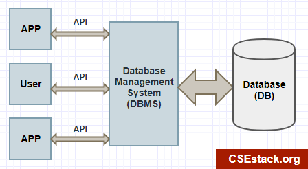

# Database Basic

---

## Database

A database is an **organized collection of data**, generally stored and accessed electronically from a computer system. Where databases are more complex they are often developed using formal design and modeling techniques.

We can:

- Read existing data (READ)
- Store new data (CREATE)
- Manipulate existing data (UPDATE)
- Remove existing data (DELETE)
- Search existing data through keyword (SEARCH)

---

## Database Paradigms

There two main database paradigms:

- **Relational** database with **SQL** (Structured Query Language) syntax
- **Non-Relational** database with **NoSQL** (Not Only SQL) syntax

---

## DBMS (Database Management System)

DBMS (Database Management System) is the software that interacts with end users, applications, manage all the data in the database, and maintain he database itself to capture and analyze the data.

Major types of DBMSs are namely **Hierarchical**, **Network**, **Relational**, **Object Oriented**.

- DBMS for **relational** database is called **RDBMS** or **SQL DBMS**
  - Example of RDBMS are MySQL/MariaDB and PostgreSQL
- DBMS for **non-relational** database is called based upon their category or name
  - Example of other DBMS are MongoDB and Redis

DBMS can live in any computer systems:

- Desktop
- Server
- Mobile
- even IoT (Internet of Things)

---

## Database Basic References

- [Database - Wikipedia](https://en.wikipedia.org/wiki/Database)
  - [Database management system - Wikipedia](https://en.wikipedia.org/wiki/Database#Database_management_system)
- [What is database (DB)? - Definition from WhatIs.com](https://searchsqlserver.techtarget.com/definition/database)
- [Database Tutorial for Beginners - YouTube](https://www.youtube.com/watch?v=wR0jg0eQsZA) 📺
- [Data Structures: Crash Course Computer Science #14 - YouTube](https://www.youtube.com/watch?v=DuDz6B4cqVc) 📺
- [What is Database? - Guru99](https://www.guru99.com/introduction-to-database-sql.html)
- [What is NoSQL? Database tutorial - YouTube](https://www.youtube.com/watch?v=qUV2j3XBRHc) 📺
