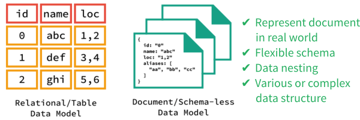
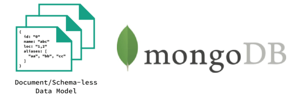

# Database NoSQL

---

## NoSQL

NoSQL (not only SQL) database provides a mechanism for storage and retrieval of data that is modeled in other than using relational way.

Data manipulation is often done through object-oriented functions or APIs. There's no specific query language like SQL.

- [SQL vs. NoSQL: What's the difference?](https://www.upwork.com/hiring/data/sql-vs-nosql-databases-whats-the-difference)
- [NoSQL Databases Explained | MongoDB](https://www.mongodb.com/nosql-explained)

---

## NoSQL Database Types



**Document databases:** pair each key with a complex data structure known as a document. Documents can contain many different key-value pairs, or key-array pairs, or even nested documents.

**Graph stores:** are used to store information about networks of data, such as social connections. Graph stores include Neo4J and Giraph.

**Key-value stores:** are the simplest NoSQL databases. Every single item in the database is stored as an attribute name (or 'key'), together with its value. Examples of key-value stores are Riak and Berkeley DB. Some key-value stores, such as Redis, allow each value to have a type, such as 'integer', which adds functionality.

**Wide-column stores:** such as Cassandra and HBase are optimized for queries over large datasets, and store columns of data together, instead of rows.

- [NoSQL Databases](http://nosql-database.org)

---

## NoSQL Database Products

There more than 220 NoSQL database products exist. Some of the populars based on their categories are:

- **Document**
  - MongoDB
  - Firebase
  - ArangoDB
  - CouchDB
  - PouchDB
  - NeDB
- **Key/Value**
  - Redis
  - DynamoDB
  - Cassandra
- **Search**
  - Elastic Search
- **Big Data**
  - Apache Hadoop
  - Apache Ignite
- **Graph-based**
  - Neo4j
  - Dgraph
  - Neptune
- **Analytical**
  - Druid
- **Time Series**
  - Influx
  - Timescale

For detailed guidance of them, refer to needed documentation on each database:

- [MongoDB for GIANT Ideas](https://www.mongodb.com)
  - [MongoDB University](https://university.mongodb.com)
  - [MongoDB Tutorial](https://www.tutorialspoint.com/mongodb/index.htm)
- [Firebase](https://firebase.google.com)
- [PouchDB, the JavaScript Database that Syncs](https://pouchdb.com)
  - [PouchDB Tutorial](https://www.tutorialspoint.com/pouchdb/index.htm)
- [Apache CouchDB](http://couchdb.apache.org)
  - [CouchDB: The Definitive Guide](http://guide.couchdb.org)
  - [Apache CouchDB Documentation](http://docs.couchdb.org)
  - [CouchDB Tutorial](https://www.tutorialspoint.com/couchdb/index.htm)
- [Couchbase: NoSQL Engagement Database](https://www.couchbase.com)
- [Redis](https://redis.io)
- [ArangoDB - highly available multi-model NoSQL database](https://www.arangodb.com)
- [Aerospike - High Performance NoSQL Database](https://www.aerospike.com)
- [Apache Cassandra](https://cassandra.apache.org)
- [Apache™ Hadoop® / HBase](http://hadoop.apache.org)
- [Neo4j](https://neo4j.com)

---

## MongoDB

MongoDB is a document database which records are documents which behave a lot like JSON objects in JavaScript. Values in documents can be looked up by their field's key. Documents can have some fields/keys and not others, which makes Mongo extremely flexible. The latest version is at `4.2`.



A NoSQL document looks like this:

```json
{
  "_id": ObjectId("5ccaac79b144f4ab1e36ca97"),
  "todos": [],
  "name": "Impact Byte",
  "username": "impactbyte",
  "email": "hello@impactbyte.com",
  "phone": "+1-234-567-890",
  "createdAt": ISODate("2019-05-02T08:38:17.271Z"),
  "updatedAt": ISODate("2019-05-02T08:38:17.271Z"),
  "id": 1,
  "__v": 0
}
```

- [MongoDB vs SQL Terminology](http://tutorialtous.com/mongodb/mongodbvssql.php)

### Installation

#### macOS

**Community Edition**

```sh
brew tap mongodb/brew

brew install mongodb-community@4.2

sudo mkdir -p /data/db

sudo chmod 777 /data

sudo chmod 777 /data/db

brew services start mongodb-community

mongo # run this to see mongo was successfully installed

# if your macOs is run on Catalina run this command below
mkdir data/db # on your root folder

sudo chmod 777 data

sudo chmod 777 data/db

mongod --dbpath=/Users/<your_home_folder>/data/db
```

- [Install MongoDB Community Edition on macOS — MongoDB Manual](https://docs.mongodb.com/manual/tutorial/install-mongodb-on-os-x)

#### Ubuntu

```sh
sudo apt-key adv --keyserver hkp://keyserver.ubuntu.com:80 --recv 9DA31620334BD75D9DCB49F368818C72E52529D4

wget -qO - https://www.mongodb.org/static/pgp/server-4.2.asc | sudo apt-key add -

# Ubuntu 18.04 (Bionic)
echo "deb [ arch=amd64 ] https://repo.mongodb.org/apt/ubuntu bionic/mongodb-org/4.2 multiverse" | sudo tee /etc/apt/sources.list.d/mongodb-org-4.2.list

sudo apt-get update

sudo apt-get install -y mongodb-org

sudo mkdir -p /data/db

sudo chmod 777 /data

sudo chmod 777 /data/db

# start
sudo service mongod start

mongo # run this to see mongo was successfully installed

# stop
sudo service mongod stop

# restart
sudo service mongod restart

```

- [Install MongoDB Community Edition on Ubuntu — MongoDB Manual](https://docs.mongodb.com/manual/tutorial/install-mongodb-on-ubuntu)
- [How to Install MongoDB on Ubuntu 18.04 | TecAdmin](https://tecadmin.net/install-mongodb-on-ubuntu/)

### MongoDB CLI Tools

MongoDB instance (`mongod`) by default can be connected via `mongo` shell.

- [mongo Shell Quick Reference — MongoDB Manual](https://docs.mongodb.com/manual/reference/mongo-shell)

#### `mongo` Shell Examples

```js
show dbs; // to see all databases exist
use your_database_name; // to create database;
db.createCollection('user', {
  name:String,
  age:Int64
})
db.getCollection("users").find();
db.users.find();

db.users.insert({
  username: "alpha",
  email: "alpha@example.com",
  country: "Argentina"
});

db.users.find("abcdefghijklmnopqrstuvwxyz");
db.users.find({ id: 1 });

db.users.insertMany([
  {
    username: "betty",
    email: "betty@example.com",
    country: "Belgium"
  },
  {
    username: "gamma",
    email: "gamma@example.com",
    country: "Canada"
  }
]);

db.users.update({}, { $unset: { username: "newusername" } }, { multi: true });
```

### MongoDB GUI Tools

MongoDB management tool or admin UIs are **Robo 3T** (formerly called **Robomongo**), **Studio 3T** (freemium product), and **MongoDB Compass**.

- [Robo 3T / Studio 3T / Robomongo](https://robomongo.org)
- [MongoDB Compass](https://www.mongodb.com/products/compass)

### Connect Node.js and MongoDB

```sh
yarn add dotenv
```

**`.env`**:

```txt
MONGODB_URL=mongodb://localhost:27017
MONGODB_DATABASE=project-express-mongodb
```

**`index.js`**:

```js
require('dotenv').config();

const MongoClient = require('mongodb').MongoClient;
const assert = require('assert');

// Connection URL
const url = process.env.MONGODB_URL;

// Database Name
const dbName = process.env.MONGODB_DATABASE;

// Use connect method to connect to the server
MongoClient.connect(url, (error, client) => {
  console.log('Connected successfully to server');
  const db = client.db(dbName);

  db.users.insert({
    username: 'alpha',
    email: 'alpha@example.com',
    country: 'Argentina'
  });
  db.users.find();

  client.close();
});
```

---

## NoSQL Database Hosting

Hosted solutions for MongoDB is **MongoDB Atlas**. Meanwhile, a closed product like **Firebase** is hosted on its own.

- [MongoDB Atlas - Fully Managed MongoDB, hosted on AWS, Azure, and GCP](https://www.mongodb.com/cloud/atlas)
