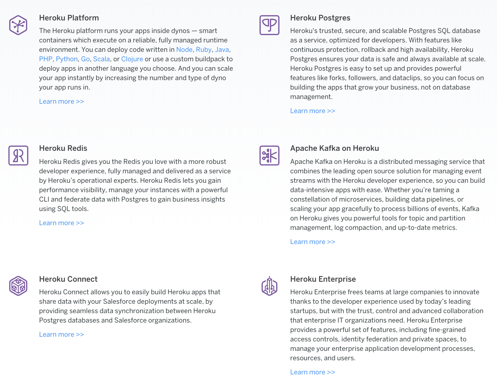

# Heroku

A Node.js application can be hosted in a lot of places, depending on your needs.

---

## BaaS, SaaS, PaaS, IaaS

- IaaS: Infrastructure as a Service
- PaaS: Platform as a Service
- SaaS: Software as a Service
- BaaS: Backend as a Service

---

## Heroku as PaaS

Heroku itself is a PaaS with a lot of features.

We can use Heroku to deploy our Node.js app.

### PaaS Alternatives to Heroku

- [ngrok - secure introspectable tunnels to localhost](https://ngrok.com)
- [Localtunnel ~ Expose yourself to the world](https://localtunnel.github.io/www)
- [ZEIT Now](https://zeit.co/now)
- [Google App Engine (GAE)](https://cloud.google.com/appengine)
- [Firebase Hosting](https://firebase.google.com/docs/hosting)
- [AWS Elastic Beanstalk](https://aws.amazon.com/elasticbeanstalk)
- [Microsoft Azure](https://docs.microsoft.com/en-us/javascript/azure)
- [Back4App - Parse Server Made Simple](https://back4app.com)

---

## Heroku to Deploy Node.js App

---

## Heroku References

- [Where to host a Node.js app](https://flaviocopes.com/nodejs-hosting)
