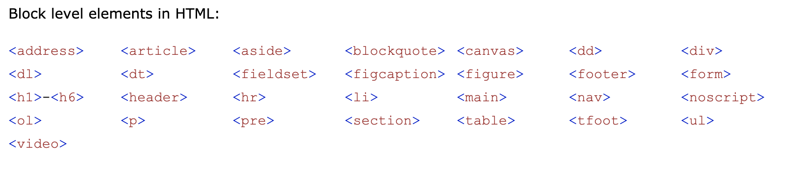
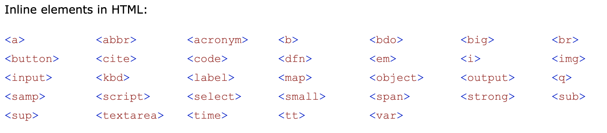

# HTML Basic

## HTML Introduction

HTML (HyperText Markup Language) is the main building blocks of a website. It structures the content, but not the style or functionality. That's why later we will also need CSS and JavaScript.

- **HyperText** means that it uses the HTTP part of the Internet
- **Markup** means the code you write is annotated with keywords
- **Language** means it can be read by both a human and a computer

When we use and code HTML, we use the HTML API behind the screen. To learn more in depth, read [HTML Syntax on MarkSheet.io](https://marksheet.io/html-syntax.html).

## HTML File

- The latest version is version 5, which is called HTML5. We don't use HTML4 or prior anymore.
- HTML has `.html` extension.
- Most of the HTML files are named as `index.html`, not `main.html` or `something.html`.
- All of the HTML files are just being used as the content, not the style.
- HTML is just a markup language, **not** a programming language.

## HTML Tags

Like any language, HTML comes with a set of rules. These rules are relatively simple. It comes down to defining boundaries, to know where something starts and where something ends.

In HTML, one of the most important rule is a `tag` or `element` .

It is declared like:

```html
<tag>text</tag>
```

```html
<h1>Hello World</h1>
```

With the opening tag and closing tag, containing the text content.

Some HTML can also be self-closed like:

```html
<tag attribute="value" />
```

```html

```

Notice that a self-closed tag still need the `/>` in the end.

- Block Elements
  
  
- Inline Elements
  

---

## HTML Elements

There are various HTML elements based on our intention or usage on the web page.

### Internal

For segmenting the web page.

#### `doctype` (document type)

```html
<!DOCTYPE html>
```

`DOCTYPE` is very imporant for an HTML page. So be sure to include it.

#### `html`

```html
<html lang="en">
  ...
</html>
```

#### `head`

```html
<head>
  ...
</head>
```

#### `body`

```html
<body>
  ...
</body>
```

#### Example of full combination of essential elements

```html
<!DOCTYPE html>
<html lang="en">
  <head>
    ...
  </head>
  <body>
    ...
  </body>
</html>
```

### Meta Data

For storing meta data.

#### `title`

```html
<head>
  <title>Website Name</title>
</head>
```

#### `meta`

```html
<head>
  <meta charset="UTF-8" />
  <meta name="viewport" content="width=device-width, initial-scale=1.0" />
  <meta http-equiv="X-UA-Compatible" content="ie=edge" />
</head>
```

### Comments

For commenting.

```html
<!-- Comment Text -->
```

### Text

For text heading and paragraph.

#### `h1`, `h2`, `h3`, `h4`, `h5`, `h6` (heading one to six)

```html
<h1>Heading One</h1>
<h2>Heading Two</h2>
<h3>Heading Three</h3>
<h4>Heading Four</h4>
<h5>Heading Five</h5>
<h6>Heading Six</h6>
```

#### `p` (paragraph)

```html
<p>
  Lorem ipsum dolor sit, amet consectetur adipisicing elit. Voluptate tempora
  provident quaerat officia maxime totam, repudiandae libero ducimus hic esse
  ipsam quam cum voluptates enim laudantium fugit quis eum suscipit.
</p>
```

#### `a` (anchor or link)

```html
<a href="https://google.com">Google</a>
```

#### `span`

```html
<span>Span Text</span>
```

#### `b` (bold) or `strong`

```html
<b>Bold Text</b> <strong>Strong Text</strong>
```

#### `i` (italic) or `em` (emphasis)

```html
<i>Italic Text</i> <em>Emphasis Text</em>
```

#### Example of full combination of text elements

```html
<p>
  Lorem, <span>ipsum</span> dolor sit amet consectetur adipisicing elit.
  Quisquam minima molestias reiciendis <b>autem</b> cupiditate placeat,
  <i>iste</i> quibusdam saepe corporis officiis explicabo eligendi quidem, nihil
  sint, <a href="https://aquaman.com">aquaman</a> facilis recusandae et
  consequuntur.
</p>
```

### Visualization

#### `img` (image)

```html

```

#### `button`

```html
<button>Button Text</button>
```

### List

For listing things.

#### `ul` (unordered list) and `li` (list)

```html
<ul>
  <li>Text</li>
  <li>Text</li>
  <li>Text</li>
</ul>
```

#### `ol` (ordered list) and `li` (list)

```html
<ol>
  <li>Text</li>
  <li>Text</li>
  <li>Text</li>
</ol>
```

#### `dl` (description list), `dt` (description term), and `dt` (description detail)

```html
<dl>
  <dt>Text</dt>
  <dd>- Description</dd>
  <dt>Text</dt>
  <dd>- Description</dd>
</dl>
```

#### Example of full combination of list elements

```html
<section>
  <nav>
    <ul>
      <li>
        <a href="https://google.com">Google</a>
        <a href="https://facebook.com">Facebook</a>
        <a href="https://instagram.com">Instagram</a>
      </li>
    </ul>
  </nav>
</section>
```

### Content

For dividing content.

#### `div` (divider)

```html
<div>
  ...
</div>
```

More professional developers commonly already use `header`, `footer`, `nav`, `main`, `section`, `article`, `aside`; instead of `div` because it's more clear to understand.

#### `header`

```html
<header>
  ...
</header>
```

#### `footer`

```html
<footer>
  ...
</footer>
```

#### `nav` (navigation)

```html
<nav>
  ...
</nav>
```

#### `main`

```html
<main>
  ...
</main>
```

#### `section`

```html
<section>
  ...
</section>
```

#### `article`

```html
<article>
  ...
</article>
```

#### `aside`

```html
<aside>
  ...
</aside>
```

#### `br` (break)

```html
<br />
```

#### `hr` (horizontal rule)

```html
<hr />
```

### Form

For form elements.

#### `form`

```html
<form action="/path">
  ...
</form>
```

#### `label`

```html
<label for="something">Text</label>
```

#### `input`

```html
<!-- Text -->
<input type="text" value="Text" />

<!-- Number -->
<input type="number" />

<!-- Email -->
<input type="email" />

<!-- Password -->
<input type="password" />

<!-- Date -->
<input type="date" />

<!-- Time -->
<input type="time" />

<!-- Radio -->
<input type="radio" name="gender" value="male" /> Option Text

<!-- File -->
<input type="file" />
```

#### `select` and `option`

```html
<select>
  <option value="a">Alpha</option>
  <option value="b">Beta</option>
  <option value="c">Camma</option>
</select>
```

#### `fieldset`

```html
<fieldset>
  <label for="something">Label Text</label>
  <input type="text" name="something" />
</fieldset>
```

#### `legend`

```html
<legend>Legend Text</legend>
```

#### `textarea`

```html
<textarea name="text-area" cols="30" rows="10"></textarea>
```

#### `required`

```html
<input type="text" required />
```

#### `autofocus`

```html
<input type="text" autofocus />
```

#### `contenteditable`

```html
<textarea name="text-area" cols="30" rows="10" contenteditable></textarea>
```

#### Example of full combination of form elements

```html
<form>
  <fieldset>
    <legend>Box size:</legend>
    <p>
      <input type="radio" name="size" id="size_1" value="small" />
      <label for="size_1">Small</label>
    </p>
    <p>
      <input type="radio" name="size" id="size_2" value="medium" />
      <label for="size_2">Medium</label>
    </p>
    <p>
      <input type="radio" name="size" id="size_3" value="large" />
      <label for="size_3">Large</label>
    </p>
  </fieldset>
</form>
```

### Table

For creating a table parts.

- Head
- Body
- Foot
- Row
- Data

#### `table`

```html
<table>
  ...
</table>
```

#### `thead` (table head)

```html
<thead>
  ...
</thead>
```

#### `tbody` (table body)

```html
<tbody>
  ...
</tbody>
```

#### `tfoot` (table footer)

```html
<tfoot>
  ...
</tfoot>
```

#### `tr` (table row) and `td` (table data)

```html
<tr>
  <td>Text</td>
  <td>Text</td>
</tr>
```

#### Example of full combination of table elements

```html
<table>
  <thead>
    <tr>
      <th>Name</th>
      <th>Age</th>
    </tr>
  </thead>
  <tbody>
    <tr>
      <td>Alpha</td>
      <td>10</td>
    </tr>
    <tr>
      <td>Beta</td>
      <td>20</td>
    </tr>
  </tbody>
  <tfoot>
    <tr>
      <th>Name</th>
      <th>Age</th>
    </tr>
  </tfoot>
</table>
```

### Multimedia

For displaying multimedia assets.

#### `video`

```html
<video width="320" height="240" controls>
  <source src="movie.mp4" type="video/mp4" />
  <source src="movie.ogg" type="video/ogg" />
  Your browser does not support the video tag.
</video>
```

#### `audio`

```html
<audio controls>
  <source src="horse.ogg" type="audio/ogg" />
  <source src="horse.mp3" type="audio/mpeg" />
  Your browser does not support the audio element.
</audio>
```

#### `iframe`

```html
<iframe src="page.html" height="200" width="300"></iframe>
```

---

## Recommended Structure of an HTML Page

```html
<!DOCTYPE html>
<html lang="en">
  <head>
    <meta charset="UTF-8" />
    <meta name="viewport" content="width=device-width, initial-scale=1.0" />
    <meta http-equiv="X-UA-Compatible" content="ie=edge" />
    <title>Name - Description</title>
  </head>
  <body>
    <!-- NAVIGATION -->
    <nav>
      <a href="">...</a>
      <a href="">...</a>
      <a href="">...</a>
    </nav>

    <!-- HEADER -->
    <header>
      <h1>...</h1>
      <h2>...</h2>
      <h3>...</h3>
    </header>

    <!-- MAIN CONTENT -->
    <main>
      <!-- STORIES -->
      <section>
        <p>...</p>
        <p>...</p>
        <p>...</p>
      </section>

      <!-- LINKS -->
      <section>
        <ul>
          <li><a href="https://...com">...</a></li>
          <li><a href="https://...com">...</a></li>
          <li><a href="https://...com">...</a></li>
        </ul>
      </section>

      <!-- ADVERTISEMENT -->
      <aside>
        ...
      </aside>
    </main>

    <!-- FOOTER AND CREDITS -->
    <footer>
      <h4>...</h4>
      <p>
        <span>...</span>
        <a href="https://...com">...</a>
      </p>
    </footer>
  </body>
</html>
```

---

## Typing Shortcut

If you need to save time, use `!` character, and then press `Tab` or `Enter`, so you will get this automatically:

```html
!
```

`Tab` or `Enter`:

```html
<!DOCTYPE html>
<html lang="en">
  <head>
    <meta charset="UTF-8" />
    <meta name="viewport" content="width=device-width, initial-scale=1.0" />
    <meta http-equiv="X-UA-Compatible" content="ie=edge" />
    <title>Document</title>
  </head>
  <body></body>
</html>
```

Then you can continue to code within the `<body>` tag.

This capability is enabled out of the box withing VS Code because of [Emmet](https://code.visualstudio.com/blogs/2017/08/07/emmet-2.0) extension. We can [learn more about Emmet here](https://emmet.io).

Here's a bit of the [cheat sheet for the shortcuts](https://docs.emmet.io/cheat-sheet):

```html
nav>ul>li
```

becomes:

```html
<nav>
  <ul>
    <li></li>
  </ul>
</nav>
```

```html
div+p+bq
```

becomes:

```html
<div></div>
<p></p>
<blockquote></blockquote>
```

```html
ul>li*3>a
```

becomes:

```html
<ul>
  <li><a href=""></a></li>
  <li><a href=""></a></li>
  <li><a href=""></a></li>
</ul>
```

---

## HTML References

- [MarkSheet: a free HTML and CSS tutorial](https://marksheet.io)
- [DevDocs HTML](https://devdocs.io/html)
- [Emmet](https://emmet.io)
  - [Emmet Cheat Sheet](https://docs.emmet.io/cheat-sheet)
