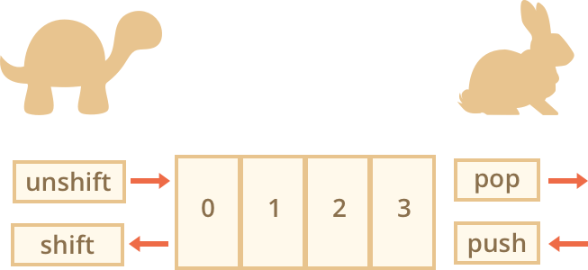

# JavaScript Global Objects `Array`

---

## Array Data

Arrays of data in JavaScript can work both as a **queue** and as a **stack**. They allow you to add/remove elements both to/from the beginning or the end. In computer science the data structure that allows it is called [deque](https://en.wikipedia.org/wiki/Double-ended_queue) (Double-ended queue).

### Array Data Queue


A **queue** is one of most common uses of an array. In computer science, this means an ordered collection of elements which supports two operations:

- `push` appends an element to the end.
- `shift` get an element from the beginning, advancing the queue, so that the 2nd element becomes the 1st.

### Array Data Stack


A **stack** It supports two operations, which new elements are added or taken always from the "end". A stack is usually illustrated as a pack of cards: new cards are added to the top or taken from the top.

- `push` adds an element to the end.
- `pop` takes an element from the end.

For stacks, the latest pushed item is received first, that’s also called **LIFO (Last-In-First-Out)** principle. For queues, we have **FIFO (First-In-First-Out)**.

### `pop`

Extracts the last element of the array and returns it.

```js
let fruits = ['Apple', 'Orange', 'Pear']

console.log(fruits.pop()) // remove "Pear" and alert it

console.log(fruits) // Apple, Orange
```

### `push`

Append the element to the end of the array.

```js
let fruits = ['Apple', 'Orange']

fruits.push('Pear')

console.log(fruits) // Apple, Orange, Pear
```

The call `fruits.push(...)` is equal to `fruits[fruits.length] = ...`.

### `shift`

Extracts the first element of the array and returns it.

```js
let fruits = ['Apple', 'Orange', 'Pear']

console.log(fruits.shift()) // remove Apple and alert it

console.log(fruits) // Orange, Pear
```

### `unshift`

Add the element to the beginning of the array.

```js
let fruits = ['Orange', 'Pear']

fruits.unshift('Apple')

console.log(fruits) // Apple, Orange, Pear
```

Methods `push` and `unshift` can add multiple elements at once.

```js
let fruits = ['Apple']

fruits.push('Orange', 'Peach')
fruits.unshift('Pineapple', 'Lemon')

// ["Pineapple", "Lemon", "Apple", "Orange", "Peach"]
console.log(fruits)
```

---

## Array is an Object?

Array is an object and thus behaves like an object, it is copied by reference. So when the copy is modified, the original is modified as well.

```js
let fruits = ['Banana']

let newFruits = fruits // copy by reference (two variables reference the same array)

console.log(newFruits === fruits) // true

newFruits.push('Pear') // modify the array by reference

console.log(fruits) // Banana, Pear - 2 items now
```

---

## Array Operation Speed/Performance



- Methods `push/pop` are fast
- Methods `shift/unshift` are slow

---

## Array Loops

### `for...of`

```js
const fruits = ['Apple', 'Orange', 'Plum']

// iterates over array elements
for (let fruit of fruits) {
  console.log(fruit)
}

// much better than this
for (let index = 0; index < fruits.length; index++) {
  const fruit = fruits[index]
  console.log(fruit)
}
```

The `for...of` doesn't give access to the index/number of the current element, just its value, but in most cases that's enough. And it's shorter.

### `for...in`

Because arrays are objects, it is also possible to use `for...in`.

```js
const array = ['Apple', 'Orange', 'Pear']

for (let key in array) {
  console.log(array[key]) // Apple, Orange, Pear
}

for (let index in array) {
  console.log(array[index]) // Apple, Orange, Pear
}
```

This is actually a bad idea. There are potential problems with it. Generally, we shouldn not use `for...in` for arrays.

- The loop `for...in` iterates over _all properties_, not only the numeric ones.
- The `for...in` loop is optimized for generic objects, not arrays, and thus is 10-100 times slower

---

## `new Array()`

There is one more syntax to create an array:

```js
const fruits = new Array('Apple', 'Pear', 'etc')
```

It's rarely used, because square brackets `[]` are shorter. Also there's a tricky feature with it.

If `new Array` is called with a single argument which is a number, then it creates an array _without items, but with the given length_.

```js
// This is a bad idea
const data = new Array(2) // will it create an array of [2] ?

console.log(data[0]) // undefined! no elements.

console.log(data.length) // length 2
```

In the code above, `new Array(number)` has all elements `undefined`. To evade such surprises, we usually use square brackets `[]` to create an array, unless we really know what we're doing.

---

## Array Multidimensional

Arrays can have items that are also arrays. We can use it for multidimensional arrays, to store matrices:

```txt
[
  [1, 2, 3],
  [4, 5, 6],
  [7, 8, 9]
]
```

```js
const matrix = [[1, 2, 3], [4, 5, 6], [7, 8, 9]]

console.log(matrix[1][1]) // 5, the central element
```

```txt
[
  [
    [11, 12, 13],
    [21, 22, 23],
    [31, 32, 33]
  ],
   [
    [41, 42, 43],
    [51, 52, 53],
    [61, 62, 63]
  ],
  [
    [71, 72, 73],
    [81, 82, 83],
    [91, 92, 93]
  ]
]
```

```js
const matrix = [
  [[11, 12, 13], [21, 22, 23], [31, 32, 33]],
  [[41, 42, 43], [51, 52, 53], [61, 62, 63]],
  [[71, 72, 73], [81, 82, 83], [91, 92, 93]]
]

console.log(matrix[0][1][2]) // 23
```

---

## Array to String

Arrays have their own implementation of `toString` method that returns a comma-separated list of elements.

```js
const data = [1, 2, 3]

console.log(data) // 1,2,3
console.log(String(data) === '1,2,3') // true
```

```js
console.log([] + 1) // 1
console.log([1] + 1) // 11
console.log([1, 2] + 1) // 1,21
```

---

## JavaScript Global Objects `Array` References

- [Arrays](http://javascript.info/array)
- [Array - JavaScript | MDN](https://developer.mozilla.org/en-US/docs/Web/JavaScript/Reference/Global_Objects/Array)
- [Arrays - Learn web development | MDN](https://developer.mozilla.org/en-US/docs/Learn/JavaScript/First_steps/Arrays)
