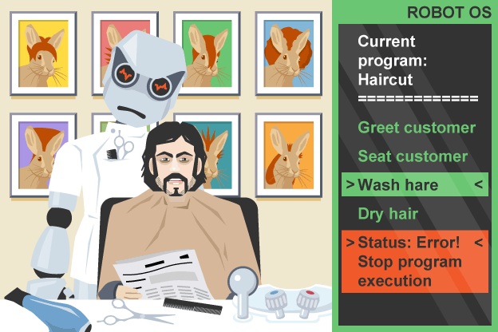
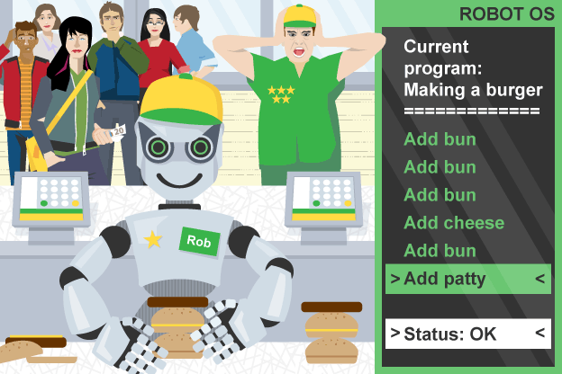

# Programming Basic

**Programming** is writing computer code to create a **program**, to solve a problem. **Programs** are created to implement algorithms. **Algorithms** can be represented as **pseudocode** or a **flowchart**, and programming is the translation of these into a computer program.

To tell a computer to do something, a program must be written to tell it exactly what to do and how to do it. If an algorithm has been designed, the computer program will follow this algorithm, step-by-step, which will tell the computer exactly what it should do.

Programming languages are designed to be easy for a human to understand and write in. However, a computer cannot run programs written in these languages directly. Most programming languages have to be translated into machine code before the computer can execute the instructions.

---

## Programming Steps

- Think
- Research
- Plan
- Write
- Validate
- Test
- Debug
- Deploy
- Refactor
- Iterate
- Modify

---

## Program Data

The main purpose of computer programs is to collect and process data. A computer can change what it does depending on the data that it has to work with.

The data that is used in a program is referred to as the data values. These influence the sequence of instructions and the program outputs.

The data values collected and used by a program control:

- what is done
- what is stored
- what is transmitted to other devices
- what is output to the user (visually, audibly)

Data values can be input by a user or obtained from a range of different sources:

- from a file, database or other piece of software
- sent from another computer or device
- collected from a hardware sensor such as a camera or microphone
- generated internally, eg by the ticking of the system clock
- Even mouse movements and button clicks are input data, and the location and timing of them can affect what happens.

---

## Programming Languages

A **programming language** is an artificial language that a computer understands. The language is made up of series of **statements** that fit together to form **instructions**. These instructions tell a computer what to do.

- **statements**: The smallest element of a programming language which expresses an action to be carried out
- **instructions**: A single action that can be performed by a computer processor).

There are many different programming languages, some more complicated and complex than others. Among the most popular languages are:

- Assembly
- Bash/Shell
- BASIC
- C
- C#
- C++
- Go
- Groovy
- Java
- JavaScript
- Kotlin
- Matlab
- Objective-C
- Perl
- PHP
- Python
- R lang
- Ruby
- Scala
- Scratch
- SQL
- Swift
- TypeScript
- VB.NET
- VBA (Visual Basic for Applications)

Remember:

- markup and style languages such as HTML and CSS are not programming languages.
- platforms and frameworks such as Node.js and TensorFlow are not programming languages.

Different languages work in different ways. For example, in Python all instructions are written in lowercase, but in BASIC they tend to be written in uppercase.

---

## Program

**Programs** are made up of **statements** that the programming language knows and understands.

Just as words are put together to form a sentence, a program puts one or more statements together to form an **instruction**. Each statement tells the computer to perform a specific task, and the instructions tell a computer what to do.

---

## Program Error

When programs are written, it is likely that at least some errors will creep in. Errors in programs are often referred to as bugs. It is vital that programs are as free of errors as possible. Errors can cause a program to produce unexpected results, or crash.

There are two types of error that need to be considered:

- syntax error: spelling issue
- logic error: process issue, harder to solve

Each type of error is different, and each is solved in different ways.

Also, the errors could be categorized as:

- trivial error: easy to solve, not a big deal
- critical error: a very important issue, harder to solve

It is also good practice to document code. Documentation helps keep code easy to read and easy to understand.

### Syntax Errors

Syntax is the spelling and grammar of a programming language. Programming languages have rules for spelling, punctuation and grammar, just like the English language. In programming, a syntax error occurs when:

- there is a spelling mistake
- there is a grammatical mistake

Syntax errors will cause a program to crash or not run at all. The program may run until it encounters a syntax error, then it will stop.

Types of syntax error:

- incorrectly spelled statements
- incorrectly spelled variables
- missing punctuation (quotes, brackets, etc)

### Logic Errors

Logic errors occur when there is a fault in the logic or structure of the problem.

Logic errors do not usually cause a program to crash. However, logic errors can cause a program to produce unexpected results.

Types of logic error:

- be in the wrong sequence
- have the wrong Boolean expression
- use the wrong data type
- be missing altogether

---

## Program and Code Documentation

Code that is hard to read makes it difficult to understand what the program is trying to do. It also makes it difficult to understand the purpose of any variables, procedures and functions. Errors are easier to fix when we understand the code we are reading through.

When we document code, we make it easier to read and understand. We also document code in case:

- **Reminder**: we need to come back to it at a later date
- **Collaboration**: someone else needs to change or fix it

Documenting code is very straightforward. It involves:

- **Naming**: giving meaningful names for variables, procedures and functions. Meaningless names make code hard to understand. Sensible and meaningful names make the purpose of code easy to decipher.
- **Commenting**: placing comments within the code to explain the purpose of each step. A comment is one or more sentences that explain the purpose of a section of code. A comment is placed just before (or after) the code to which it refers.

Having properly documented code makes it much easier for a programmer to understand and, if necessary, debug the program.

Well-written documentations and comments explain:

- the name of the program and its author
- what the programmer intends the code to do
- whether the programmer thinks the code could be better written
- where the program may be incomplete or need updating

Comments make your code easier to understand. Try to include meaningful comments in your code wherever possible. Be aware, though, that including too many comments can actually make code harder to read, so use them appropriately.

---

## Programming References

- [Programming - KS3 Computing - BBC Bitesize](https://www.bbc.com/bitesize/topics/zhy39j6)
  - [Introduction to programming - Revision 1 - KS3 Computer Science - BBC Bitesize](https://www.bbc.com/bitesize/guides/zts8d2p/revision/1)
  - [Constants, variables and data types - Revision 1 - GCSE Computer Science - BBC Bitesize](https://www.bbc.com/bitesize/guides/zc6s4wx/revision/1)
  - [Writing error-free code - Revision 1 - KS3 Computer Science - BBC Bitesize](https://www.bbc.com/bitesize/guides/zcjfyrd/revision/1)
