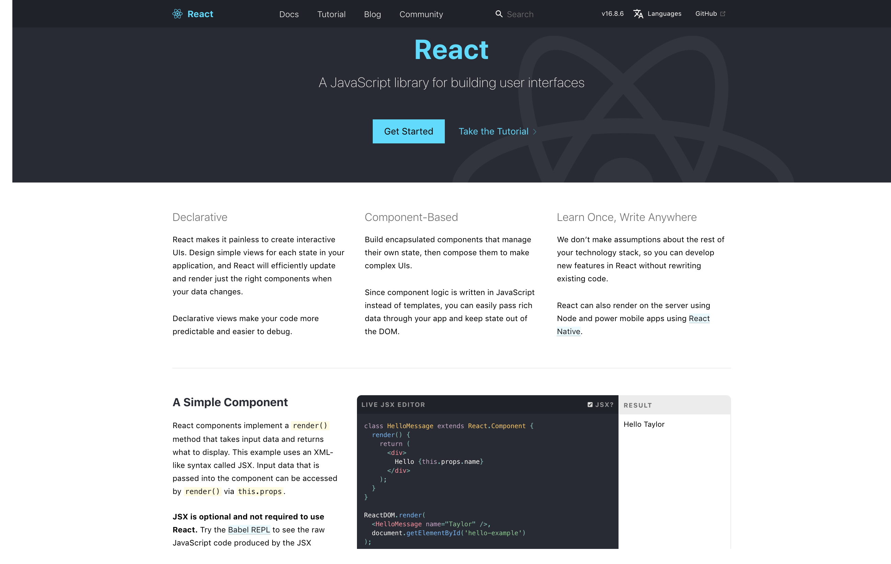
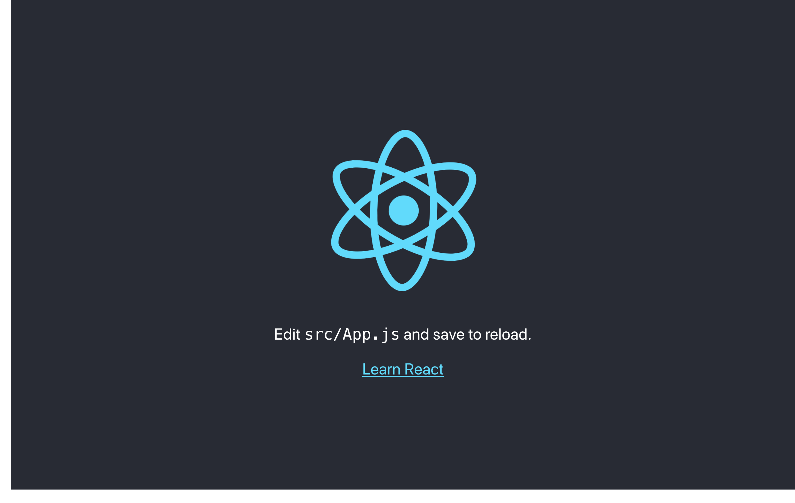
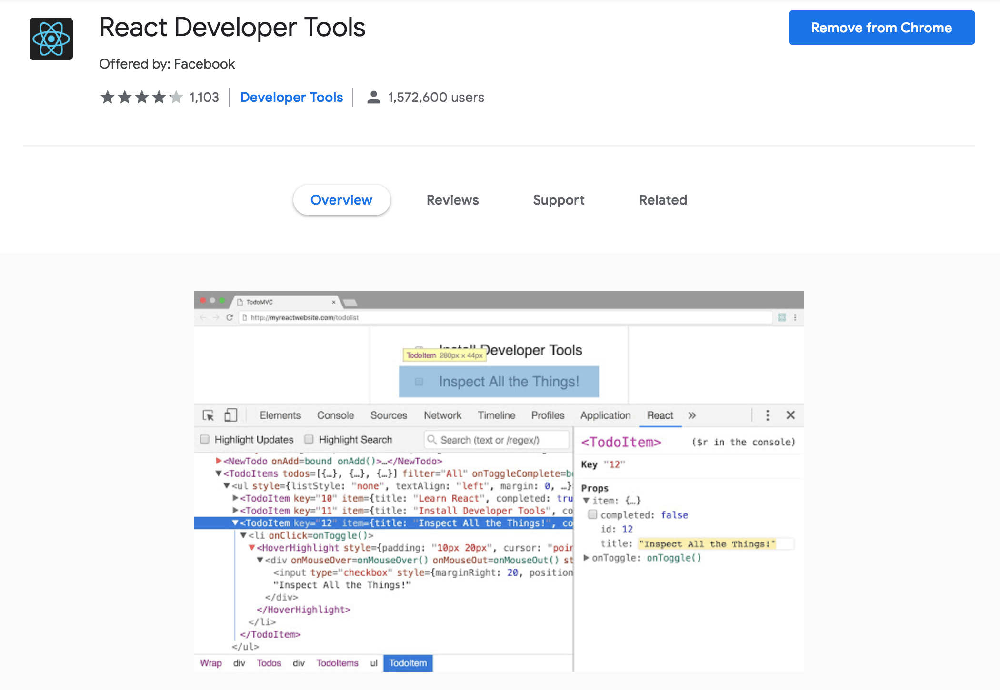

# React Basic



React is described as a JavaScript library for building user interfaces (taken from the [official documentation](https://reactjs.org)). The current latest version is at `16.x.x`. The main reasons and philosophy of React is to improve both developer and designer productivity, by using a component-based approach when building a complex web application.

The 3 main features mentioned in the homepage are:

- **Declarative**: React makes it painless to create interactive UIs using JSX (JavaScript Extension) syntax. Design simple views for each state in your application, and React will efficiently update and render just the right components when your data changes. Declarative views make your code more predictable and easier to debug.
- **Component-Based**: Build encapsulated components that manage their own state, then compose them to make complex UIs. Since component logic is written in JavaScript instead of templates, you can easily pass rich data through your app and keep state out of the DOM.
- **Learn Once, Write Anywhere**: We don’t make assumptions about the rest of your technology stack, so you can develop new features in React without rewriting existing code. React can also render on the server using Node and power mobile apps using [React Native](https://facebook.github.io/react-native).

A simple starter React app or website would be like this:



And the code using JSX, an XML-like syntax, looks like this:

```jsx
import React from "react";
import logo from "./logo.svg";
import "./App.css";

function App() {
  return (
    <div className="App">
      <header className="App-header">
        
        <p>
          Edit <code>src/App.js</code> and save to reload.
        </p>
        <a
          className="App-link"
          href="https://reactjs.org"
          target="_blank"
          rel="noopener noreferrer"
        >
          Learn React
        </a>
      </header>
    </div>
  );
}

export default App;
```

JSX here is a DSL (Domain Specific Language) over JavaScript. So it is not plain programming language. JSX is completely optional, many people find it helpful for writing UI code, both with React and with other libraries.

React itself has been designed from the start for gradual adoption, and you can use as little or as much React as you need. So we can still use React with any other library we want, such as Vue, Angular, Backbone, etc. But still, it is very recommended to use React by its own ecosystem. We can even use React with plain JavaScript/JSX, TypeScript, Reason, etc. React can even replace, be compared, and used together with jQuery, Vue, Angular, Preact, Backbone, Web Components, Elm.

If you are interested in playing around with React, you can use an online code playground. Try a Hello World template on [CodePen](codepen://hello-world), [CodeSandbox](https://codesandbox.io/s/new), or [Glitch](https://glitch.com/edit/#!/remix/starter-react-template).

**Who uses React?** A lot of companies and organizations. Especially Facebook, Instagram, Netflix, Airbnb, New York Times, Yahoo! Mail, Khan Academy, WhatsApp, Vivaldi Browser, Codecademy, Dropbox, Atlassian, Cloudflare, Glassdoor, Instacart, Legendary, Lyft, MongoDB, New Relic, Vice, Warby Parker, IBM, AT&T, Sonic Automotiv, and others, including Impact Byte!

**Should we always React?** Depends. If our application has some complexity, it's recommended to use. But if it's just a simple website, just using plain HTML, CSS, and JavaScript like usual.

---

## React Component

React components implement a `render()` method that takes input data and returns what to display. The attribute/input data that is passed into the component can be accessed by `render()` via `this.props`. Here, it uses `Component` and behind that there is virtual DOM technology.

Remember that **JSX is optional and not required to use React**.

```jsx
class HelloMessage extends React.Component {
  render() {
    return <div>Hello {this.props.name}</div>;
  }
}

ReactDOM.render(
  <HelloMessage name="World" />,
  document.getElementById("hello-example")
);
```

```txt
Hello World
```

The actual JavaScript code is like this:

```js
class HelloMessage extends React.Component {
  render() {
    return React.createElement("div", null, "Hello ", this.props.name);
  }
}

ReactDOM.render(
  React.createElement(HelloMessage, { name: "World" }),
  document.getElementById("hello-example")
);
```

In the end, the JSX is actually just `React.createElement()`

In a `class`, `constructor` is only needed if we have some data:

```jsx
class HelloMessage extends React.Component {
  constructor() {
    this.state = {
      name: "World"
    };
  }

  render() {
    return <div>Hello {this.state.name}</div>;
  }
}
```

We can even use plain `function` instead of `class` to create the component:

```jsx
function HelloMessage(props) {
  return <div>Hello {props.name}</div>;
}

const HelloMessage = props => {
  return <div>Hello {props.name}</div>;
};
```

Here, some variables/parameters such as `this.props.name` became `props.name`, and the `props` need to passed as parameter.

---

## React Stateful Component

In addition to taking input data (accessed via `this.props`), a component can maintain internal state data (accessed via `this.state`). When a component’s state data changes, the rendered markup will be updated by re-invoking or re-running `render()`.

```jsx
class Timer extends React.Component {
  constructor(props) {
    super(props);
    this.state = { seconds: 0 };
  }

  tick() {
    this.setState(state => ({
      seconds: state.seconds + 1
    }));
  }

  componentDidMount() {
    this.interval = setInterval(() => this.tick(), 1000);
  }

  componentWillUnmount() {
    clearInterval(this.interval);
  }

  render() {
    return <div>Seconds: {this.state.seconds}</div>;
  }
}

ReactDOM.render(<Timer />, document.getElementById("timer-example"));
```

```txt
Seconds: 42
```

---

## React Scripts

Adding React as a plain `<script>` tag on an HTML page, optionally with JSX, is possible. This is the easiest way to integrate React into an existing website.

### Step 1: Add a DOM Container to the HTML

First, open the HTML page you want to edit. Add an empty `<div>` tag to mark the spot where you want to display something with React. For example:

```html
<!-- ... existing HTML ... -->
<div id="like-button-container"></div>
<!-- ... existing HTML ... -->
```

### Step 2: Add the Script Tags

Next, add three `<script>` tags to the HTML page right before the closing `</body>` tag:

- The first two tags load React
- The third one will load your component code

```html
  <!-- ... other HTML ... -->

  <!-- Load React. -->
  <!-- Note: when deploying, replace "development.js" with "production.min.js". -->
  <script src="https://unpkg.com/react@16/umd/react.development.js" crossorigin></script>
  <script src="https://unpkg.com/react-dom@16/umd/react-dom.development.js" crossorigin></script>

  <!-- Load our React component. -->
  <script src="LikeButton.js"></script>

</body>
```

### Step 3: Create a React Component

Create a component file, i.e. `LikeButton.js`, next to your HTML page.

```js
"use strict";

class LikeButton extends React.Component {
  constructor(props) {
    super(props);
    this.state = {
      liked: false
    };
  }

  render() {
    if (this.state.liked) {
      return "You liked this";
    }

    return React.createElement(
      "button",
      { onClick: () => this.setState({ liked: true }) },
      "Like"
    );
  }
}

const domContainer = document.querySelector("#like-button-container");

ReactDOM.render(React.createElement(LikeButton), domContainer);
```

The last 2 lines of code find the `<div>` we added to our HTML in the first step, and then display our "Like" button React component inside of it.

---

## Create React App (CRA)

Create React App (CRA or `create-react-app`) is a comfortable environment for learning React, and is the best way to start building a new single-page application in React.

Because previously, we only relied on features that are natively supported by the browsers. This is why we used a plain JavaScript function call to tell React what to display:

```js
// Display a "Like" <button>
return React.createElement(
  "button",
  { onClick: () => this.setState({ liked: true }) },
  "Like"
);
```

However, React also offers an option to use JSX instead:

```jsx
// Display a "Like" <button>
return <button onClick={() => this.setState({ liked: true })}>Like</button>;
```

But in order to configure it, we need other libraries or scripts to automate the conversion between JSX and plain JavaScript. Most of the projects need [Babel](https://babeljs.io) and [webpack](https://webpack.js.org) to convert JSX to JavaScript.

Create React App can sets up your development environment so that you can use the latest JavaScript features, provides a nice developer experience, and optimizes your app for production. You’ll need to have Node `>=6` and npm `>=5.2` on your machine.

Create React App does not handle backend logic or databases. It just creates a frontend build pipeline, so you can use it with any backend you want. Under the hood, it uses still uses Babel and webpack, but you do not need to configure that if using CRA.

To install `create-react-app`, run:

```sh
npm install --global create-react-app
# or
yarn global add create-react-app
```

If you found this, `npx`, it is not the same with `npm`, but it is a package runner tool that comes with npm `5.2+`. Basically it will install `create-react-app` and then automatically run the app.

```sh
npx create-react-app folder-name
```

To create a project, run:

```sh
create-react-app folder-name
cd folder-name
yarn start
```

Or if you already have a folder, run:

```sh
mkdir folder-name
cd folder-name
create-react-app .
yarn start
```

The full information:

```sh
$ create-react-app .

Creating a new React app in /Users/username/folder-name.

Installing packages. This might take a couple of minutes.
Installing react, react-dom, and react-scripts...

yarn add v1.9.4
[1/4] 🔍  Resolving packages...
[2/4] 🚚  Fetching packages...
[3/4] 🔗  Linking dependencies...
[4/4] 📃  Building fresh packages...
success Saved lockfile.
success Saved 19 new dependencies.
info Direct dependencies
├─ react-dom@16.8.6
├─ react-scripts@3.0.0
└─ react@16.8.6
info All dependencies
├─ ...
└─ react@16.8.6
✨  Done in 20.52s.

Initialized a git repository.

Success! Created project-react at /Users/username/folder-name
Inside that directory, you can run several commands:

  yarn start
    Starts the development server.

  yarn build
    Bundles the app into static files for production.

  yarn test
    Starts the test runner.

  yarn eject
    Removes this tool and copies build dependencies, configuration files
    and scripts into the app directory. If you do this, you can’t go back!

We suggest that you begin by typing:

  cd /Users/username/folder-name
  yarn start

Happy hacking!
```

The created directory structure looks like this:

```sh
.
├── README.md
├── package.json
├── public
│   ├── favicon.ico
│   ├── index.html
│   └── manifest.json
├── src
│   ├── App.css
│   ├── App.js
│   ├── App.test.js
│   ├── index.css
│   ├── index.js
│   ├── logo.svg
│   └── serviceWorker.js
└── yarn.lock
```

What's really important here is the `index.js` and `App.js` file.

After that, we can inspect all files or edit particular files that have been created by `create-react-app`

To start the app, run:

```sh
yarn start
```

```sh
$ yarn start

Starting the development server...

Compiled successfully!

You can now view project-react in the browser.

  Local:            http://localhost:3000/
  On Your Network:  http://192.168.88.3:3000/

Note that the development build is not optimized.
To create a production build, use yarn build.
```

Then just open `localhost:3000` in your browser.

To build the app when you are ready to deploy to production, running `yarn build` will create an optimized build of your app in the build folder. You can learn more about Create React App from its README and the User Guide.

```sh
yarn build
```

```sh
$ yarn build                                                                               master 8b79fc1
yarn run v1.9.4
$ react-scripts build
Creating an optimized production build...
Compiled successfully.

File sizes after gzip:

  36.44 KB  build/static/js/2.b41502e9.chunk.js
  762 B     build/static/js/runtime~main.a8a9905a.js
  602 B     build/static/js/main.28647029.chunk.js
  524 B     build/static/css/main.3e545749.chunk.css

The project was built assuming it is hosted at the server root.
You can control this with the homepage field in your package.json.
For example, add this to build it for GitHub Pages:

  "homepage" : "http://myname.github.io/myapp",

The build folder is ready to be deployed.
You may serve it with a static server:

  yarn global add serve
  serve -s build

Find out more about deployment here:

  https://bit.ly/CRA-deploy

✨  Done in 10.35s.
```

---

## React App Deployment

Using Netlify, after connecting and picking the repo, in the **Deploy settings**, set the **Basic build settings**.

**Build command**:

```sh
yarn build
```

**Publish directory**:

```sh
build/
```

Later we can also use the **Advanced build settings**:

```txt
Key: REACT_APP_NAME
Value: project-react
```

It is the same with `process.env` or `.env` variable:

```txt
REACT_APP_NAME=project-react
```

---

## React JSX in VS Code

To configure JSX to work well with Emmet (HTML autocomplete) in VS Code, configure this manually inside **User Settings** with JSON format (`settings.json`):

```json
{
  // ...
  "emmet.includeLanguages": {
    "javascript": "javascriptreact"
  },
  "emmet.syntaxProfiles": {
    "javascript": "jsx"
  },
  "emmet.triggerExpansionOnTab": true
  // ...
}
```

---

## React DevTools

To ease debugging of React app, use [React DevTools](https://chrome.google.com/webstore/detail/react-developer-tools/fmkadmapgofadopljbjfkapdkoienihi) Chrome Extension.




---

## Recommended Toolchains

The React team primarily recommends these solutions for extra capabilities:

- If you're **learning React** or **creating a new [single-page](/docs/glossary.html#single-page-application) app,** use [Create React App](#create-react-app).
- If you're building a **server-rendered website with Node.js,** try [Next.js](#nextjs).
- If you're building a **static content-oriented website,** try [Gatsby](#gatsby).
- If you're building a **component library** or **integrating with an existing codebase**, try [More Flexible Toolchains](#more-flexible-toolchains).

---

## React Basic References

### Essentials

- [React – A JavaScript library for building user interfaces](https://reactjs.org)
  - [Getting Started – React](https://reactjs.org/docs/getting-started.html)
  - [Add React to a Website – React](https://reactjs.org/docs/add-react-to-a-website.html)
  - [Create a New React App – React](https://reactjs.org/docs/create-a-new-react-app.html)
  - [Tutorial: Intro to React – React](https://reactjs.org/tutorial/tutorial.html)
  - [Thinking in React – React](https://reactjs.org/docs/thinking-in-react.html)
- [React.js Review, Customers, and Alternatives](https://siftery.com/reactjs?group=unicorns)
- [Companies that use React & React Integrations | StackShare](https://stackshare.io/react)
- [React for Designers](https://reactfordesigners.com)
- [Getting Started with React - An Overview and Walkthrough – Tania Rascia](https://www.taniarascia.com/getting-started-with-react)
- [React Handbook](https://reacthandbook.com)
- [React Handbook on Medium](https://medium.freecodecamp.org/the-react-handbook-b71c27b0a795)
- [React Handbook by Flavio Copes (PDF)](https://drive.google.com/open?id=1V7r9p8ERnJg6kL8cc8WG0haI03YSLqly)
- [Create React App | Docs](https://create-react-app.dev/docs/getting-started)

### Course

- [Learn React by building an app to help you find the best movie to watch](https://sweetpumpkins.codecamps.com)
- [Fullstack React: 30 Levels of React](https://fullstackreact.com/30-days-of-react)
- [Fullstack React 🐬 Book - The Complete Guide to ReactJS and Friends](https://fullstackreact.com)
- [React Nanodegree by Udacity](https://udacity.com/degrees/react-nanodegree--nd019)

### Extra

- [React Enlightenment](https://www.reactenlightenment.com)
- [Build with React JS Tutorial](http://buildwithreact.com)
- [React Tutorial: A Comprehensive Guide to learning React.js in 2018 - Tyler McGinnis](https://tylermcginnis.com/reactjs-tutorial-a-comprehensive-guide-to-building-apps-with-react)
- [Start Learning React - egghead.io](https://egghead.io/courses/start-learning-react)
- [Learn ReactJS: Part I | Codecademy](https://www.codecademy.com/courses/react-101/lessons/react-jsx-intro/exercises/why-react)
- [`react-howto` - Your guide to the (sometimes overwhelming!) React ecosystem](https://github.com/petehunt/react-howto)
- [Top 5 Tutorials for Getting Started with React](https://www.javascriptstuff.com/getting-started-tutorials)
- [Bit - Component Discovery and Collaboration](https://bit.dev)
- [React Armory - The simplest way to learn React](https://reactarmory.com/)
  - [Lifecycle Simulators](https://reactarmory.com/guides/lifecycle-simulators)
- [Pure React](https://daveceddia.com/pure-react)
  - [Your Timeline for Learning React](https://daveceddia.com/timeline-for-learning-react)
  - [How To Learn React (and what to build along the way)](https://daveceddia.com/how-to-learn-react)
  - [Learning React? Start Small](https://daveceddia.com/learning-react-start-small)
  - [Learning React as an Experienced Developer](https://daveceddia.com/learn-react-as-experienced-developer)
  - [A Visual Guide to State in React](https://daveceddia.com/visual-guide-to-state-in-react)
  - [AJAX Requests in React: How and Where to Fetch Data](https://daveceddia.com/ajax-requests-in-react)
  - [Do I need Node.js in the backend?](https://daveceddia.com/do-i-need-nodejs-backend-for-react-angular)
- [Cabin: Thoroughly Learn React and Redux with this example app](http://cabin.getstream.io)
- [8 Key React Component Decisions – freeCodeCamp](https://medium.com/@housecor/8-key-react-component-decisions-cc965db11594)
- [React For Beginners - Learn with Video Tutorials](https://reactforbeginners.com)
- [Stop Using React for EVERYTHING!](https://medium.com/@zackargyle/stop-using-react-for-everything-c8297ac1a644)
- [React Tinkerer Manual](https://github.com/adhywiranata/react-tinkering-manual)
- [React HMR with `create-react-app`](https://daveceddia.com/hot-reloading-create-react-app)

### In Bahasa Indonesia

- [Reactjs.id](https://reactjs.id/)
- [Video Tutorial: React untuk Pemula | DumbWays.id - Screencast](https://dumbways.id/p/react-untuk-pemula)
- [React Dasar](https://www.idrails.com/series/react-dasar)

### Directory and Packages

- [Awesome React - A collection of awesome things regarding React ecosystem](https://github.com/enaqx/awesome-react)
- [JavaScript Stuff](https://www.javascriptstuff.com)
- [JS.coach](https://js.coach)
- [React.parts – A catalog of React components](https://react.parts)
- [React Hot Loader - Tweak React components in real time](http://gaearon.github.io/react-hot-loader)
  - [`react-app-rewire-hot-loader` - Add the `react-hot-loader` to your `create-react-app` app via `react-app-rewired`](https://daveceddia.com/hot-reloading-create-react-app)
  - [Hot reloading with `create-react-app` without ejecting 🔥 ⏏️](https://medium.com/@brianhan/hot-reloading-cra-without-eject-b54af352c642)
