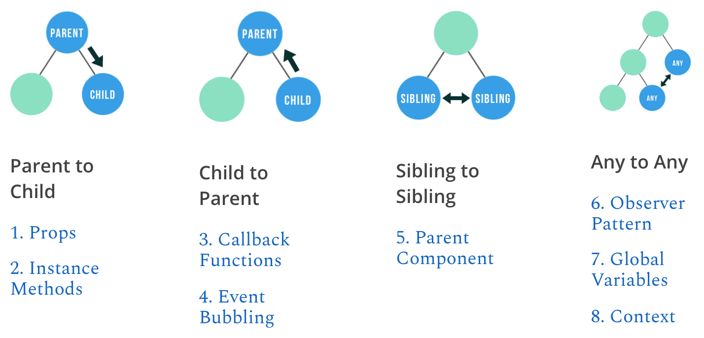
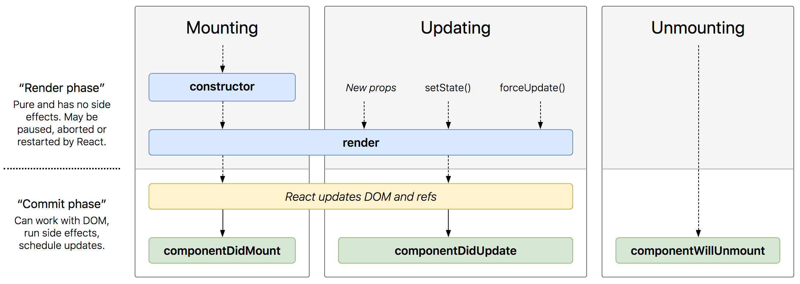

# React Data

---

## Component Types

Remember, always start component names with a **C**apital letter, or using a **`TitleCase`**.

React treats components starting with lowercase letters as DOM tags. For example, `<div />` represents an HTML div tag, but `<Welcome />` represents a component and requires `Welcome` to be in scope (in the same file or being imported).

### `class` Components

`class` component or stateful component is a classic React component. It contains built-in features or lifecycle from `React.Component`.

#### `export`

```jsx
export class Button extends React.Component {
  render() {
    return <button>Text</button>
  }
}
```

```jsx
import { Button } from './components/Button'
```

#### `export default`

```jsx
class Button extends React.Component {
  render() {
    return <button>Text</button>
  }
}

export default Button
```

```jsx
import Button from './components/Button'
```

### `function` Components

`function` component or stateless functional component. It can only `return` or `render` the component directly.

#### `export`

```jsx
export const Button = () => {
  return <button>Text</button>
}
```

#### `export default`

```jsx
const Button = () => {
  return <button>Text</button>
}

export default Button
```

#### One-Line Component with Implicit Return

As you know, using arrow function enables us to implicitly return something:

```jsx
export const Button = () => <button>Text</button>
```

Wow. Compared to this:

```jsx
class Button extends React.Component {
  render() {
    return <button>Text</button>
  }
}

export default Button
```

---

## Components Relationship

In React, one of the first big issues that comes up is figuring out how components should communicate with each other to transfer or exchange data.

```jsx
export const Component1 = () => {
  return <button>Click</button>
}
```

```jsx
export const Component2 = () => {
  return (
    <p>
      <span>Button is clicked?</span>
      <span>YES/NO</span>
    </p>
  )
}
```

For example, what's the best way to tell `Component2` that `Component1` was clicked? If you start to dig a little, you'll get a ton of answers on the Internet 🌈. If you found something like Context, Flux, Redux, or MobX (hmm, what's with the **X**?), ignore them since it's unnecessary for now. We'll cover that later.

There are at least [8 simple strategies](https://www.javascriptstuff.com/component-communication) for communicating between React components.



Before going into those, we have to master what makes a component updates, data from `props` and `state`, along with the lifecycle.

---

## [React Only Updates What's Necessary](https://reactjs.org/docs/rendering-elements.html#react-only-updates-whats-necessary)

React DOM compares the element and its children to the previous one, and only applies the DOM updates necessary to bring the DOM to the desired state.


Even though we create an element describing the whole UI tree on every change, only the element or node whose contents has changed gets updated by React DOM.

In our experience, thinking about how the UI should look at any given moment rather than how to change it over time eliminates a whole class of bugs.

---

## Component Properties and Methods

There are several properties and methods commonly used inside a component. Remember, inside, not outside.

### Instance Properties

- `props`: to **TRANSFER** data from component to other component
- `state`: to handle data **INSIDE** a component

### Class Properties

- `defaultProps`
- `displayName`

### State Methods

- `setState()`: to change the `state` value
- `forceUpdate()`

Remember, these are not exist:

- `getState()`, because there's `this.state`.
- `getProps()`, because there's `this.props`.
- `setProps()`, because we cannot change `props`. We can only change it when the `props` is defined like in `<element property="value">`.

---

## `props`

`props` is used to **TRANSFER** or pass data from parent to child component.

**Parent**

```jsx
import { ButtonStateful } from './components/ButtonStateful'
import { ButtonStateless } from './components/ButtonStateless'

const App = () => {
  return (
    <main>
      <ButtonStateful text='Click Me' />
      <ButtonStateless text='Click You' />
    </main>
  )
}
```

**Child**

```jsx
export class ButtonStateful extends React.Component {
  render() {
    return <button>{this.props.text}</button>
  }
}
```

```jsx
export const ButtonStateless = props => {
  return <button>{props.text}</button>
}
```

### `children` props

We can access some element(s) inside a component through `children` props.

**Parent**

```jsx
import { ButtonStateful } from './components/ButtonStateful'
import { ButtonStateless } from './components/ButtonStateless'

const App = () => {
  return (
    <main>
      <ButtonStateful>Click Me</ButtonStateful>
      <ButtonStateless>Click You</ButtonStateless>
    </main>
  )
}
```

Notice there's no attribute, only text node, but it's still a `props`.

**Child**

```jsx
export class ButtonStateful extends React.Component {
  render() {
    return <button>{this.props.children}</button>
  }
}
```

```jsx
export const ButtonStateless = props => {
  return <button>{props.children}</button>
}
```

### Extra Trips

Using `props`, we can leverage:

- [Composing Components](https://reactjs.org/docs/components-and-props.html#composing-components), so we can use the same components multiple times, but with different `props`
- [Extracting Components](https://reactjs.org/docs/components-and-props.html#extracting-components) if we have a large component, so we can split the elements to separated components
- Pure functions with respect to their `props`, because [Props are Read-Only](https://reactjs.org/docs/components-and-props.html#props-are-read-only). "Purity" or "Pure" because they do not attempt to change their inputs (immutable), and always return the same result for the same inputs.

---

## Typechecking With `PropTypes`

As your app grows, you can catch a lot of bugs with typechecking. For some applications, you can use JavaScript extensions like [Flow](https://flow.org) or [TypeScript](https://typescriptlang.org) to typecheck your whole application. But even if you don't use those, React has some built-in typechecking abilities. To run typechecking on the props for a component, you can assign the special `propTypes` property:

```jsx
import React from 'react'
import PropTypes from 'prop-types'

class Greeting extends React.Component {
  render() {
    return <h1>Hello, {this.props.name}</h1>
  }
}

Greeting.propTypes = {
  name: PropTypes.string
}
```

`PropTypes` exports a range of validators that can be used to make sure the data you receive is valid. In this example, we're using `PropTypes.string`. When an invalid value is provided for a prop, a warning will be shown in the JavaScript console. For performance reasons, `propTypes` is only checked in development mode.

Note: `React.PropTypes` has moved into a different package since React `v15.5`. Please use the `prop-types` library instead.

### PropTypes

Here is an example documenting the different validators provided:

```javascript
import React from 'react'
import PropTypes from 'prop-types'

MyComponent.propTypes = {
  // You can declare that a prop is a specific JS type. By default, these
  // are all optional.
  optionalArray: PropTypes.array,
  optionalBool: PropTypes.bool,
  optionalFunc: PropTypes.func,
  optionalNumber: PropTypes.number,
  optionalObject: PropTypes.object,
  optionalString: PropTypes.string,
  optionalSymbol: PropTypes.symbol,

  // Anything that can be rendered: numbers, strings, elements or an array
  // (or fragment) containing these types.
  optionalNode: PropTypes.node,

  // A React element.
  optionalElement: PropTypes.element,

  // You can also declare that a prop is an instance of a class. This uses
  // JS's instanceof operator.
  optionalMessage: PropTypes.instanceOf(Message),

  // You can ensure that your prop is limited to specific values by treating
  // it as an enum.
  optionalEnum: PropTypes.oneOf(['News', 'Photos']),

  // An object that could be one of many types
  optionalUnion: PropTypes.oneOfType([
    PropTypes.string,
    PropTypes.number,
    PropTypes.instanceOf(Message)
  ]),

  // An array of a certain type
  optionalArrayOf: PropTypes.arrayOf(PropTypes.number),

  // An object with property values of a certain type
  optionalObjectOf: PropTypes.objectOf(PropTypes.number),

  // An object taking on a particular shape
  optionalObjectWithShape: PropTypes.shape({
    color: PropTypes.string,
    fontSize: PropTypes.number
  }),

  // You can chain any of the above with `isRequired` to make sure a warning
  // is shown if the prop isn't provided.
  requiredFunc: PropTypes.func.isRequired,

  // A value of any data type
  requiredAny: PropTypes.any.isRequired
}
```

### Requiring Single Child

With `PropTypes.element` you can specify that only a single child can be passed to a component as children.

```jsx
import React from 'react'
import PropTypes from 'prop-types'

export class MyComponent extends React.Component {
  render() {
    // This must be exactly one element or it will warn.
    const children = this.props.children

    return <div>{children}</div>
  }
}

MyComponent.propTypes = {
  children: PropTypes.element.isRequired
}
```

### Default Prop Values

You can define default values for your `props` by assigning to the special `defaultProps` property:

```jsx
import React from 'react'
import PropTypes from 'prop-types'

export class Greeting extends React.Component {
  render() {
    return <h1>Hello, {this.props.name}</h1>
  }
}

Greeting.propTypes = {
  name: PropTypes.string
}

// Specifies the default values for props:
Greeting.defaultProps = {
  name: 'Stranger'
}

// Renders "Hello, Stranger":
ReactDOM.render(<Greeting />, document.getElementById('example'))
```

---

## Component Methods

Handling events with React elements is very similar to handling events on DOM elements. There are some syntactic differences:

- React event handlers are named using `camelCase` (`onClick`), rather than `lowercase` (`onclick`).
- With JSX you pass any data types including a function as the event handler, rather than a string.

**HTML**

```html
<button onclick="activateLasers()">Activate Lasers</button>
```

**JSX**

```jsx
<button onClick={activateLasers}>Activate Lasers</button>
```

To [handle an `event`](https://reactjs.org/docs/handling-events.html), when we define a a stateful component using an ES6 class, a common pattern is for an event handler to be a method on the class, accessible through `this`:

```jsx
export class MyComponent extends React.Component {
  onClick = () => {
    console.log('Clicked!')
  }

  render() {
    return <button onClick={this.onClick}>Click!</button>
  }
}
```

Or if using a stateless component, use other functions, accessible without through `this`:

```jsx
const onClick = () => {
  console.log('Clicked!')
}

export const MyComponent = () => {
  return <button onClick={onClick}>Click!</button>
}
```

To prevent default behaviors:

```jsx
const ActionLink = () => {
  const handleClick = event => {
    event.preventDefault()
    console.log('The link was clicked, but not open anything')
  }

  return (
    <a href='#' onClick={handleClick}>
      Click me
    </a>
  )
}
```

When using React you should generally not need to call `addEventListener` to add listeners to a DOM element after it is created. Instead, just provide a listener when the element is initially rendered.

---

## `state`

`state` is used to handle data **INSIDE** a class component.

Commonly declared in the `constructor`:

```jsx
export class MyComponent extends React.Component {
  constructor(props) {
    super(props)
    this.state = {
      counter: 0
    }
  }

  render() {}
}
```

Or outside of the `constructor`:

```jsx
export class MyComponent extends React.Component {
  state = {
    counter: 0
  }

  render() {}
}
```

Avoid copying `props` into `state`! This is a common mistake:

```jsx
export class MyComponent extends React.Component {
  constructor(props) {
    super(props)
    // Don't do this! It's a bad practice
    this.state = { color: props.color }
  }
}
```

We cannot use `state` within a stateless functional component, though.

To use or change the `state`, access with `this.state` or modify with `this.setState()`:

### `this.state`

```jsx
export class MyComponent extends React.Component {
  constructor(props) {
    super(props)
    this.state = {
      counter: 0
    }
  }

  render() {
    return (
      <div>
        <button>Click!</button>
        <p>{this.state.counter}</p>
      </div>
    )
  }
}
```

### `this.setState()`

```jsx
export class MyComponent extends React.Component {
  constructor(props) {
    super(props)
    this.state = {
      counter: 0
    }
  }

  // with arrow function
  onClick = () => {
    this.setState({
      counter: this.state.counter + 1
    })
  }

  render() {
    return (
      <div>
        <button onClick={this.onClick}>Click!</button>
        <p>{this.state.counter}</p>
      </div>
    )
  }
}
```

Some example shows that within a stateful component, we need to `bind` the method inside a `constructor` if we're going to use `this.setState()`.

That's why we have to be careful about the meaning of `this` in JSX callbacks. In JavaScript, class methods are not _bound_ by default. If you forget to bind `this.handleClick` and pass it to `onClick`, `this` will be `undefined` when the function is actually called.

```jsx
export class MyComponent extends React.Component {
  constructor(props) {
    super(props)
    this.state = {
      counter: 0
    }
    this.onClick = this.onClick.bind(this)
    // bind onClick with component's this
    // so this is accessible inside onClick
  }

  // without arrow function
  onClick() {
    this.setState({
      counter: this.state.counter + 1
    })
  }

  render() {
    return (
      <div>
        <button onClick={this.onClick}>Click!</button>
        <p>{this.state.counter}</p>
      </div>
    )
  }
}
```

But this is not necessary if we're using arrow function, because the function automatically `bind` with the component.

### Passing Arguments to Event Handlers

Inside a function it is common to want to pass an extra parameter to an event handler. For example, if `id` is defined, either of the following would work:

```js
<button onClick={(event) => this.deleteRow(id, event)}>Delete</button>
<button onClick={this.deleteItem.bind(this, id)}>Delete</button>
```

The above two lines are equivalent, and use [arrow functions](https://developer.mozilla.org/en-US/docs/Web/JavaScript/Reference/Functions/Arrow_functions) and [`Function.prototype.bind`](https://developer.mozilla.org/en-US/docs/Web/JavaScript/Reference/Global_objects/Function/bind) respectively.

In both cases, the `event` argument representing the React `event` that will be passed as a second argument after the ID. With an arrow function, we have to pass it explicitly, but with `bind` any further arguments are automatically forwarded.

---

## Looping Data with `map` and `key`

When we have multiple items from a data (such as array), it is common to loop over the data in order to render each item in an element using `map`:

```jsx
this.state.data.map((item, index) => {
  return <li key={index}>{item}</li>
})
```

Notice that we need a `key` in each child element item in a list, the `key` should be unique as well. [Because keys help React identify](https://reactjs.org/docs/lists-and-keys.html#keys) which items have changed, are added, or are removed. Keys should be given to the elements inside the array to give the elements a stable identity.

```jsx
export class MyComponent extends React.Component {
  constructor(props) {
    super(props)
    this.state = {
      days: [
        'Monday',
        'Tuesday',
        'Wednesday',
        'Thursday',
        'Friday',
        'Saturday',
        'Sunday'
      ]
    }
  }

  render() {
    return (
      <ul>
        {this.state.days.map((day, index) => {
          return <li key={index}>{day}</li>
        })}
      </ul>
    )
  }
}
```

---

## Conditional Rendering

In React, you can create distinct components that encapsulate behavior you need. Then, you can render only some of them, depending on the state of your application.

[Conditional rendering](https://reactjs.org/docs/conditional-rendering.html) in React works the same way conditions work in JavaScript. Use JavaScript operators like [`if`](https://developer.mozilla.org/en-US/docs/Web/JavaScript/Reference/Statements/if...else) or the [conditional operator](https://developer.mozilla.org/en/docs/Web/JavaScript/Reference/Operators/Conditional_Operator) to create elements representing the current state, and let React update the UI to match them.

Consider these two components:

```js
const UserGreeting = props => {
  return <h1>Welcome back!</h1>
}

const GuestGreeting = props => {
  return <h1>Please sign up.</h1>
}
```

The layout is the same, but only the contents are different. We can condition which component will be rendered.

Here a `Greeting` component can displays either of these components depending on whether a user is logged in:

```jsx
const Greeting = props => {
  const isLoggedIn = props.isLoggedIn

  if (isLoggedIn) {
    return <UserGreeting />
  } else {
    return <GuestGreeting />
  }
}

ReactDOM.render(
  // Try changing to isLoggedIn={true}
  <Greeting isLoggedIn={false} />,
  document.getElementById('root')
)
```

### Inline If-Else with Ternary Conditional Operator

We can also use ternary conditional operator (`condition ? true : false`), but it has to be inside `return`:

```jsx
const Notification = props => {
  const isLoggedIn = props.isLoggedIn

  return (
    <div>
      The user is <b>{isLoggedIn ? 'currently' : 'not'}</b> logged in.
    </div>
  )
}
```

```jsx
const Greeting = props => {
  const isLoggedIn = props.isLoggedIn

  return <div>{isLoggedIn ? <UserGreeting /> : <GuestGreeting />}</div>
}
```

```jsx
const AuthNavigation = props => {
  const isLoggedIn = props.isLoggedIn

  return (
    <div>
      {isLoggedIn ? (
        <LogoutButton onClick={this.handleLogoutClick} />
      ) : (
        <LoginButton onClick={this.handleLoginClick} />
      )}
    </div>
  )
}
```

### Inline Condition with Logical `&&` Operator

You may [embed any expressions in JSX](https://reactjs.org/docs/introducing-jsx.html#embedding-expressions-in-jsx) by wrapping them in curly braces. This includes the JavaScript logical `&&` operator. It can be handy for conditionally including an element:

```jsx
const Mailbox = props => {
  const unreadMessages = props.unreadMessages

  return (
    <div>
      <h1>Hello!</h1>
      {unreadMessages.length > 0 && (
        <h2>You have {unreadMessages.length} unread messages.</h2>
      )}
    </div>
  )
}

const messages = ['React', 'Re: React', 'Re:Re: React']

ReactDOM.render(
  <Mailbox unreadMessages={messages} />,
  document.getElementById('root')
)
```

Combined with loop:

```jsx
const Mailbox = props => {
  const unreadMessages = props.unreadMessages

  return (
    <div>
      <h1>Hello!</h1>
      {unreadMessages.length > 0 && (
        <section>
          <p>
            You have <b>{unreadMessages.length}</b> unread messages.
          </p>
          <ul>
            {unreadMessages.map((title, index) => {
              return <li key={index}>{title}</li>
            })}
          </ul>
        </section>
      )}
    </div>
  )
}
```

---

## Fragments

A common pattern in React is for a component to return multiple elements. But we cannot return multiple elements directly, we need a wrapper element to do that, such as using `<div>`.

```jsx
class MyComponent extends React.Component {
  render() {
    return (
      <div>
        <ChildA />
        <ChildB />
        <ChildC />
      </div>
    )
  }
}
```

Because that ineffeciency, we can use [Fragments](https://reactjs.org/docs/fragments.html) that let the component return a group of children without adding extra nodes to the DOM.

```jsx
class MyComponent extends React.Component {
  render() {
    return (
      <React.Fragment>
        <ChildA />
        <ChildB />
        <ChildC />
      </React.Fragment>
    )
  }
}
```

---

## Component Lifecycle

In a component, the only method you _must_ define in a `React.Component` subclass is called `render()`. All the other methods are optional.

Each component has several "lifecycle methods" that you can override to run code at particular times in the process. **You can use [this lifecycle diagram](http://projects.wojtekmaj.pl/react-lifecycle-methods-diagram/) as a cheat sheet.** In the list below, commonly used lifecycle methods are marked as **bold**. The rest of them exist for relatively rare use cases.



### Mounting

These methods are called in the following order when an instance of a component is being created and inserted into the DOM:

- **`constructor()`**: If you don’t initialize state and you don’t bind methods, you don’t need to implement a constructor for your React component.
- `static getDerivedStateFromProps()`: We don't need it for now.
- **`render()`**: The only required method in a `class` component. You can directly return a JSX in a `function` component.
- **`componentDidMount()`**: Invoked immediately after a component is mounted (inserted into the tree). Initialization that requires DOM nodes should go here. If you need to load data from a remote endpoint, this is a good place to instantiate the network request.

These methods are considered legacy and you should [avoid them](/blog/2018/03/27/update-on-async-rendering.html) in new code:

- `UNSAFE_componentWillMount()`: Don't use it anymore.

### Updating

An update can be caused by changes to props or state. These methods are called in the following order when a component is being re-rendered:

- `static getDerivedStateFromProps()`: We don't need it for now.
- `shouldComponentUpdate()`: We don't need it for now.
- **`render()`**: Render runs in both Mounting and Updating.
- `getSnapshotBeforeUpdate()`: We don't need it for now.
- **`componentDidUpdate()`**: Invoked immediately after updating occurs. This method is not called for the initial render.

These methods are considered legacy and you should [avoid them](/blog/2018/03/27/update-on-async-rendering.html) in new code:

- `UNSAFE_componentWillUpdate()`: Don't use it anymore.
- `UNSAFE_componentWillReceiveProps()`: Don't use it anymore.

### Unmounting

This method is called when a component is being removed from the DOM:

- **`componentWillUnmount()`**: Invoked immediately before a component is unmounted and destroyed. Perform any necessary cleanup in this method, such as clearing up state, invalidating timers, canceling network requests, or cleaning up any subscriptions data that were created in `componentDidMount()`.

### Error Handling

These methods are called when there is an error during rendering, in a lifecycle method, or in the constructor of any child component.

- `componentDidCatch()`
- `static getDerivedStateFromError()`

---

## React Data References

### Official

- Main Concepts
  - [Hello World](https://reactjs.org/docs/hello-world.html)
  - [Introducing JSX](https://reactjs.org/docs/introducing-jsx.html)
  - [Rendering Elements](https://reactjs.org/docs/rendering-elements.html)
  - [Components and Props](https://reactjs.org/docs/components-and-props.html)
  - [State and Lifecycle](https://reactjs.org/docs/state-and-lifecycle.html)
  - [Handling Events](https://reactjs.org/docs/handling-events.html)
  - [Conditional Rendering](https://reactjs.org/docs/conditional-rendering.html)
  - [Lists and Keys](https://reactjs.org/docs/lists-and-keys.html)
  - [Forms](https://reactjs.org/docs/forms.html)
  - [Lifting State Up](https://reactjs.org/docs/lifting-state-up.html)
  - [Composition vs Inheritance](https://reactjs.org/docs/composition-vs-inheritance.html)
  - [Thinking In React](https://reactjs.org/docs/thinking-in-react.html)
- Advanced Guides
  - [Fragments](https://reactjs.org/docs/fragments.html)
  - [Typechecking With PropTypes](https://reactjs.org/docs/typechecking-with-proptypes.html)
- API Reference
  - [React.Component Lifecycle](https://reactjs.org/docs/react-component.html)
    - [React lifecycle methods diagram](http://projects.wojtekmaj.pl/react-lifecycle-methods-diagram)

### Essentials

- [8 no-Flux strategies for React component communication](https://www.javascriptstuff.com/component-communication)
- [How to communicate between Components – freeCodeCamp.org](https://medium.freecodecamp.org/how-to-communicate-between-components-b48ef70bf913)
- [React: Communication Between Components – Bits and Pieces](https://blog.bitsrc.io/react-communication-between-components-c0cfccfa996a)

### In Bahasa Indonesia

- [React Prop & State, Apa bedanya ? – Coderupa – Medium](https://medium.com/coderupa/react-prop-state-apa-bedanya-7ee61df8257f)
- [Komunikasi Data antar Component React – Coderupa – Medium](https://medium.com/coderupa/komunikasi-data-antar-component-react-554c8834a3c1)
