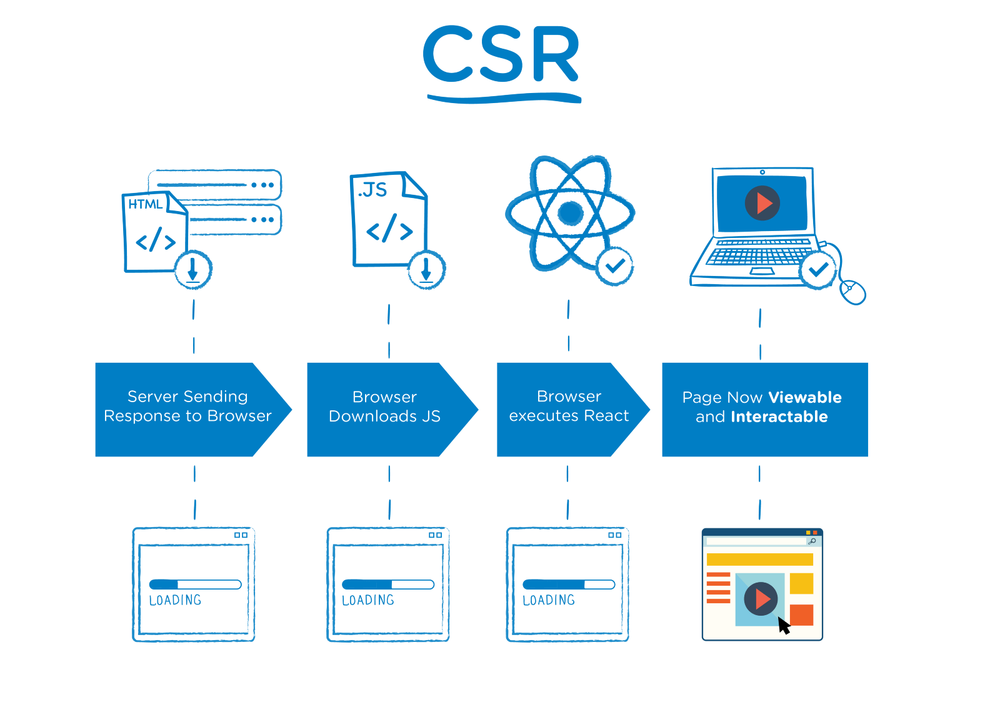
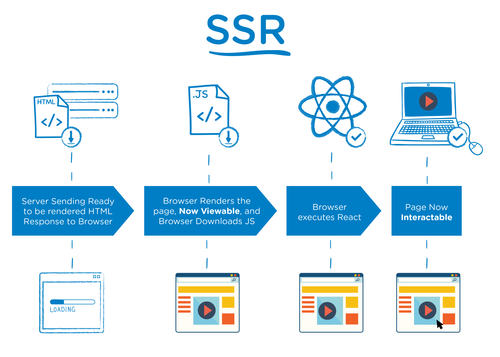
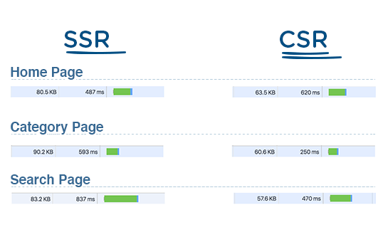

# React SSR

---

## SSR vs CSR


SSR (Server Side Rendering) behaves differently with the default CSR (Client Side Rendering) app. SSR allows application to take a client-side JavaScript framework website and render it to static HTML and CSS on the server, before or when requested by the client.

**Why is this important?** We all want fast loading websites and SSR is a tool to help you get your website rendered faster. SSR flips the process of rendering a JavaScript framework app and when done right can give your users a better page load.



In short, in CSR:

- Browser request the app files from the server
- Server response with just the files, plain HTML, CSS, and JavaScript
- The JavaScript is not even run or render the app
- Browser need to render the app when it arrives in front of the user
- There might be a slower load or some things might break



In SSR:

- Browser request the app files from the server
- Server response with the files, plain HTML, CSS, and JavaScript
- But previously, thehe JavaScript is already run or render the app, so the HTML already contains the important parts of the app
- Browser already have the app's content, so it's faster, some things might already work
- Browser might just need to render the remaining minor parts of the app when it arrives in front of the user

Overall, the load would be slimmer or faster with SSR:



---

## React SSR

In React, there some popular SSR solutions, built out of the box:

- [Next.js - The React Framework](https://nextjs.org). Impact Byte uses this because it's the pioneer.
- [GatsbyJS](https://www.gatsbyjs.org)

What really needs to be noticed that they have their own built in router (`next/link`) and utility solutions as well, so we need to use them instead of the other community's solution (`react-router-dom`).

```jsx
import Link from 'next/link'

export default function Index() {
  return (
    <div>
      <h1>Hello Next.js 👋</h1>
      <Link href='/about'>
        <a>About</a>
      </Link>
    </div>
  )
}
```

---

## React SSR + Netlify

When we use React Router with Netlify, we have a drawback of not able to render the other pages when we access them directly (not from the homepage). It will throw a 404 error. Because the actual page needs to be rendered in CSR fashion by default.

To configure it make React Router work well in Netlify, read the article on ["How to Build a Serverless, SEO-friendly React blog in Netlify" → "Deploying to Netlify"](https://www.netlify.com/blog/2017/09/26/how-to-build-a-serverless-seo-friendly-react-blog/#deploying-to-netlify).

It's not exactly SSR, but a close approach called prerendering.

In short:

- **Enable Prerendering** in **Build & Deploy**
- Create a `_redirects` file in our build directory with: `/* /index.html 200`
- To make sure this file gets redirected each time we build our app, we can update our `build` script in `package.json`: `"build": "react-scripts build && echo '/* /index.html 200' > build/_redirects"`

---

## React SSR References

- [What is Server-Side Rendering? (Server-side Rendering with JavaScript Frameworks) - YouTube](https://www.youtube.com/watch?v=GQzn7XRdzxY)
  - [Server-side Rendering React from Scratch! (Server-side Rendering with JavaScript Frameworks) - YouTube](https://www.youtube.com/watch?v=82tZAPMHfT4&list=PLl-K7zZEsYLkbvTj8AUUCfBO7DoEHJ-ME&index=6&t=0s)
- [The Benefits of Server Side Rendering Over Client Side Rendering](https://medium.com/walmartlabs/the-benefits-of-server-side-rendering-over-client-side-rendering-5d07ff2cefe8)
- [Prerendering | Netlify](https://www.netlify.com/docs/prerendering)
- [Prerendering Explained | Netlify](https://www.netlify.com/blog/2016/11/22/prerendering-explained)
- [Prerender - Dynamic Rendering for JavaScript Website SEO](https://prerender.io)
