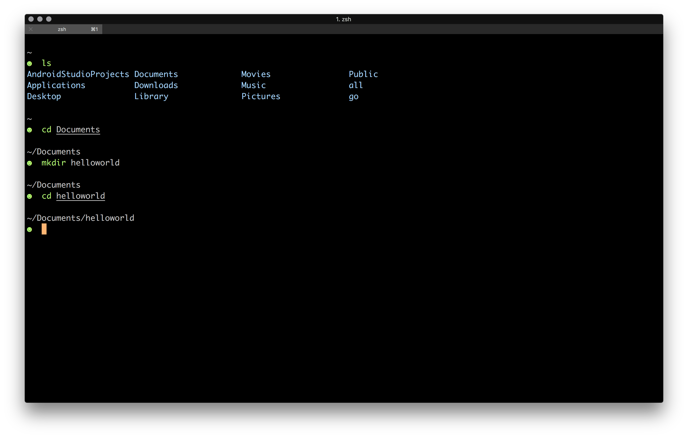
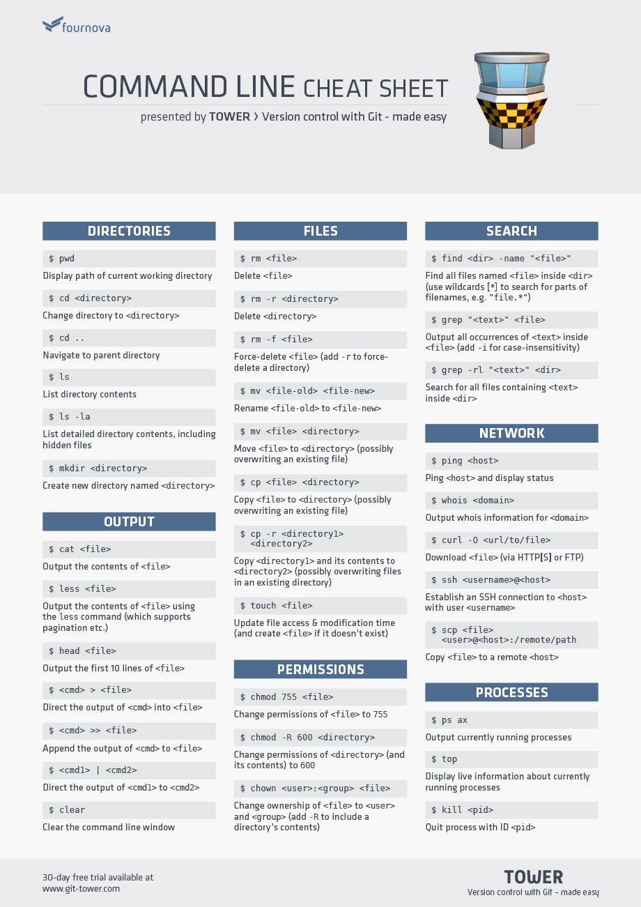

# Terminal Basic

## Terminal for CLI

- Terminal is using CLI to interact with.
- In Linux Ubuntu, We can use built in terminal called "Terminal".
- In Mac, there's a built in one, but it's recommended to use "iTerm2". Get help from our mentor for installation.
- In terminal, we will commonly see some names, folders/directories, files, extensions, and know where our home folder is.

After you open your terminal, usually it looks like:



The prompt looks like:

```sh
yourname@computer:~$
```

or can be as simple as:

```sh
$
```

Then you can use any of these programs, apps, or commands:

- Navigation
  - `ls`: list all files and folders
  - `clear`: clear the terminal screen
  - `ctrl+l`: shortcut to clear the terminal screen
- File Manipulation
  - `touch`: create a blank file
  - `cp`: copy file or folder to another file
  - `mv`: move or rename file or folder
  - `rm`: remove or delete file or folder
- Folder/Directory Manipulation
  - `mkdir`: make directory
  - `cd`: change directory
  - `pwd`: print working directory
- Text
  - `echo`: print text
  - `cat`: concatenate or see text inside a file
  - `less`: see text inside a file
- Help
  - `which`: see which app is being used
  - `man`: see manual of an app
- Root User
  - `sudo`: "super user do"
- Installation
  - `brew` on macOS
  - `apt` on Ubuntu
  - `rpm` on Fedora

Display all files and folders in current path:

```sh
$ ls
Documents  Pictures  Templates
Downloads  Music  Public  Videos
Audio  Desktop
```

Creating files:

```sh
# create a blank file
$ touch file.txt

# create a blank file
$ touch README.md

# copy file to another file
$ cp file.txt file.md

# move or rename file
$ mv file.txt index.txt

# remove or delete file
$ rm file.md
```

Moving between folders:

```sh
# change directory into Documents
$ cd Documents

# change directory to above
$ cd ..

# print working directory
$ pwd
/home/yourname

# change directory to the previous one
$ cd -

# print working directory again
$ pwd
/home/yourname/Documents
```

Operation with text or file contents:

```sh
# print some text
$ echo 'Hello World'

# concatenate or see text inside a file
$ cat file.txt

# see text inside a file
$ less file.txt
```

Get help with manual page:

```sh
# run manual
$ man

# see manual of ls
$ man ls

# see manual of cd
$ man cd
```

Editing text with CLI code editors:

```sh
# edit with nano
$ nano file.txt
```

To quit `nano`, type `Ctrl+X`, then save the file.

```sh
# edit with vim
$ vim file.txt
```

To quit `vim`, type `:wq`, to save (write) and quit the file.

### Naming Tips

The best practice for naming is that we use all lowercase characters with a clear name:

```sh
touch hello.txt

mkdir project
```

In exception of `README.md`, because it's a special file.

If we need to use more than one word, use `-` (dash) character:

```sh
touch hello-world.txt

mkdir project-code
```

As much as possible, avoid uppercase character and space character.

## Terminal References

You can always lookup command line cheat sheets on the Web.

- [Command Line Cheat Sheet](https://www.git-tower.com/blog/command-line-cheat-sheet)
- [Linux Commands Cheat Sheet | Linux Training Academy](https://www.linuxtrainingacademy.com/linux-commands-cheat-sheet)

[](https://www.git-tower.com/blog/command-line-cheat-sheet)
