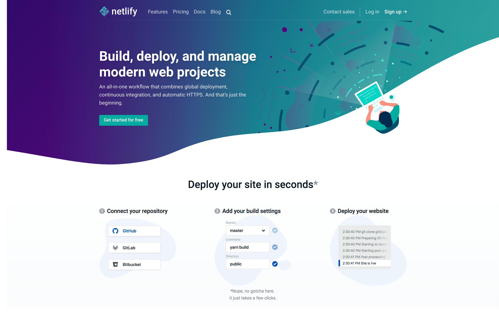
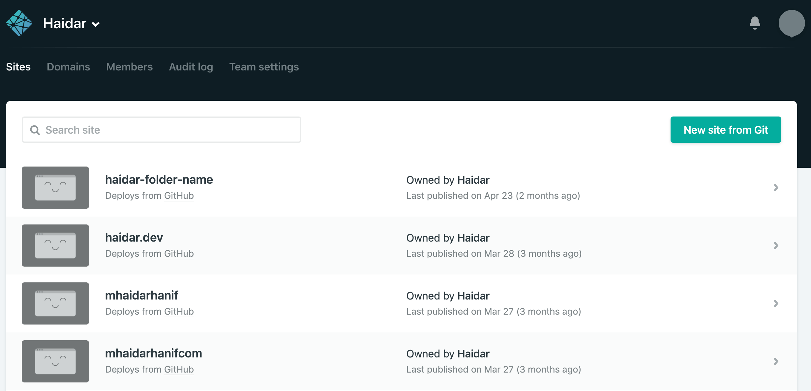

# Web Deployment

For beginners, we can use free tools to deploy or upload our website (that is coded with HTML). Deployment means we make our project live for public, so everyone can see.

## [Netlify](https://netlify.com)

- It's free for life!
- Easy deployment. just drag and drop our folder to deploy. or connect with GitHub repo to deploy automatically after push some changes.
- Netlify lives on <https://project-name.netlify.com> URL format. So you can have your own name like `alexander.netlify.com`.

Watch the official video tutorials here:

- [Netlify Tutorial – Deploy a new site just by Drag and Dropping - YouTube](https://www.youtube.com/watch?v=vywDFg2uIxY)
- [Netlify Tutorial – Deploying from Git - YouTube](https://www.youtube.com/watch?v=mN9oI98As_4)

## [GitHub Pages](https://pages.github.com)

- It's also free for life!
- Available after we create a GitHub repo.
- GitHub pages lives on <https://username.github.io> or <https://username.github.io/project-name> URL format. So you can have your own name like `alexander.github.io`.
- The downside is just it's slower than Netlify.
