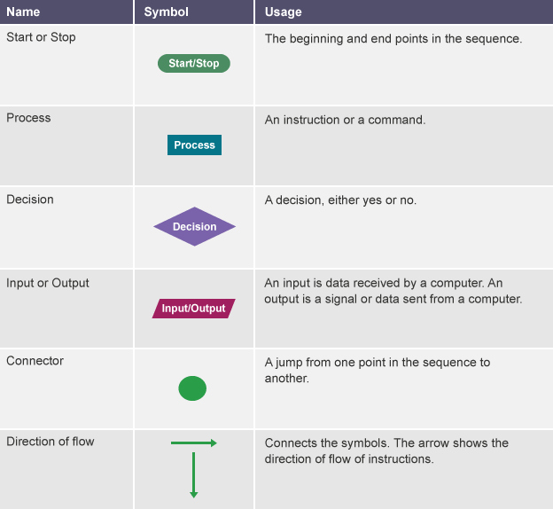
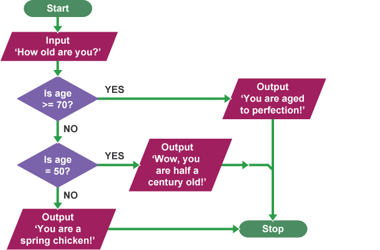

# Algorithm Basic

Algorithm is a way to develop a _step by step solution_ to the problem or the _rules to follow_ to solve the problem. Most of the time we have to use our own or our collective logic to build an algorithm.

Algorithms mostly consist of:

- **Input** from outside: data and their quantities
- **Process** inside the system: steps, functions, or methods
- **Output** to outside: finished result


Algorithms are used in all areas of computing such as:

- Search engine ranking, PageRank, Google's search engine algorithm
- Weather forecasting
- Automating to decide the price of products
- Finding the fastest or the closest path from point A to B in a map

## Example of Inputs

- data
  - text
  - number
  - boolean
  - array (multiple items) of data
- keyboard
- mouse
- microphone
- scanner
- camera
- pressure sensor
- temperature sensor
- magnetic sensor
- moisture sensor
- light sensor

## Example of Processes

- adding data
- substracting data
- multiplying data
- dividing data
- searching data
- sorting data

## Example of Outputs

- another data
- printers
- speakers
- motors
- monitors
- heaters
- electromagnets
- bulbs/LEDs

---

## Algorithm Design

Before designing an algorithm it is important to first understand what the problem is. Algorithms can be designed using **pseudocode** or a **flowchart**, and the standard notations of each should be known.

When designing an algorithm there are two main areas to look at:

- the **big picture**: What is the final goal?
- the **individual stages**: What steps or hurdles need to be overcome on the way to the goal?

Before an algorithm can be designed, it is important to check that the problem is completely understood. There are a number of basic things to know in order to really understand the problem:

- What are the **inputs** into the problem?
- What will be the **outputs** of the problem?
- In what order do **instructions** need to be carried out?
- What **decisions** need to be made in the problem?
- Are any areas of the problem **repeated**?

Common examples of algorithm usage:

- **Searching**: Searching for data can be very difficult. Searching algorithms, such as serial search and binary search, make the process of searching for data much easier. Search algorithms prevent you from having to look through lots of data to find the information you are searching for.
  - serial search
  - binary search
- **Sorting**: Putting data into order can be difficult and time consuming. Sorting algorithms, such as bubble sort and bucket sort can help with this.
  - bubble sort
  - bucket sort

---

## Algorithm Parts

Algorithms have data values that can be constant (fixed) or variable. These values are stored in a memory location and can be changed, depending on the output that is needed.

### Constants

Data values that stay the same every time a program is executed are known as constants. Constants are not expected to change.

Literal constants are actual values fixed into the source code. An example of this might be the character string "hello world". The data value "hello world" has been fixed into the code.

Named constants are values where a name is defined to be used instead of a literal constant. An example of this might be stating that the 'starting level' of a game is always referred to as 1.

Examples of a constant within a game might be:

- the unit of gravity
- the number of lives available for the player
- the amount of time allowed for a level in a game

### Variables

Variables are data values that can change when the user is asked a question, for example, their age. Variables may change during program execution.

A variable is a memory location. It has a name that is associated with that location. The memory location is used to hold data.

### Assignment

In order to change the data value stored in a variable, you use an operation called assignment. This causes the value to be copied into a memory location, overwriting what was in there before.

Different values may be assigned to a variable at different times during the execution of a program. Each assignment overwrites the current value with a new one.

### Scope

The scope of variables can be local or global.

- **local** variables only work in the loop, procedure or class they are created in
- **global** variables can be accessed from any point in a program

### Declarations

Declaring a name for a variable is saying what the data type will be and where it will be stored in memory.

---

## Algorithm Building Blocks (Constructs)

### Sequencing

Sequencing is the specific order in which instructions are performed in an algorithm.. Algorithms consist of instructions that are carried out (performed) one after another. It is crucial that the steps in an algorithm are performed in the right order - otherwise the algorithm will not work correctly. A computer can only do what it is programmed to do. If the steps are programmed in the wrong sequence, the computer will perform the tasks in this sequence – even if this is incorrect.

Sequencing is implemented in programming using:

- `NAME`/`KEY` variable
- `PRINT` or `LOG` statement
- `=` assignment expression
- `+`, `-`, `*`, etc operator expression

### Selection

Selection is a decision or question. Selection allows there to be more than one path through a program. At some point, a program may need to ask a question because it has reached a step where one or more options are available. Depending on the answer given, the program will follow a certain step and ignore the others.

Selection is implemented in programming using:

- `IF` statement
- `IF...ELSE` statement
- `ELSE IF` statement

### Iteration

Iteration is the process of repeating steps. Algorithms consist of steps that are carried out (performed) one after another. Sometimes an algorithm needs to repeat certain steps until told to stop or until a particular condition has been met. Iteration allows us to simplify our algorithm by stating that we will repeat certain steps until told otherwise. This makes designing algorithms quicker and simpler because they don’t have to include lots of unnecessary steps.

There are two ways in which programs can iterate or 'loop':

- **count-controlled** loops: in a range of numbers, such as from 0 to 100
- **condition-controlled** loops: in a specific condition, such as when the toggle is true

Iteration is implemented in programming using:

- `FOR` statement
  - `FOR...OF` statement
  - `FOR...IN` statement
- `WHILE` statement
  - `DO WHILE` statement

---

## Logical Reasoning

Logical reasoning is the process of applying rules to problem solving. Algorithms are designed as a set of steps to follow to solve a problem. At the same time, a set of rules is determined.

Rules are built using logical reasoning to ensure that the algorithm performs correctly.

When trying to solve a problem, it may be that more than one solution is found. A different algorithm can be built from each solution. Logical reasoning determines if algorithms will work by predicting what happens when the algorithm’s steps (and the rules they consist of) are followed.

Predictions from each algorithm can be used to compare solutions and decide on the best one.

---

## Flowchart

A flowchart is a diagram that represents a set of instructions. Flowcharts normally use standard symbols to represent the different types of instructions. These symbols are used to construct the flowchart and show the step-by-step solution to the problem.

A flow chart shows the key points in an algorithm:

- the start and end
- the order in which the sequences of instructions are performed
- the points where inputs and outputs occur
- the points where decisions are made about what to do next

The most commonly used symbols are:

- start or stop (end)
- input/output
- decision
- process






---

## Pseudocode

You can write algorithms in plain English before you decide which programming language you want to use. Writing algorithms this way is called pseudocode.

Pseudocode is not a programming language, it is a simple way of describing a set of instructions that does not have to use specific syntax.

This is a good way of working out exactly what you need to do before you start coding. It is also a good way of sharing your ideas with other people. There is no 'exactly right' form for a pseudocode algorithm - as long as it makes sense to others.

The most important things about a pseudocode algorithm are:

- it is correct
- it is written in a form that can be understood by fellow programmers
- what is intended is clear, and not at all ambiguous
- it can be implemented on the computer system it is written for

### Pseudocode Notation

There is no strict set of standard notations for pseudocode, but some of the most widely recognised are:

- **INPUT**: indicates a user will be inputting something
- **OUTPUT**: indicates that an output will appear on the screen
- **WHILE**: a loop (iteration that has a condition at the beginning)
- **FOR**: a counting loop (iteration)
- **REPEAT** – **UNTIL**: a loop (iteration) that has a condition at the end
- **IF** – **THEN** – **ELSE**: a decision (selection) in which a choice is made
- any instructions that occur inside a selection or iteration are usually indented

```txt
REPEAT
	OUTPUT 'What is the best subject you take?'
	INPUT user inputs the best subject they take
	STORE the user's input in the answer variable
	IF answer = 'Computer Science' THEN
		OUTPUT 'Of course it is!'
	ELSE
		OUTPUT 'Try again!'
UNTIL answer = 'Computer Science'
```

---

## Actual Code

Either after you have or have not created the flowchart or pseudocode, you can code your in the actual programming language of your choice.

```js
console.log('Start Program Person Age')

const ageInput = window.prompt('How old are you?')
const age = Number(ageInput)

if (age >= 70) {
  window.alert('You are aged to perfection!')
} else if (age >= 50) {
  window.alert('Wow, you are half a century old!')
} else {
  window.alert('You are a spring chicken!')
}

console.log('Stop Program Person Age')
```

### Syntax

Syntax is the set of rules about how to use a particular language. In the same way that English has rules, so do programming languages.

### Statements

A statement is a single action in a computer program.

In a computer program, statements might include some of the following actions:

- **input data**: for example, ask the user a question or collect a value from a sensor
- **process data**: for example, add two values together or make a decision when a value reaches a certain amount
- **output data**: display some results or play a sound

A simple statement in a computer program could be this one:

**JavaScript**

```js
console.log('Hello World')
window.alert('Hello World')
```

**Python**

```py
print("Hello World")
```

Statements can be more complex and contain many other smaller elements.

**JavaScript**

```js
if (c !== 'q' || c !== 'quit') {
  console.log('Quite')
}
```

**Python**

```py
if (c != "q") or (c != "quit"):
	print "alert")
```

### Expressions

Expressions are used within statements when working with values. For example, `2 + 2` is an expression that returns the value of `4`. In a computer program, an expression to work out your age might look like this:

**JavaScript**

```js
const ageNextYear = currentAge + 1
```

**Python**

```py
AgeNextYear = CurrentAge + 1
```

---

## Algorithm Basic References

- [Algorithms - KS3 Computing - BBC Bitesize](https://www.bbc.com/bitesize/topics/z7d634j)
  - [Introducing algorithms - Revision 1 - GCSE Computer Science - BBC Bitesize](https://www.bbc.com/bitesize/guides/z22wwmn/revision/1)
  - [Designing an algorithm - Revision 1 - KS3 Computer Science - BBC Bitesize](https://www.bbc.com/bitesize/guides/z3bq7ty/revision/1)
