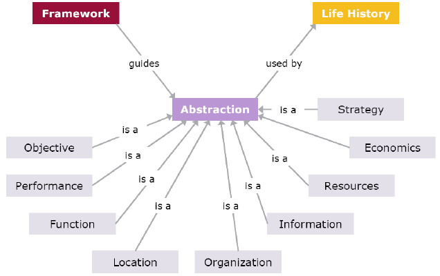

# API Basic

## Introduction to API (Application Programming Interface)

API is a way to communicate with technology as a markup language, styling language, programming language, graphic language, library, protocol, network, etc.

API is one of the form of abstraction so anyone outside of the creator of the technoloqy can communicate with it.

So when you use Markdown, HTML, CSS, JavaScript, and other computer languages; you already use API.

## Various API Reference or Documentation

- [Markdown](https://commonmark.org/help)
- [HTML](https://developer.mozilla.org/en-US/docs/Web/HTML): Hypertext Markup Language
- [CSS](https://developer.mozilla.org/en-US/docs/Web/CSS): Cascading Style Sheets
- [JavaScript](https://developer.mozilla.org/en-US/docs/Web/JavaScript)
- Library and Framework
- [HTTP](https://developer.mozilla.org/en-US/docs/Web/HTTP): Hypertext Transfer Protocol
- [REST](https://developer.mozilla.org/en-US/docs/Glossary/REST): Representational State Transfer
- [SOAP](https://developer.mozilla.org/en-US/docs/Glossary/SOAP): Simple Object Access Protocol
- [GraphQL](https://graphql.org): Graph Query Language
- [WebSocket](https://developer.mozilla.org/en-US/docs/Web/API/WebSockets_API)
- [WebRTC](https://developer.mozilla.org/en-US/docs/Web/API/WebRTC_API): Web Real-Time Communications
- [WebGL](https://developer.mozilla.org/en-US/docs/Web/API/WebGL_API): Web Graphics Library
- [Streaming](https://www.quora.com/What-is-meant-by-streaming-API)

## Web API Documentation

- [MDN (Mozilla Developer Network)](https://developer.mozilla.org/en-US)
- [DevDocs](https://devdocs.io)
- [Zeal](https://zealdocs.org)

## File Extension and Folder Types

Most of APIs are only able to work with a specific file extensions or folder types.

- `README.md`
- `index.html`
- `index.css`
- `index.sass`
- `index.less`
- `index.styl`
- `index.js`
- `index.jsx`
- `index.ts`
- `index.tsx`
- `package.json`
- `manifest.json`
- `yarn.lock`
- `script.sh`
- `webpack.config.js`
- `.babelrc`
- `.gitignore`
- `.env`
- `.env.template`
- `.vscode/settings.json`
- `assets`
  - `assets/images`
  - `assets/styles`
  - `assets/scripts`
- `node_modules`
