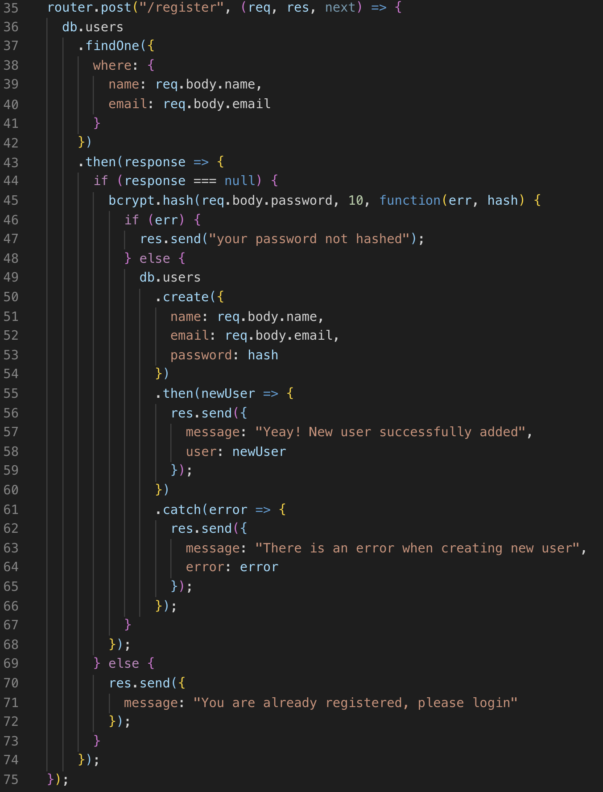
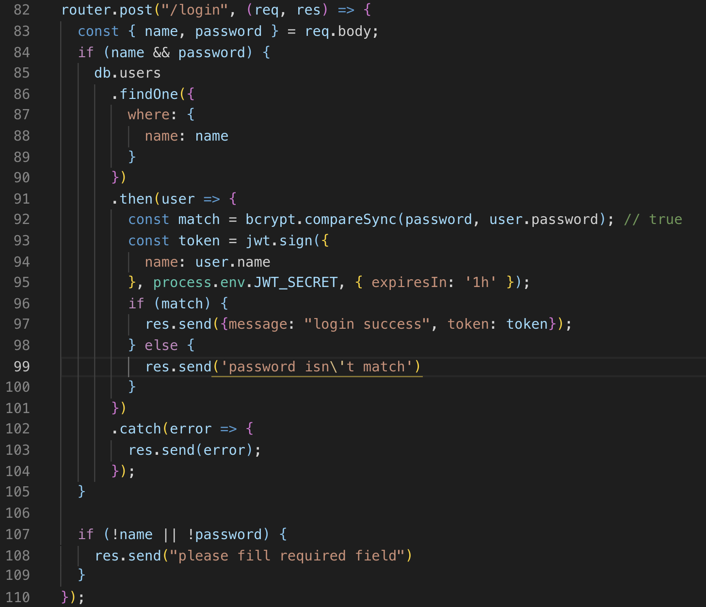

# Authentication & Authorization

---

## Authentication

Authentication means confirming your ownidentity, whereas authorization meansbeing allowed access to the system. Ineven more simpler terms authentication isthe process of verifying oneself, whileauthorization is the process of verifyingwhat you have access to.

authentication factors can vary from one of the following:

- **Single- Factor Authentication**: This is the simplest form of authentication method which requires a password to grant user access to a particular system such as a website or a network. The person can request access to the system using only one of the credentials to verify one’s identity. For example, only requiring a password against a username would be a way to verify a login credential using single- factor authentication.
- **Two- Factor Authentication**: This authentication requires a two- step verification process which not only requires a username and password, but also a piece of information only the user knows. Using a username and password along with a confidential information makes it that much harder for hackers to steal valuable and personal data.
- **Multi- Factor Authentication**: This is the most advanced method of authentication which requires two or more levels of security from independent categories of authentication to grant user access to the system. This form of authentication utilizes factors that are independent of each other in order to eliminate any data exposure. It is common for financial organizations, banks, and law enforcement agencies to use multiple- factor authentication.

## Authorization

Authorization is the process to determine whether the authenticated user has access to the particular resources. A good example of this is, once verifying and confirming employee ID and passwords through authentication, the next step would be determining which employee has access to which floor and that is done through authorization.

---

# Database Auth

Encrypt user's credentials such as password with bcrypt.

## Authentication Flow

Register or signup for a new account:

1.  Encrypt the password body with bcrypt hash
2.  Create the user in the database
3.  Create the token with JWT sign
4.  Response with a token and user data (without password)

Login or signin for an existing account:

1.  Find the requested user email or username
    - If error, tell user is not found
2.  Validate the password with bcrypt compare
    - If error, tell password is invalid
3.  Create the token with JWT sign
4.  Response with a token and user data

---

## References

### Documentations

- [`bcrypt`](https://npm.im/bcrypt)
- [`jsonwebtoken`](https://npm.im/jsonwebtoken)
- [JSON Web Tokens - jwt.io](https://jwt.io)
  - [JSON Web Token Introduction - jwt.io](https://jwt.io/introduction)
  - [JSON Web Token (JWT) explained](https://flaviocopes.com/jwt)
  - [JWT Analyzer & Inspector Chrome Extension](https://chrome.google.com/webstore/detail/jwt-analyzer-inspector/henclmbnehmcpbjgipaajbggekefngob?hl=en)
  - [JWT Debugger Chrome Extension](https://chrome.google.com/webstore/detail/jwt-debugger/ppmmlchacdbknfphdeafcbmklcghghmd?hl=en)

---
