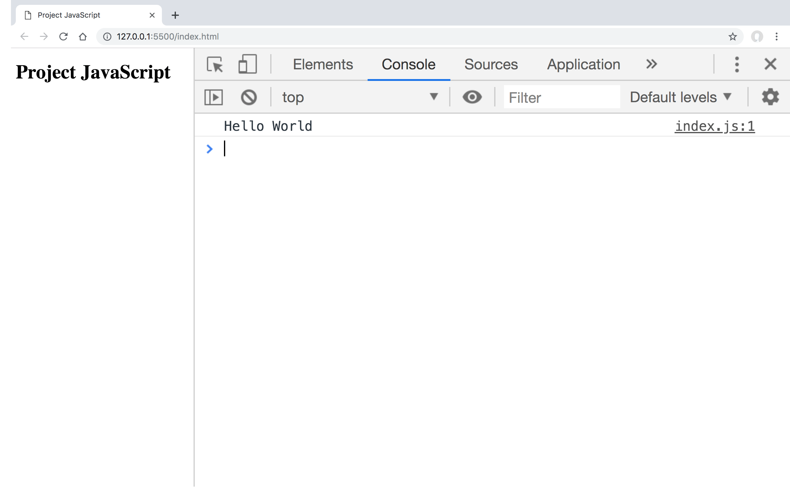
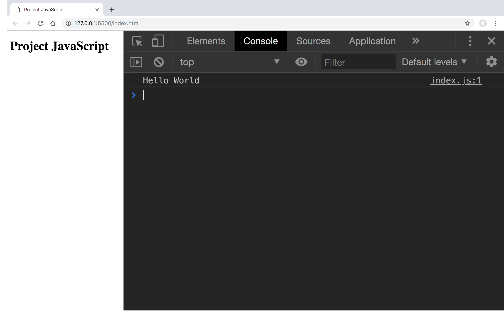
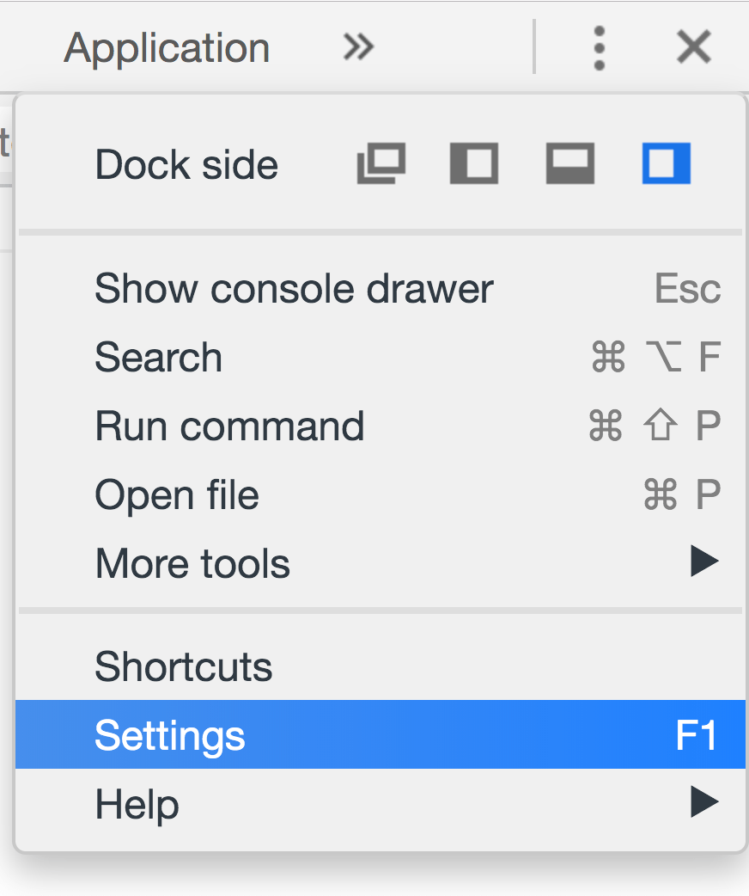
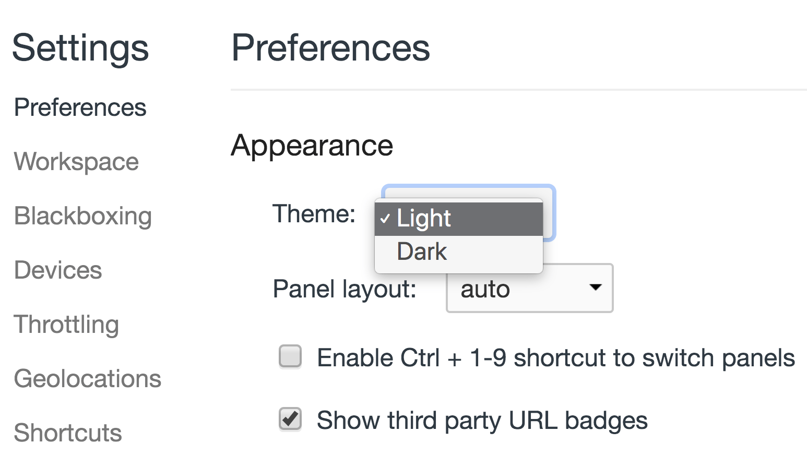

# Chrome DevTools Console

Code is prone to errors. You will quite likely make errors.

But in the browser, users don’t see errors by default. So, if something goes wrong in the script, we won’t see what’s broken and can’t fix it.

To see errors and get a lot of other useful information about scripts, "developer tools" have been embedded in browsers.

Most developers lean towards Chrome or Firefox for development because those browsers have the best developer tools aka DevTools™. Other browsers also provide developer tools, sometimes with special features, but are usually playing "catch-up" to Chrome or Firefox. So most developers have a "favorite" browser and switch to others if a problem is browser-specific.

Developer tools are potent, they have many features. To `Infinity` and beyond!

## Console Tab

Below the error message, there is a blue `>` symbol. It marks the "command line prompt" where we can type JavaScript commands. Press `Enter` to run them. To insert multiple line, press `Shift+Enter`.

We can also change the appearance theme:

## Chrome DevTools Console References

- [Chrome DevTools Overview - Google Chrome](https://developer.chrome.com/devtools)
- [Using the Console | Tools for Web Developers | Google Developers](https://developers.google.com/web/tools/chrome-devtools/console)
- [Developer console - JavaScript.info](http://javascript.info/devtools)
