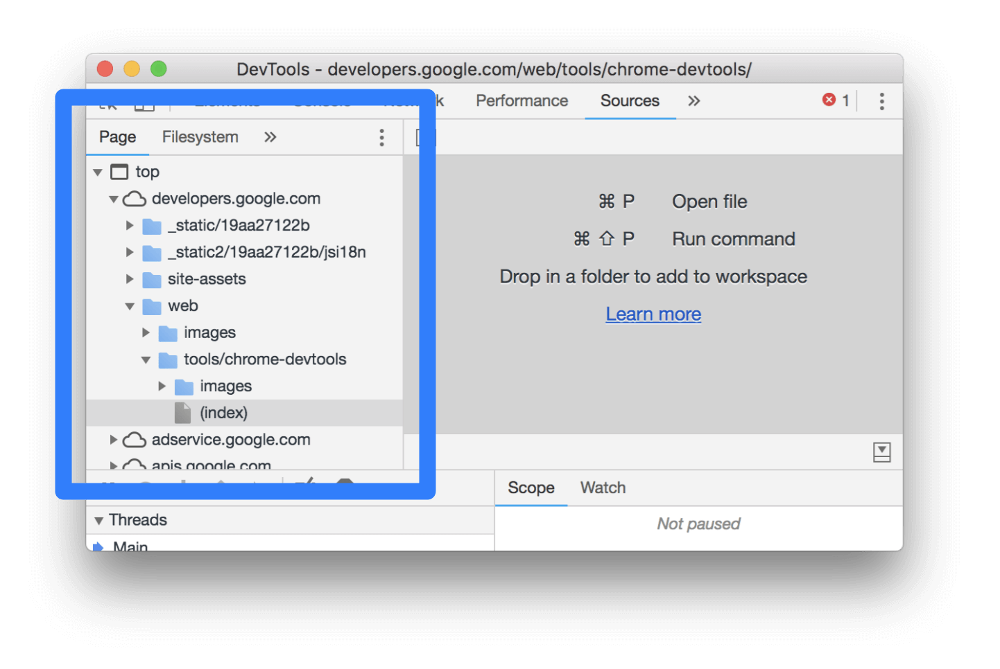
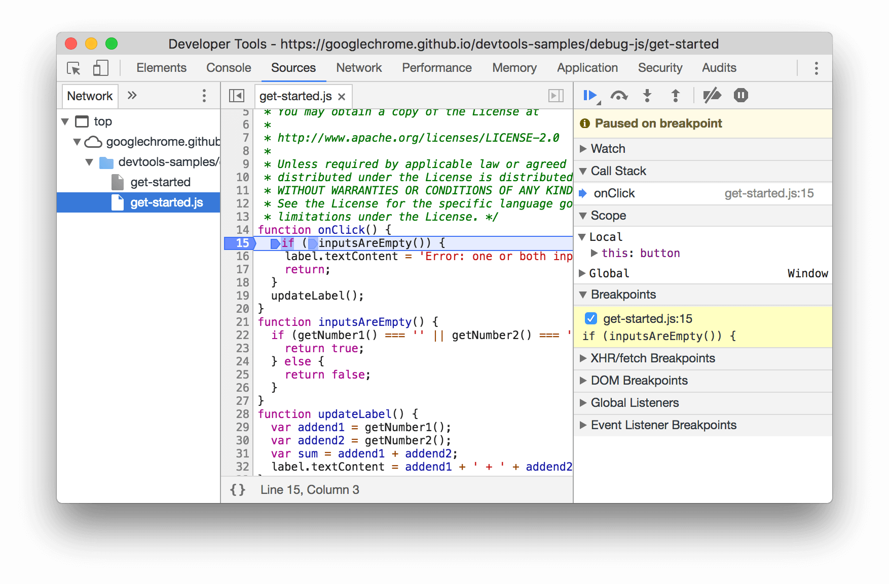

# Chrome DevTools Sources

Use the Chrome DevTools Sources panel to:

- View files
- Edit JavaScript, HTML, and CSS
- Create and save Snippets of JavaScript, which you can run on any page
  - Snippets are similar to bookmarklets
- Debug JavaScript
- Set up a Workspace, so that changes you make in DevTools get saved to the code on your file system

## Chrome DevTools Sources References

- [Sources Panel Overview | Tools for Web Developers | Google Developers](https://developers.google.com/web/tools/chrome-devtools/sources)
- [Debug JavaScript in Chrome with DevTool Sources from @mykola on @eggheadio](https://egghead.io/courses/chrome-devtools-sources-panel)
