# Code Editor Basic

## Editors

### GUI

- [Visual Studio Code](https://code.visualstudio.com)
- [Atom](https://atom.io)
- [Sublime](https://www.sublimetext.com)
- [Brackets](http://brackets.io)
- [Notepad++](https://notepad-plus-plus.org)

### CLI

- [GNU nano](https://www.nano-editor.org)
- [GNU Emacs](https://www.gnu.org/software/emacs)
- [Vim](https://www.vim.org)

## Installation

- [Installation on macOS](https://code.visualstudio.com/docs/setup/mac)
- [Installation on Linux](https://code.visualstudio.com/docs/setup/linux)
- [Installation on Windows](https://code.visualstudio.com/docs/setup/windows)

## Code Editor Window Panels

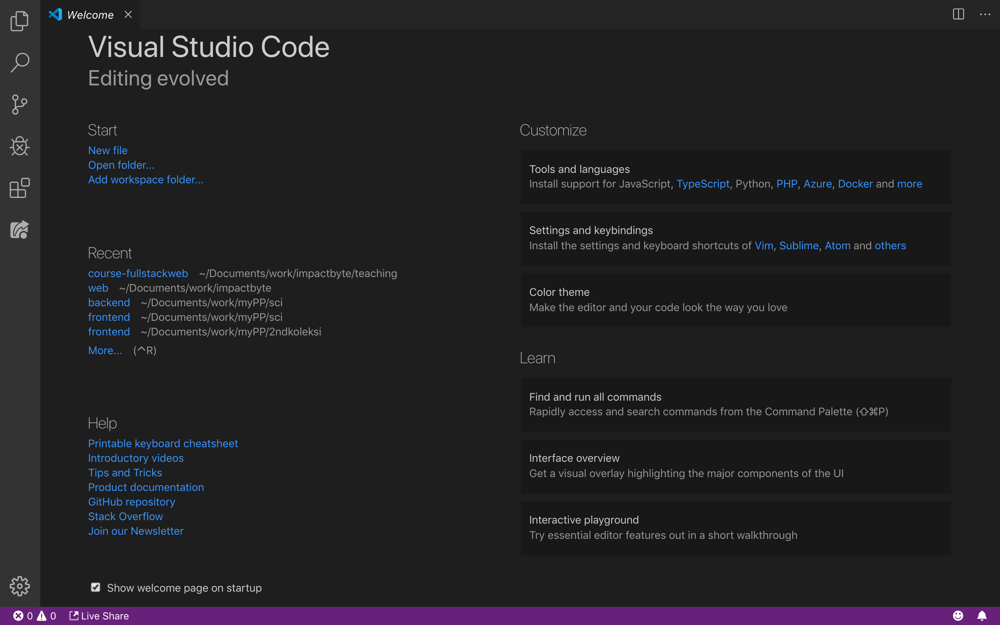

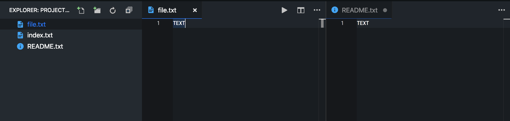

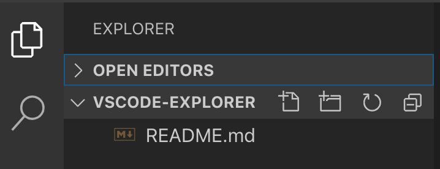

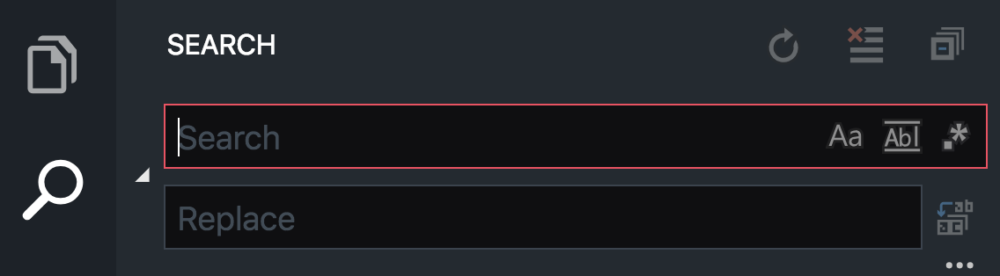

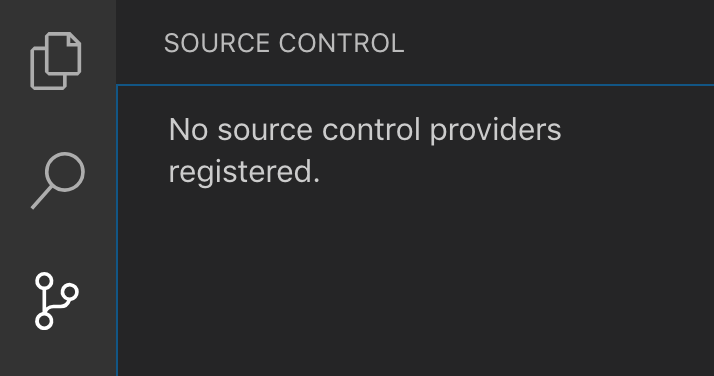

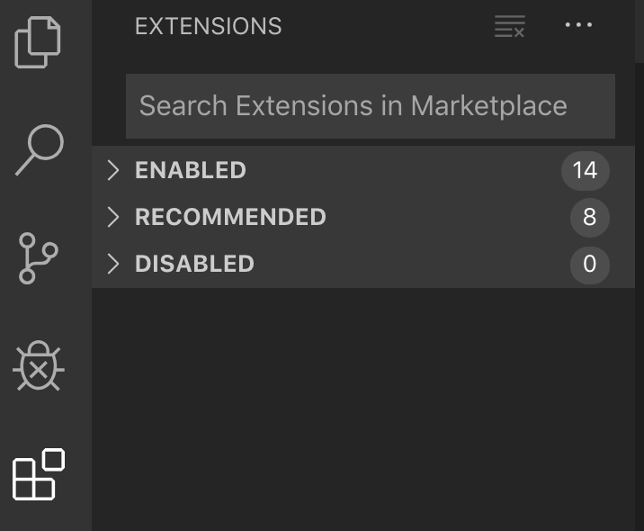

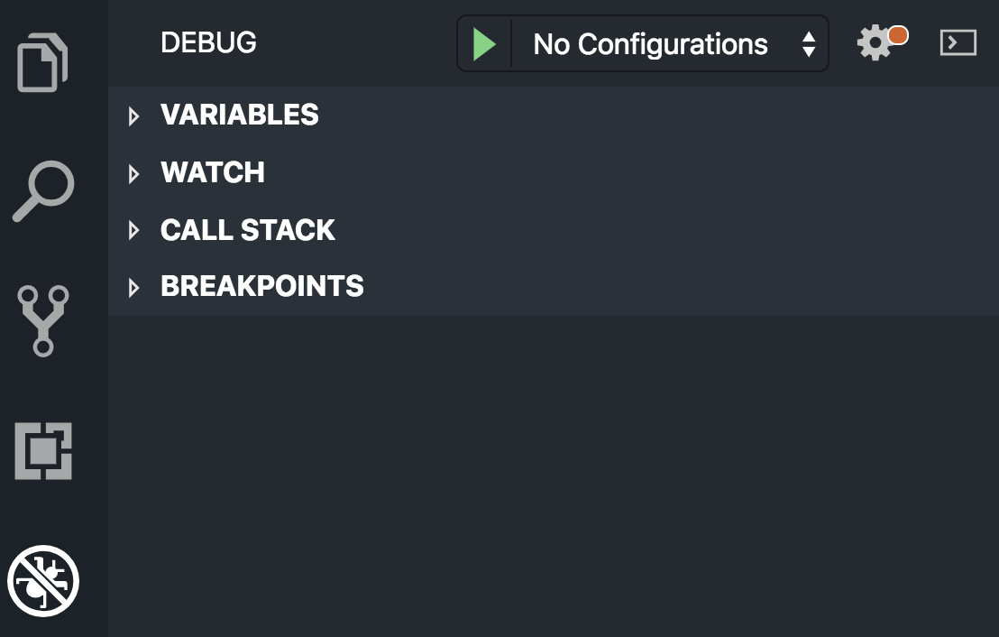

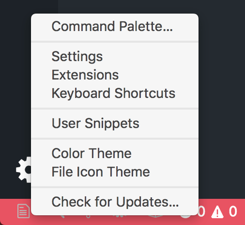

- Welcome
- File Editor
  - Split View
- Status Bar
- Explorer
- Search
- Source Control: Git
- Extensions
- Debug
- Settings

## Code Editor Command Palette

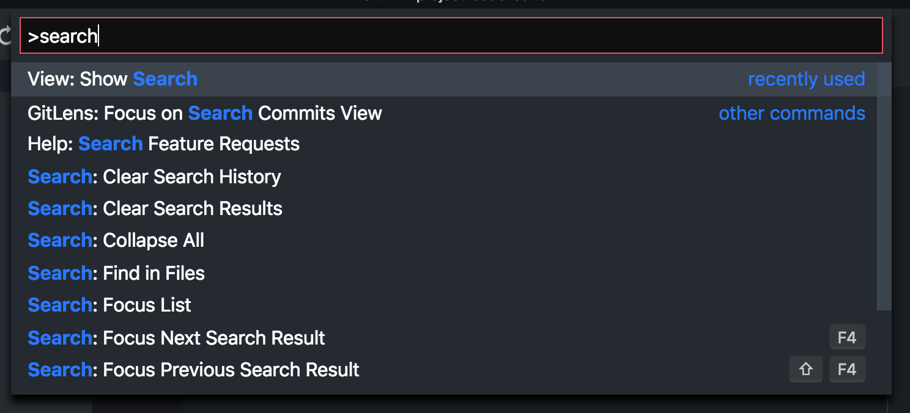

- `Cmd + Shift + P`
- `Ctrl + Shift + P`

## Code Editor Output Panels

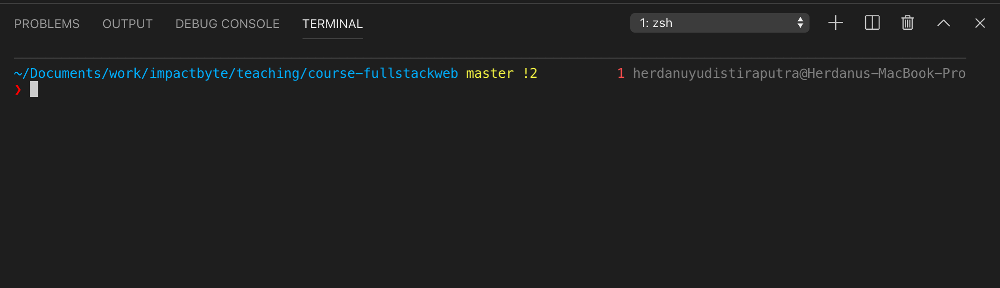

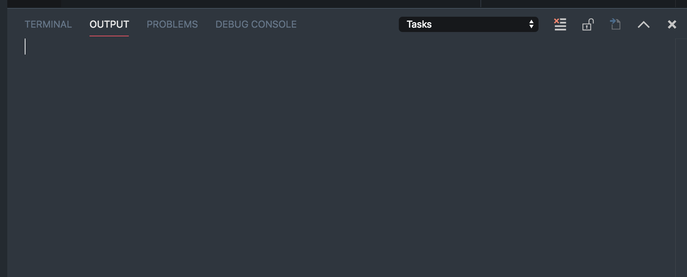

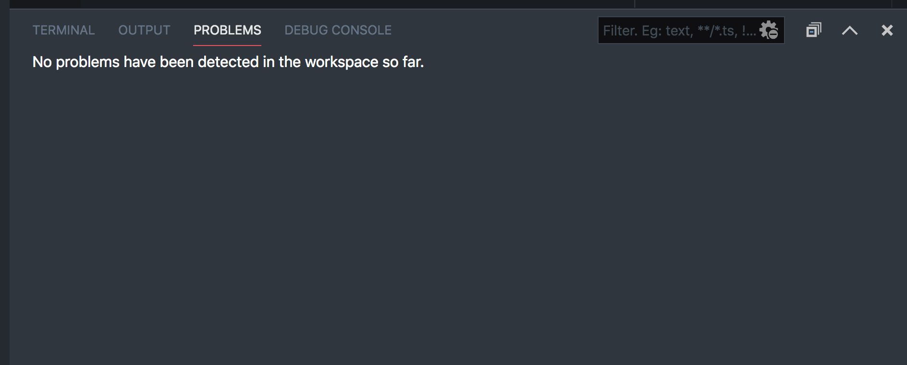

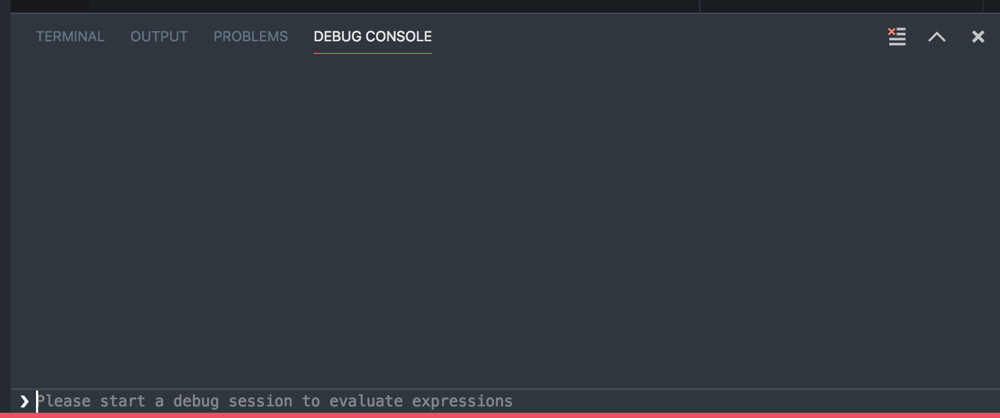

- Terminal
  - Multiple Terminals
  - Add and Kill Terminal
  - Show, Hide, Resize, Maximize, Minimize Screen
- Output
- Problems
- Debug Console
