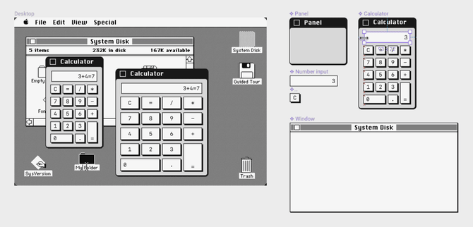
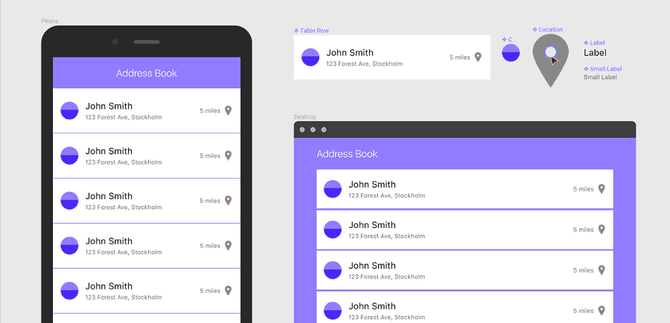

# Component-Based Design

Let's think in component-based design and development. To ease the design process, we can use [Figma](https://figma.com)'s component features.

---

## Component-Based Design References

- [Figma: the collaborative interface design tool](https://www.figma.com)
  - [Components in Figma](https://www.figma.com/blog/components-in-figma)
  - [Using Components and Instances - Figma](https://help.figma.com/article/66-components)
  - [Figma components tutorial: the management for Instances](https://uxdesign.cc/figma-components-tutorial-the-management-for-instances-b02dca6761a1)
- [Framer - Interactive Design Tool](https://www.framer.com)
- [Bit - Component Discovery and Collaboration](https://bit.dev)
