# CSS Layout

## CSS Box Model

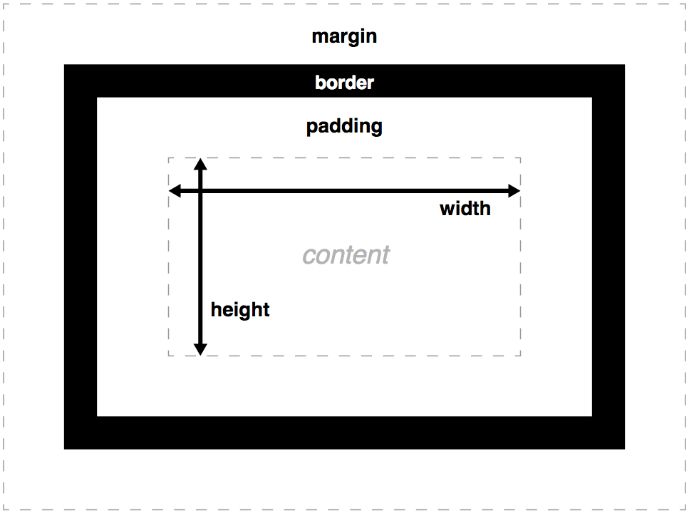

By default, every HTML element is rendered in the browser as a rectangle. The dimensions of that rectangle are dynamic: they vary according to the content of that element. You can consider these rectangles as fluid, altering their shape to fit the content.

That is because a webpage is a living element. Just resize your browser window to see how most elements will adapt automatically to fit within the available space.

- `padding`: The padding is the space between an element’s border and its content.
- `border`: Because an HTML element is rendered as a rectangle, it can have up to 4 borders: top, bottom, left and right. You can set a border on all sides at once, or on each side individually.
- `margin`: If padding adds space inside an element (between its border and its content), margins adds space outside between an element and other elements.

## CSS Flexbox

In flexbox (`display: flex;`) layout system, there is a way to control other element positions. It's a more efficient way to lay out, align, and distribute space among items in a container. Even when their size is unknown and/or dynamic (thus the word "flex").

- `container`: parent element which can control their children/items positions
- `items`: children element/s which being controlled by their parent/container

```html
<section class="container">
  <div class="item">One</div>
  <div class="item">Two</div>
  <div class="item">Three</div>
  <div class="item">Four</div>
</section>
```

```css
.container {
  display: flex;
  justify-content: center;
  align-items: center;
}

.item {
  color: blue;
}
```

Container

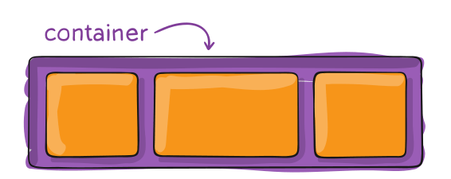

Items

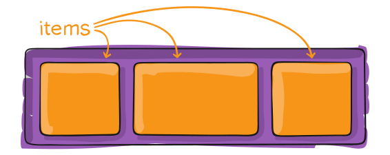

`justify-content`

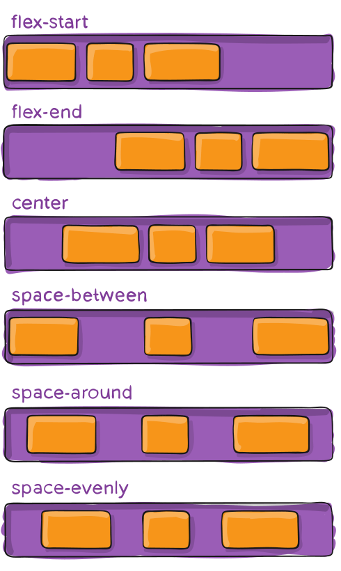

`align-items`

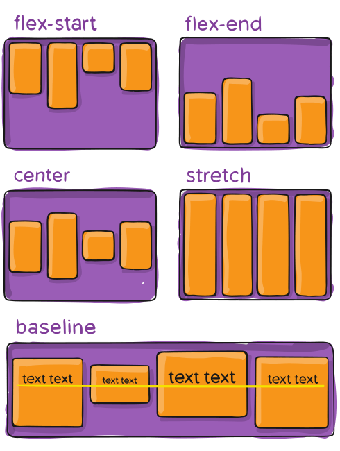

`align-content`

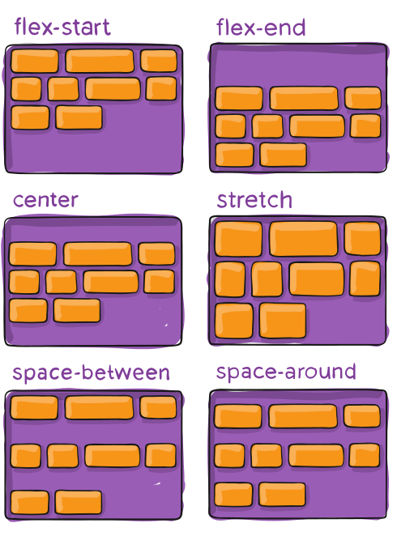

`align-self`

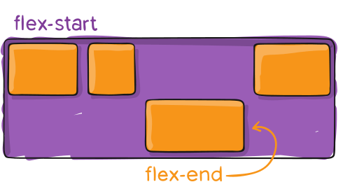

`flex-direction`

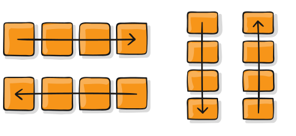

`flex-grow`

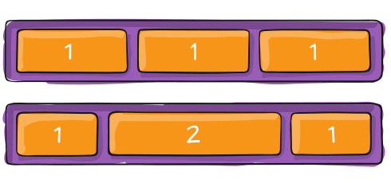

`flex-wrap`

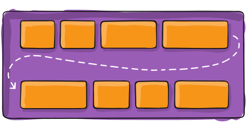

`order`

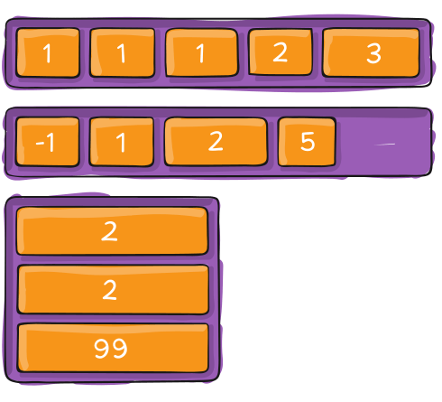

### `justify-content`

- `flex-start`: Items align to the left side of the container
- `flex-end`: Items align to the right side of the container
- `center`: Items align at the center of the container
- `space-between`: Items display with equal spacing between them
- `space-around`: Items display with equal spacing around them

### `align-items`

- `flex-start`: Items align to the top of the container
- `flex-end`: Items align to the bottom of the container
- `center`: Items align at the vertical center of the container
- `baseline`: Items display at the baseline of the container
- `stretch`: Items are stretched to fit the container

### `flex-direction`

- `row`: Items are placed the same as the text direction.
- `row-reverse`: Items are placed opposite to the text direction.
- `column`: Items are placed top to bottom.
- `column-reverse`: Items are placed bottom to top.

## CSS Layout References

- [A Complete Guide to Flexbox | CSS-Tricks](https://css-tricks.com/snippets/css/a-guide-to-flexbox)
- [CSS Flexbox Froggy](https://flexboxfroggy.com)
- [CSS Grid Garden](https://cssgridgarden.com)
- [Layout Land](https://www.youtube.com/channel/UC7TizprGknbDalbHplROtag)
