# CSS Preprocessing

A `CSS` preprocessor is a program that lets you generate `CSS` from the preprocessor's own unique syntax. There are many `CSS` preprocessors to choose from, however most `CSS` preprocessors will add some features that don't exist in pure `CSS`, such as _**mixin**_, _**nesting selector**_, _**inheritance selector**_, and so on. These features make the `CSS` structure more readable and easier to maintain.

To use a `CSS` preprocessor, you must install a `CSS` compiler on your web server.

Here are a few of the most popular `CSS` preprocessors:

- [SASS](https://sass-lang.com/)
- [LESS](http://lesscss.org/)
- [Stylus](http://stylus-lang.com/)

---

## Preprocessing

**SASS (Syntactically Awesome Style Sheets)**

Once you start tinkering with `Sass`, it will take your preprocessed `Sass` file and save it as a normal `CSS` file that you can use in your website.

`SASS` is not a programming language. `Sass` is the most mature, stable, and powerful professional grade `CSS` extension language in the world.

`SASS` features:

- `CSS` Compatible
- Feature Rich
- Mature
- Industry Approved
- Large Community
- Frameworks

  - [Compass](http://compass-style.org/)
  - [Bourbon](https://www.bourbon.io/)
  - [Susy](https://www.oddbird.net/susy/)

---

## SASS and SCSS

> Sass supports two different syntaxes. Each one can load the other, so it's up to you and your team which one to choose.

**SCSS**

The SCSS syntax uses the file extension .scss. With a few small exceptions, it’s a superset of CSS, which means essentially all valid CSS is valid SCSS as well. Because of its similarity to CSS, it’s the easiest syntax to get used to and the most popular.

SCSS looks like this:

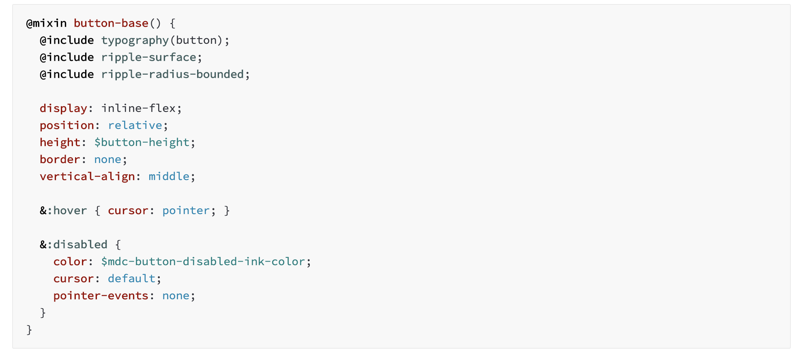

**The Indented Syntax**

The indented syntax was Sass’s original syntax, and so it uses the file extension .sass. Because of this extension, it’s sometimes just called “Sass”. The indented syntax supports all the same features as SCSS, but it uses indentation instead of curly braces and semicolons to describe the format of the document.

In general, any time you’d write curly braces in CSS or SCSS, you can just indent one level deeper in the indented syntax. And any time a line ends, that counts as a semicolon. There are also a few additional differences in the indented syntax that are noted throughout the reference.

The indented syntax looks like this:

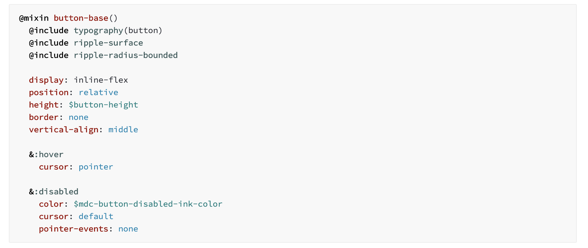

---

## Variables

Think of variables as a way to store information that you want to reuse throughout your stylesheet. You can store things like colors, font stacks, or any CSS value you think you'll want to reuse. Sass uses the \$ symbol to make something a variable. Here's an example:

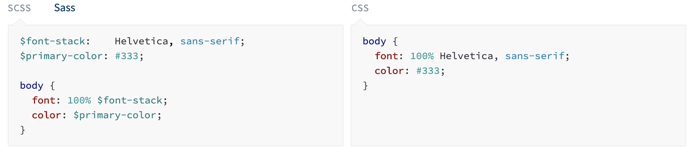

## Nesting

When writing HTML you've probably noticed that it has a clear nested and visual hierarchy. CSS, on the other hand, doesn't.

Sass will let you nest your CSS selectors in a way that follows the same visual hierarchy of your HTML. Be aware that overly nested rules will result in over-qualified CSS that could prove hard to maintain and is generally considered bad practice.

With that in mind, here's an example of some typical styles for a site's navigation:

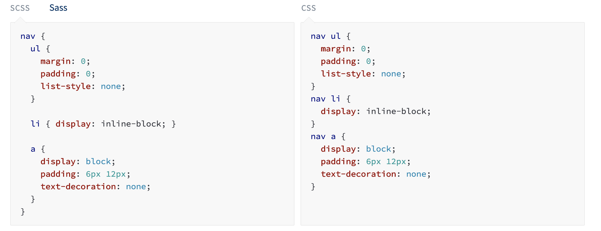

## Partials and Modules

You can create partial `Sass` files that contain little snippets of CSS that you can include in other `Sass` files. This is a great way to modularize your CSS and help keep things easier to maintain. A partial is a `Sass` file named with a leading underscore. You might name it something like `_variables.scss`. The underscore lets `Sass` know that the file is only a partial file and that it should not be generated into a `CSS` file. `Sass` partials are used with the `@import` rule.

You don't have to write all your `Sass` in a single file. You can split it up however you want with the `@import` rule. This rule loads another `Sass` file as a module, which means you can refer to its variables, mixins, and functions in your `Sass` file with a namespace based on the filename. Using a file will also include the CSS it generates in your compiled output!

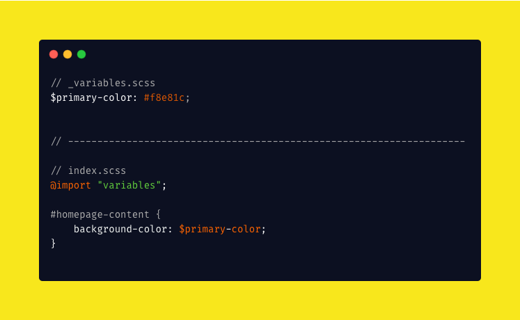

## Mixins

Some things in CSS are a bit tedious to write, especially with CSS3 and the many vendor prefixes that exist. A mixin lets you make groups of CSS declarations that you want to reuse throughout your site. You can even pass in values to make your mixin more flexible. A good use of a mixin is for vendor prefixes. Here's an example for transform.

To create a mixin you use the @mixin directive and give it a name. We've named our mixin transform. We're also using the variable \$property inside the parentheses so we can pass in a transform of whatever we want. After you create your mixin, you can then use it as a CSS declaration starting with @include followed by the name of the mixin.

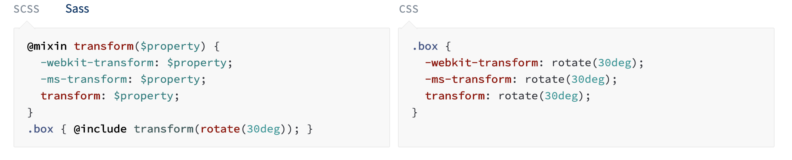

## Extend/Inheritance

This is one of the most useful features of Sass. Using @extend lets you share a set of CSS properties from one selector to another. It helps keep your Sass very DRY. In our example we're going to create a simple series of messaging for errors, warnings and successes using another feature which goes hand in hand with extend, placeholder classes. A placeholder class is a special type of class that only prints when it is extended, and can help keep your compiled CSS neat and clean.

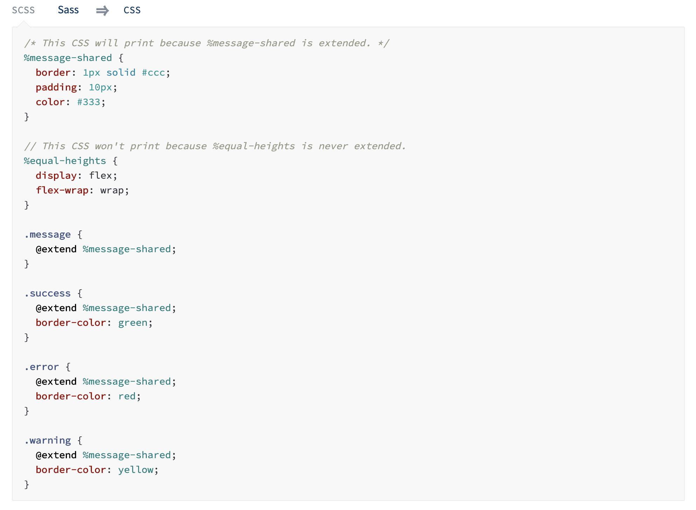

What the above code does is tells .message, .success, .error, and .warning to behave just like %message-shared. That means anywhere that %message-shared shows up, .message, .success, .error, & .warning will too. The magic happens in the generated CSS, where each of these classes will get the same CSS properties as %message-shared. This helps you avoid having to write multiple class names on HTML elements.

You can extend most simple CSS selectors in addition to placeholder classes in Sass, but using placeholders is the easiest way to make sure you aren't extending a class that's nested elsewhere in your styles, which can result in unintended selectors in your CSS.

Note that the CSS in %equal-heights isn't generated, because %equal-heights is never extended.

## Operators

Doing math in your CSS is very helpful. Sass has a handful of standard math operators like +, -, \*, /, and %. In our example we're going to do some simple math to calculate widths for an aside & article.

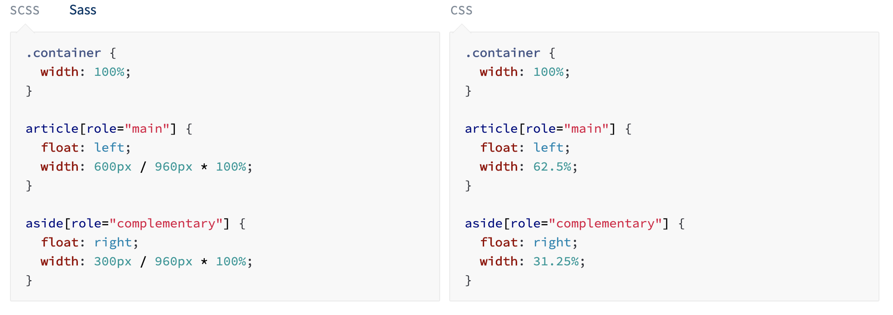

We've created a very simple fluid grid, based on 960px. Operations in Sass let us do something like take pixel values and convert them to percentages without much hassle.

## Installation

- Application

  There are a good many applications that will get you up and running with `Sass` in a few minutes for `Mac`, `Windows`, and `Linux`. You can download most of the applications for free but a few of them are paid apps (and totally worth it).

  - [CodeKit](https://codekitapp.com/) - <small>paid</small>
  - [ScoutApp](https://scout-app.io/) - <small>free</small>

You can download `ScoutApp` as per your operating system.

- Command Line

  - Linux

    - ```sh
      npm install -g sass
      ```

  - OS
    - ```sh
      brew install sass/sass/sass
      ```

After installation, check if sass is installed succesfully.

```sh
sass --version
```

When you install Sass on the command line, you'll be able to run the sass executable to compile .sass and .scss files to .css files. For example:

```sh
sass source/stylesheets/index.scss build/stylesheets/index.css
```

_You can change `source` with your own folder path._

But for now, let just focus with `ScoutApp` and `Live Sass`.
We will come back later when we discuss about `NPM`.

---

Thanks to `VSCode` there are many compiler to create `CSS` file from our `SCSS`.

Please add **Live Sass Compiler** to your `VSCode` extension

## Usage

### **Live Sass**

1. Click to **Watch Sass** from Statusbar to turn on the live compilation and then click to Stop Watching `Sass` from Statusbar to turn on live compilation . Statusbar control
   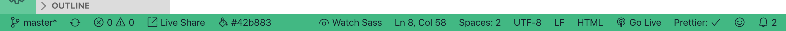

2. Press F1 or `ctrl+shift+P` or `cmd+shift+P` and type Live `Sass`: Watch `Sass` to start live compilation or, type Live `Sass`: Stop Watching `Sass` to stop a live compilation.

3. Press F1 or `ctrl+shift+P` or `ctrl+shift+P` and type Live `Sass`: Compile `Sass` - Without Watch Mode to compile `Sass` or Scss for one time.

When using `Live Sass`, they will automatically generate a folder call `dist` and contains our `CSS` files.

### **Scout App**

1. Open **ScoutApp**

   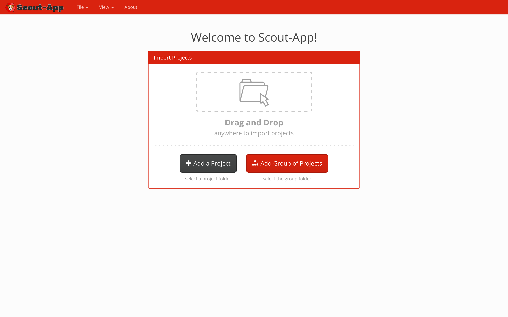

2. Select a folder by drag and drop or just click the Add a Project button

3. - In input folder select the folder that contain your `SCSS` files
   - In output folder select a folder that will contain your `CSS` files (_if a folder doesn't exist yet, please create first_)
   - Select development for the environment section

     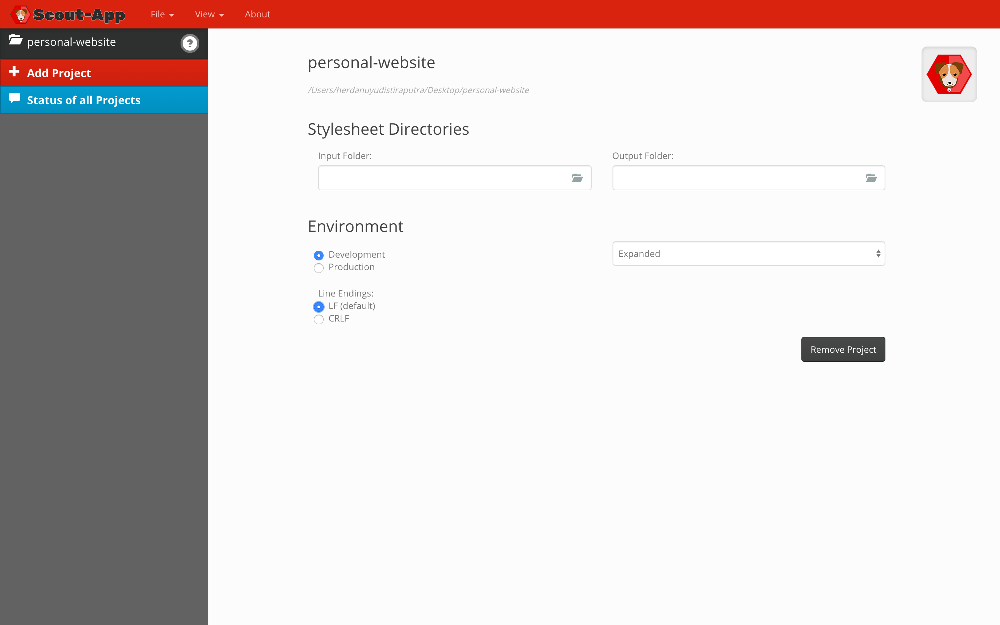

4. Compile the `SCSS` files by click play button on the top-left corner besides your project folder name.

   

   Link your `HTML` file with compiled `CSS` files.

## References

- [SASS](https://sass-lang.com/)
- [ScoutApp](https://scout-app.io/)
- [Live Sass Compiler](https://marketplace.visualstudio.com/items?itemName=ritwickdey.live-sass)
