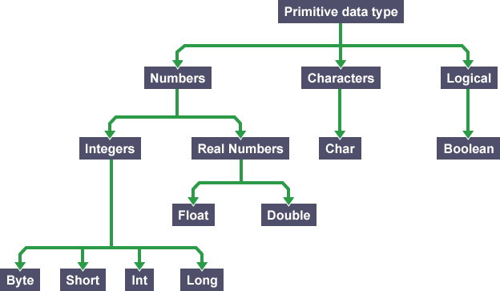
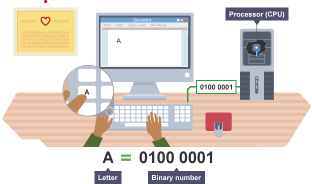
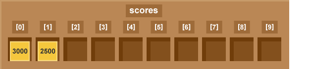

# Data Structure Basic

Data in a computer program is organised using a data structure. There are different methods for organising data. Arrays are a common tool used to organise data when programming.

Data structures can have two main characteristics. Firstly they can be static or dynamic, and secondly they can be mutable or immutable.

- A **static** structure is fixed in size but a dynamic structure can grow or shrink. An array is a static structure as its size is fixed. A list is a dynamic structure as its size can increase or decrease.
- A **mutable** or _changeable_ structure allows data to be edited, deleted or moved, but in an **immutable** structure data cannot be changed, it can only have more data added. An array is a mutable structure as its contents can be edited, deleted or moved. A string is an immutable structure as its contents cannot be changed without creating a new string.

The most commonly supported data types in programming languages are:

| Data type                       | Example                      | Size                   |
| ------------------------------- | ---------------------------- | ---------------------- |
| Binary                          | `0`, `1`                     | 1 bit                  |
| Integer (whole number)          | `3`, `27`, `65535`           | 1 to 8 bytes           |
| Floating point (decimal number) | `3.14`, `27.4`, `5.63`       | 4 to 8 bytes           |
| Character                       | `a`, `F`, `3`, `$`, `£`, `#` | 1 byte                 |
| String                          | `abc`, `hello world`         | Limited to main memory |
| Boolean                         | `true`, `false`              | 1 bit                  |

Data types may be different in different languages. The main data types are grouped under hierarchies. They are either numbers, characters or logical.



- Binary number is a number expressed in the base-2 numeral system or binary numeral system, which uses only two symbols, typically "0" and "1"
- Integers are whole numbers represented as binary values. Most programming languages provide a data type called 'integer', often called 'int' for short.
- Floating point numbers are numbers that have a fractional part. They are usually given names like 'float', 'single', 'double', 'real' or 'longreal'.
- Character can be every letter, digit, and punctuation mark. Most programming languages provide a data type called 'character' or 'char'.
  - In a character sets, each value represents a single character from a predefined set, such as ASCII or Unicode. Each character has its own binary pattern.
- String is used for data values that are made up of ordered sequences of characters, such as "hello world". A string can contain any sequence of characters, visible or invisible, and characters may be repeated. Remember that a string such as `"123"` is not the same as the number `123`, because a string is a sequence of characters whereas a number is a sequence of digits. All keyboard input and text output is in the form of character strings.

---

## Binary


There are a number of very common needs for a computer, including the need to store and view **data**.

Computers use electrical signals that are on or off, so they have to see everything as a series of **binary** numbers. This data is represented as a sequence of 1s and 0s (on and off). **All data that we want a computer to process needs to be converted into this binary format**.


**Binary is a number system that only uses two digits: 1 and 0**. All information that is processed by a computer is in the form of a sequence of 1s and 0s. Therefore, all data that we want a computer to process needs to be converted into binary.

The binary system is known as a 'base 2' system. This is because:

- there are only two digits to select from (1 and 0)
- when using the binary system, data is converted using the power of two.



A code where each number represents a character can be used to convert text into binary. One code we can use for this is called **ASCII**. The **ASCII** code takes each character on the keyboard and assigns it a binary number. For example:

- the letter 'a' has the binary number 0110 0001 (this is the denary number 97)
- the letter 'b' has the binary number 0110 0010 (this is the denary number 98)
- the letter 'c' has the binary number 0110 0011 (this is the denary number 99)

---

## String

String is just a text.

**JavaScript**

```js
const name = 'JavaScript'
```

**Python**

```py
name = 'Python'
```

---

## Number

The number type represents both integer and floating point numbers.

There are many operations for numbers, e.g. multiplication `*`, division `/`, addition `+`, subtraction `-`, and so on.

Besides regular numbers, there are so-called "special numeric values" which also belong to this data type: `Infinity`, `-Infinity`, and `NaN` (Not a Number).

**JavaScript**

```js
const age = 23
// JavaScript is older than we thought
```

**Python**

```py
age = 29
# Python is older than JavaScript!
```

---

## Boolean


The boolean type has only two values: `true` and `false`.

This type is commonly used to store yes or no values: `true` means “yes, correct” and `false` means “no, incorrect”.

**JavaScript**

```js
const toggle = true
```

**Python**

```py
toggle = true
```


Boolean logic uses algebra and algebraic expressions. We use these expressions in algorithms and programs.

| Expression               | Boolean Equivalents |
| ------------------------ | ------------------- |
| Equals                   | `==`, `===`         |
| Does not equal           | `<>`, `!=`, `!==`   |
| Greater than             | `>`                 |
| Less than                | `<`                 |
| Greater than or equal to | `>=`                |
| Less than or equal to    | `<=`                |
| And                      | `&&`, `AND`, `and`  |
| Or                       | `||`, `OR`, `or`    |
| Not                      | `!`, `NOT`, `not`   |

---

## Array



Array consists of other data types. The variable name is often a plural word.

An index is used to point at a data element within an array. Commonly, array's index starts from `0`, not `1`.

**JavaScript**

```js
const scores = [124, 99, 121, 105, 132]

scores[0] // 124
scores[1] // 99
```

**Python**

```py
scores = (124, 99, 121, 105, 132)
```

### Multi Dimensional Array

**JavaScript**

```js
const studentScores = [['Alpha', 100], ['Betty', 75], ['Gamma', 50]]

studentScores[0][0] // Alpha
studentScores[0][1] // 100

studentScores[1][0] // Betty
studentScores[1][1] // 75
```

```js
const studentScores = [
  {
    name: 'Alpha',
    score: 100
  },
  {
    name: 'Betty',
    score: 75
  },
  {
    name: 'Gamma',
    score: 50
  }
]

studentScores[0]['name'] // Alpha
studentScores[0].name // Alpha
studentScores[0].score // 100
```

Many games use two dimensional arrays to plot the visual environment of a game. Positions in a two dimensional array are referenced like a map using horizontal and vertical reference numbers. They are sometimes called matrices.

We are not limited to making one and two-dimensional arrays. We can also make three-dimensional arrays as well. Many games (such as Minecraft) use three-dimensional arrays to model an environment.

---

## Objects, Records, or Dictionary

Objects are used to store keyed collections of various data and more complex entities. It is more powerful than array, and can be combined with anything else.

**JavaScript**

```js
const human = {
  name: 'Brendan Eich',
  website: 'https://brendaneich.com',
  twitter: 'https://twitter.com/BrendanEich',
  github: 'https://github.com/BrendanEich'
}
```

A record is a data structure that groups together related items of data. These are slightly more complex than arrays as you can store more than one type of data together.

**Python**

```py
human = {
  "name": "Guido van Rossum"
  "website": "http://python.org/~guido"
  "blog": "http://neopythonic.blogspot.com"
  "github": "https://github.com/gvanrossum"
}
```

---

## Data Structure Basic References

- [Data structures - Revision 1 - GCSE Computer Science - BBC Bitesize](https://www.bbc.com/bitesize/guides/z4tf9j6/revision/1)
  - [Boolean logic - Revision 1 - KS3 Computer Science - BBC Bitesize](https://www.bbc.com/bitesize/guides/zqp9kqt/revision/1)
- [Data types - JavaScript.info](https://javascript.info/types)
