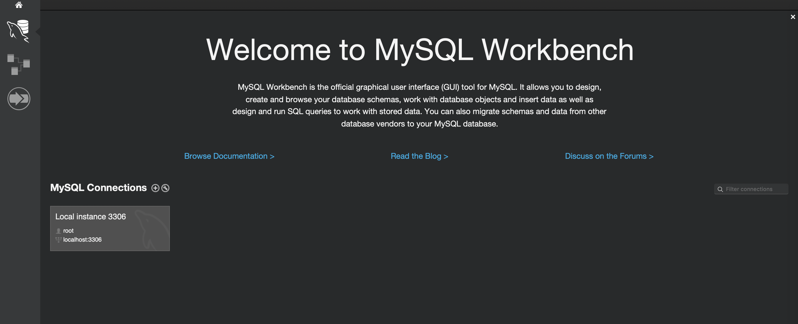
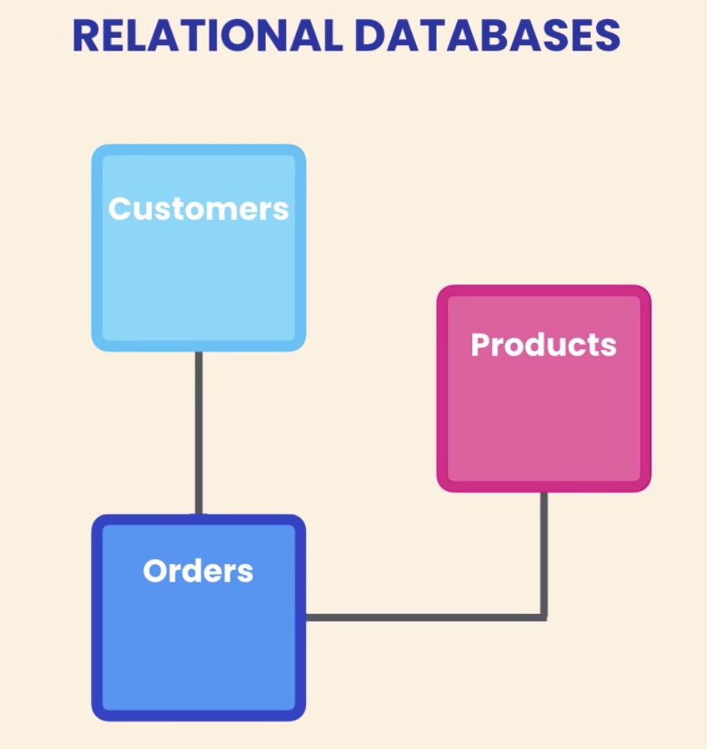
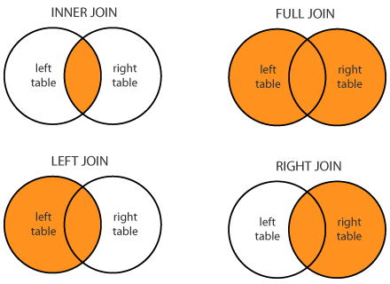

# Database SQL

---

## Relational Database

The most common database structure is build upon relational model.

The data modeling itself contains entities/tables of fields and values, consisted in rows and columns.

In each table, data schema can be created to give the requirement of the data.

### Table View

**Users**

```sh
+----+-------+------------------+
| id | name  | email            | # Field
+----+-------+------------------+
|  1 | Alpha | alpha@domain.com | # Record/Row
|  2 | Beta  | beta@domain.com  |
+----+-------+------------------+
# Column
```

**Todos**

```sh
+----+--------------+-----------+
| id | text         | person_id |
+----+--------------+-----------+
|  1 | Learn coding |  1        |
|  2 | Apply a job  |  2        |
+----+--------------+-----------+

```

**Addresses**

```sh
+----+------------+-----------+
| id | address    | person_id |
+----+------------+-----------+
|  1 | Ex Street  |  1        |
|  2 | Way Street |  2        |
+----+------------+-----------+
```

- **Field** = Every table is broken up into smaller entities called fields. The fields in the `Users` table consist of `id`, `name`, `email`.
- **Record/Row** = A record is also called as a row of data is each individual entry that exists in a table.
- **Column** = A column is a vertical entity in a table that contains all information associated with a specific field in a table.

### Schema View

**Users**

```js
{
  id: Number,
  name: String,
  email: String
}
```

**Todos**

```js
{
  id: Number,
  text: String,
  person_id: Number
}
```

**Addresses**

```js
{
  id: Number,
  address: String,
  person_id: Number
}
```

---

## SQL (Structured Query Language)


SQL itself is a query language that often used for storing, manipulating, and retrieving data stored in a relational database. They used to communicate between client and the DBMS.

It allows to:

- Create, Read, and Delete data in the database
- Set permission (who can access the data)
- Create and drop databases and tables

- [A Gentle Introduction to SQL and NoSQL Databases – Jimmy Farrell’s Blog – Medium](https://medium.com/jimmy-farrell/a-gentle-introduction-to-sql-and-nosql-databases-347e53056b06)
- [SQL Tutorial - TutorialsPoint](https://www.tutorialspoint.com/sql/index.htm)
  - [SQL Syntax](https://www.tutorialspoint.com/sql/sql-syntax.htm)
- [SQL Tutorial - w3schools](https://www.w3schools.com/sql/default.asp)

---

## SQL-Based RDBMS

- [SQLite](https://www.sqlite.org)
  - [SQLite Tutorial](https://www.tutorialspoint.com/sqlite/index.htm)
  - [DevDocs — SQLite documentation](http://devdocs.io/sqlite)
- [MySQL](https://www.mysql.com)
  - [`mycli` - MyCLI is a command line interface for MySQL, MariaDB, and Percona with auto-completion and syntax highlighting](https://www.mycli.net)
  - [MySQL Tutorial](https://www.tutorialspoint.com/mysql/index.htm)
  - [MySQL Tutorial - Learn MySQL Fast, Easy and Fun](http://www.mysqltutorial.org)
    - [MySQL Sample Database](http://www.mysqltutorial.org/mysql-sample-database-aspx)
- [MariaDB](https://mariadb.org)
  - [MariaDB Tutorial](https://www.tutorialspoint.com/mariadb/index.htm)
- [PostgreSQL](https://www.postgresql.org)
  - [`pgcli` - Pgcli is a command line interface for Postgres with auto-completion and syntax highlighting](https://www.pgcli.com)
  - [PostgreSQL Tutorial](https://www.tutorialspoint.com/postgresql/index.htm)
  - [DevDocs — PostgreSQL 10 documentation](http://devdocs.io/postgresql~10)
- [CockroachDB - The SQL database for global cloud services](https://www.cockroachlabs.com)
- [Google Cloud SQL - MySQL & PostgreSQL Relational Database Service](https://cloud.google.com/sql)
- [Amazon Relational Database Service (RDS) – AWS](https://aws.amazon.com/rds)
- [Microsoft Azure SQL Database – Cloud Database as a Service](https://azure.microsoft.com/en-us/services/sql-database)

---

# SQL (Structured Query Language)


<!-- SQL itself is a query language that often used for storing, manipulating, and retrieving data stored in a relational database. -->

SQL is a query language that used to working with these relational database management system (RDMS).

It allows to:

- Create, Retrieve, and Delete data in the database.
- Set permission (who can access the data).
- Create and drop databases and tables.
- etc.

<!-- - access data in the relational database management systems.
- describe the data.
- define the data in a database and manipulate that data.
- within other languages using SQL modules, libraries, and pre-compilers.
- create and drop databases and tables.
- create view, stored procedure, functions in a database.
- set permissions on tables, procedures, and views. -->

## References

- [A Gentle Introduction to SQL and NoSQL Databases – Jimmy Farrell’s Blog – Medium](https://medium.com/jimmy-farrell/a-gentle-introduction-to-sql-and-nosql-databases-347e53056b06)
- [SQL Tutorial - TutorialsPoint](https://www.tutorialspoint.com/sql/index.htm)
- [SQL Syntax](https://www.tutorialspoint.com/sql/sql-syntax.htm)
- [SQL Tutorial - w3schools](https://www.w3schools.com/sql/default.asp)
- [Basic SQL by Mosh Hamedani on YouTube](https://www.youtube.com/watch?v=7S_tz1z_5bA)

---

# SQL Database Tools



Then in order to access and use the installed database, we have to use a CLI or GUI tool.

We will make it with MySQL

- Installation

  - Linux
    - [FOLLOW THIS INSTRUCTION](https://dev.mysql.com/doc/mysql-apt-repo-quick-guide/en/)
  - Mac OS
    - [FOLLOW THIS INSTRUCTION](https://dev.mysql.com/doc/refman/8.0/en/osx-installation-pkg.html)
    - create or open `.bash_profile`
    - add `EXPORT PATH=$PATH:/usr/local/mysql/bin` and save!
    - run `source .bash_profile` to restart bash

- Configuration

  - Connect to MysQL

  ```
  mysql -u root -p
  ```

  in MySQL shell run this if you get an error AUTHENTICATION PROTOCOL when try to connect MYSQL with Express

  ```
  mysql> ALTER USER 'root'@'localhost' IDENTIFIED WITH mysql_native_password BY 'your_password';

  mysql> FLUSH PRIVILEGES;
  ```

## References

- [`mysql` — The MySQL Command-Line Tool](https://dev.mysql.com/doc/refman/5.7/en/mysql.html)
- [`mycli` - A Terminal Client for MySQL with AutoCompletion and Syntax Highlighting](http://www.mycli.net)
- [MySQL Workbench](https://www.mysql.com/products/workbench)
- [TeamSQL - Cross-platform SQL Client for MySQL, PostgreSQL, Microsoft SQL Server, Amazon Redshift and Redis](https://teamsql.io)
- [dbeaver](https://dbeaver.io/)

---

# SQL Database Hosting

There are various hosting solutions for SQL database that available for free. But for customized solution, we still need to install them in our own server or use a cloud service.

## References

- [Heroku Postgres - SQL Database Service on Heroku](https://www.heroku.com/postgres)
- [A Basic MySQL Tutorial | DigitalOcean](https://www.digitalocean.com/community/tutorials/a-basic-mysql-tutorial)
- [Caspio - Free Online Database | Create Easy Cloud Applications](https://free.caspio.com)
- [Amazon Relation Database Service](https://aws.amazon.com/getting-started/tutorials/create-microsoft-sql-db/)
- [Compose](https://www.compose.com/databases/mysql)
- [ScaleGrid](https://scalegrid.io/)
- [Azure Database For MySQL](https://azure.microsoft.com/en-us/services/mysql/)
- [Google Cloud Platform](https://cloud.google.com/sql/docs/mysql/quickstart)

---

# Entity Relations/Associations



In relational database design, entities or tables are representing the overview of the data.

Tables can have relations, connections, or associations between other tables.

The relationship between tables can be as:

- [The 3 Types of Relationships in Database Design | Database.Guide](http://database.guide/the-3-types-of-relationships-in-database-design)
- [SQL for Beginners: Part 3 - Database Relationships](https://code.tutsplus.com/articles/sql-for-beginners-part-3-database-relationships--net-8561)
- [What is Normalization? | Database.Guide](http://database.guide/what-is-normalization)

---

## SQL Query/Syntax/Command

These syntaxes can be classified into the following groups based on their nature of statements.

### DDL - Data Definition Language

**Create Table**
Syntax :

```sql
CREATE TABLE table_name (
    column1 datatype,
    column2 datatype,
    column3 datatype,
   ....
);
```

Example:

```sql
CREATE TABLE customers (
    id INT NOT NULL AUTO_INCREMENT,
    firstName VARCHAR(50),
    lastName VARCHAR(50),
    address VARCHAR(200),
    age INT(5)
);
```

**Data Types**

| **Data Type**     | **Description**                                                                                                                                                                                                                                          |
| ----------------- | -------------------------------------------------------------------------------------------------------------------------------------------------------------------------------------------------------------------------------------------------------- |
| `INT(size)`       | `-2147483648` to `2147483647` is normal. `0` to `4294967295` if `UNSIGNED`. The maximum number of digits may be specified in parenthesis                                                                                                                 |
| `DOUBLE(size,d)`  | A large number with a floating decimal point. The maximum number of digits may be specified in the size parameter. The maximum number of digits to the right of the decimal point is specified in the d parameter                                        |
| `VARCHAR(size)`   | Holds a variable length string (can contain letters, numbers, and special characters). The maximum size is specified in parenthesis. Can store up to `255` characters. Note: If you put a greater value than `255` it will be converted to a `TEXT` type |
| `DATE()`          | A date with format: `YYYY-MM-DD`                                                                                                                                                                                                                         |
| `TEXT`            | Holds a string with a maximum length of `65,535` characters                                                                                                                                                                                              |
| `BLOB`            | For BLOBs (Binary Large OBjects). Holds up to `65,535` bytes of data                                                                                                                                                                                     |
| `ENUM(x,y,z,...)` | Let you enter a list of possible values. You can list up to 65535 values in an ENUM list. If a value is inserted that is not in the list, a blank value will be inserted.                                                                                |
| `TIMESTAMP()`     | A timestamp. TIMESTAMP values are stored as the number of seconds since the Unix epoch (`'1970-01-01 00:00:00' UTC)`. Format: `YYYY-MM-DD HH:MI:SS`                                                                                                      |

### Primary Key

The Primary Key constraint uniquely identifies each record in a database table.

Example=:

```sql
CREATE TABLE customers (
    id INT NOT NULL AUTO_INCREMENT,
    firstName VARCHAR(50),
    lastName VARCHAR(50),
    address VARCHAR(200),
    age INT(5),
    PRIMARY KEY (id)
);
```

Similar like this:

```sql
CREATE TABLE customers (
    id INT NOT NULL AUTO_INCREMENT,
    firstName VARCHAR(50),
    lastName VARCHAR(50),
    address VARCHAR(200),
    age INT(5)
);
ALTER TABLE customers
ADD PRIMARY KEY (ID);
```

### Foreign Key

A Foreign Key is a field (or collection of fields) in one table that refers to the Foreign Key in another table.

```sql
CREATE TABLE products (
	  id int not null auto_increment,
    name varchar(255),
    price int,
    primary key(id)
);

CREATE TABLE orders (
	  id int not null auto_increment,
    orderNumber int,
    productId int,
    customerId int,
    orderDate datetime default current_timestamp,
    primary key(id),
    foreign key(customerId) references customers(id),
    foreign key(productId) references products(id)
);
```

### Alter Table

The ALTER TABLE statement is used to add, delete, or modify columns in an existing table.

Syntax :

```sql
/* Alter Table - Add Column */
ALTER TABLE table_name
ADD column_name datatype;

/* Alter Table - Drop Column */
ALTER TABLE table_name
DROP COLUMN column_name;

/* Alter Table - Modify Column */
ALTER TABLE table_name
MODIFY COLUMN column_name datatype;
```

Example :

```sql
ALTER TABLE customers ADD newCol varchar(255);
ALTER TABLE customers MODIFY COLUMN newCol INT(11);
ALTER TABLE customers DROP COLUMN newCol;
```

### Drop Table

The DROP TABLE statement is used to drop an existing table in a database.

Syntax :

```sql
DROP TABLE table_name;
```

Example :

```sql
DROP TABLE customers
```

## DML - Data Manipulation Language

### Insert

The INSERT INTO statement is used to insert new records in a table.

Syntax :

```sql
INSERT INTO table_name (column1, column2, column3, ...)
VALUES (value1, value2, value3, ...);
```

Example :

```sql
insert into customers (firstName,lastName,email,address,city,state,zipcode,age) values
("John", "Doe","johndoe@gmail.com","55 Main st","Boston","Massachusetts","01221",23);

insert into customers (firstName,lastName,email,address,city,state,zipcode,age) values
("Kathy", "Morris","kmorris@gmail.com","40 Willow st","Haverhill","Massachusetts","01860",45),
("Steven Samson", "Morris","ssamson@gmail.com","12 Gills Rd","Exeter","New Hampshire","01284",20),
("Lilian", "Davidson","liliand@gmail.com","7 Whittier st","Brooklyn","New York","34833",33);
```

### Select

The SELECT statement is used to select data from a database.

Syntax :

```sql
SELECT column1, column2, ...
FROM table_name;
```

Example :

```sql
SELECT * FROM customers;
SELECT firstName,lastName FROM customers;
```

### Where, And, Or, Not

Syntax :

```sql
SELECT column1, column2, ...
FROM table_name
WHERE condition1 AND condition2 OR condition3 NOT condition4 ...;
```

```sql
SELECT * FROM customers WHERE age > 30;
SELECT * FROM customers WHERE firstname = "John";
SELECT * FROM customers WHERE city = "Haverhill" AND age > 30;
```

### **Like**

The LIKE operator is used in a WHERE clause to search for a specified pattern in a column.

Syntax :

```sql
SELECT column1, column2, ...
FROM table_name
WHERE columnN LIKE pattern;
```

Example :

```sql
SELECT * FROM customers WHERE city LIKE "%on";
SELECT * FROM customers WHERE city LIKE "n%";
SELECT * FROM customers WHERE city NOT LIKE "%n%";
```

### **Update**

The UPDATE statement is used to modify the existing records in a table.

Syntax :

```sql
UPDATE table_name
SET column1 = value1, column2 = value2, ...
WHERE condition;
```

Example :

```sql
UPDATE customers
SET
    email = 'newemail@gmail.com'
WHERE
    id = 6;
```

### **Delete**

The DELETE statement is used to delete existing records in a table.

Syntax :

```sql
DELETE FROM table_name
WHERE condition;
```

Example :

```sql
DELETE FROM customers
WHERE id = 6;
```

## DCL - Data Control Language

- `GRANT` = Gives a privilege to user.
- `REVOKE` = Takes back privileges granted from user.

---

# SQL Table Join



The SQL Joins clause is used to combine records from two or more tables in a database. A JOIN is a means for combining fields from two tables by using values common to each.

There are different types of joins available in SQL:

- INNER JOIN − returns rows when there is a match in both tables.
- OUTER JOIN - returns rows when there is an excluding match in both tables.
  - Not available in `MySQL`
- LEFT JOIN − returns all rows from the left table, even if there are no matches in the right table.
- RIGHT JOIN − returns all rows from the right table, even if there are no matches in the left table.
- FULL JOIN − returns rows when there is a match in one of the tables.
- SELF JOIN − is used to join a table to itself as if the table were two tables, temporarily renaming at least one table in the SQL statement.
- CARTESIAN JOIN − returns the Cartesian product of the sets of records from the two or more joined tables.

Example :

```sql
/* ----------------------------------------------------------------------------------- */
/* SELECT FROM MULTIPLE TABLE  */
SELECT
    c.firstName, c.lastName, o.id, o.orderNumber
FROM
    customers c,
    orders o
WHERE
    c.id = o.customerId;

/* ----------------------------------------------------------------------------------- */
/* SELECT FROM MULTIPLE TABLE (INNER JOIN) */

SELECT
    c.firstName, c.lastName, o.id, o.orderNumber
FROM
    customers c
        INNER JOIN
    orders o ON c.id = o.customerId
ORDER BY c.lastName;

/* ----------------------------------------------------------------------------------- */
/* SELECT FROM MULTIPLE TABLE (LEFT JOIN) */

SELECT
    c.firstName, c.lastName, o.id, o.orderNumber, o.orderDate
FROM
    customers c
        LEFT JOIN
    orders o ON c.id = o.customerId
ORDER BY c.lastName;

/* ----------------------------------------------------------------------------------- */
/* SELECT FROM MULTIPLE TABLE (RIGHT JOIN) */

SELECT
    c.firstName, c.lastName, o.id, o.orderNumber, o.orderDate
FROM
    customers c
        RIGHT JOIN
    orders o ON c.id = o.customerId
ORDER BY c.lastName;
```

More Example (Using Aliases):

```sql
SELECT
    o.orderNumber as "Order Number", c.firstName "First name", c.lastName "Last Name", p.name "Product Name"
FROM
    orders o
        INNER JOIN
    products p ON o.productId = p.id
        INNER JOIN
    customers c ON o.customerId = c.id
ORDER BY o.orderNumber;
```

## References

- [SQL Using Joins](https://www.tutorialspoint.com/sql/sql-using-joins.htm)

---

# Database ACID

Desired transactions in a SQL database is often have ACID (Atomic Consistent Isolated Durable) properties.

**Atomic**

All changes are made (commit) or none (rollback). Atomicity takes individual operations and turns them into an all-or-nothing unit of work, succeeding if and only if all contained operations succeed.

**Consistent**

Transaction won't violate declared system integrity constraints. Consistency means that constraints are enforced for every committed transaction. That implies that all Keys, Data types, Checks and Trigger are successful and no constraint violation is triggered.

**Isolated**

Results independent of concurrent transactions. Isolation brings us the benefit of hiding uncommitted state changes from the outside world, as failing transactions shouldn’t ever corrupt the state of the system

**Durable**

Committed changes survive various classes of hardware failure. A successful transaction must permanently change the state of a system, and before ending it, the state changes are recorded in a persisted transaction log. If our system is suddenly affected by a system crash or a power outage, then all unfinished committed transactions may be replayed.

## References

- [A beginner's guide to ACID and database transactions - Vlad Mihalcea](https://vladmihalcea.com/a-beginners-guide-to-acid-and-database-transactions/)
- [ACID and database transactions? - Stack Overflow](https://stackoverflow.com/questions/3740280/acid-and-database-transactions)
- [Atomic Consistent Isolated Durable](http://wiki.c2.com/?AtomicConsistentIsolatedDurable)

---

# Database CAP Theorem

**Consistency**

When performing a “read” from one node in the system, you always receive the most recent “write”, even if that “write” occurred on a different node. Different than the “consistency” in ACID.

**Availability**

When a request is made to a node, as long as the node has not failed, it will respond to the request.

**Partition Tolerance**

When a node is removed from the system, the system continues to operate and uphold its other attributes.

---

# Database Trivia Terminologies

- Database Indexing
- Entity Relationship Diagram (ERD)
- Data Flow Diagram (DFD)
- Extract, Transform, Load (ETL)
- Backup as Dump
- Master Slave
- Replica Set
- Clustering

---

# References

- [What is a database index?](http://www.vertabelo.com/blog/technical-articles/what-is-a-database-index)
- [Database Indexes Explained - Essential SQL](https://www.essentialsql.com/what-is-a-database-index)
- [The Basics of Database Indexes For Relational Databases](https://medium.com/jimmy-farrell/the-basics-of-database-indexes-for-relational-databases-bfc634d6bb37)
- [Entity Relationship Diagram - Everything You Need to Know About ER Diagrams](https://www.smartdraw.com/entity-relationship-diagram)
- [What is a Data Flow Diagram | Lucidchart](https://www.lucidchart.com/pages/data-flow-diagram)
- [ETL Process](http://datawarehouse4u.info/ETL-process.html)
