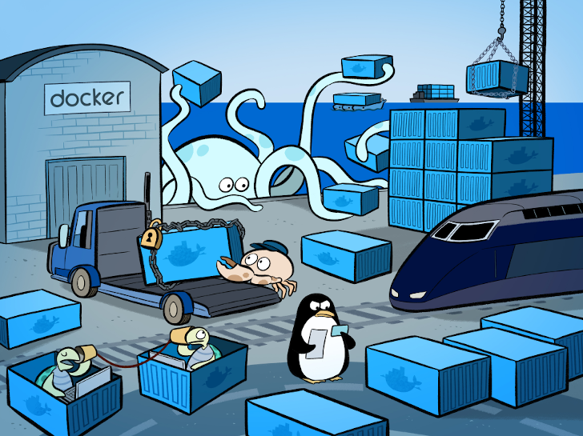
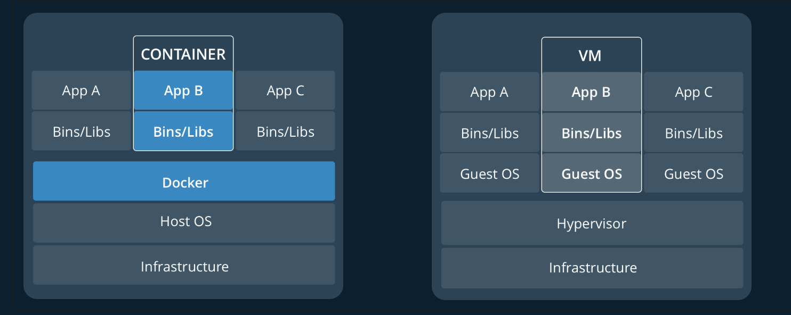

# Docker

Building and deploying new applications is faster with **containers**. `Docker` **containers** wrap up software and its dependencies into a standardized unit for software development that includes everything it needs to run: `code`, `runtime`, `system tools`and `libraries`. This guarantees that your application will always run the same and makes collaboration as simple as sharing a **container** image.

`Docker` **containers** whether `Windows` or `Linux` are backed by `Docker tools` and `APIs` and help you build better software:

- Onboard faster and stop wasting hours trying to set up development environments, spin up new instances and make copies of production code to run locally.
- Enable polyglot development and use any language, stack or tools without worry of application conflicts.
- Eliminate environment inconsistencies and the "works on my machine" problem by packaging the application, configs and dependencies into an isolated container.
- Alleviate concern over application security

## Docker concepts

`Docker` is a platform for developers and sysadmins to `build`, `share`, and `run` applications with containers. The use of containers to deploy applications is called containerization. Containers are not new, but their use for easily deploying applications is.

Containerization is increasingly popular because containers are:

- Flexible: Even the most complex applications can be containerized.
- Lightweight: Containers leverage and share the host kernel, making them much more efficient in terms of system resources than virtual machines.
- Portable: You can build locally, deploy to the cloud, and run anywhere.
- Loosely coupled: Containers are highly self sufficient and encapsulated, allowing you to replace or upgrade one without disrupting others.
- Scalable: You can increase and automatically distribute container replicas across a datacenter.
- Secure: Containers apply aggressive constraints and isolations to processes without any configuration required on the part of the user.



## Images and containers

Fundamentally, a **container** is nothing but a running process, with some added encapsulation features applied to it in order to keep it isolated from the host and from other **containers**. One of the most important aspects of container isolation is that each container interacts with its own, private filesystem; this filesystem is provided by a `Docker` **image**. An **image** includes everything needed to run an application -- the code or binary, runtimes, dependencies, and any other filesystem objects required.

## Containers and virtual machines

A **container** runs natively on `Linux` and shares the kernel of the host machine with other **containers**. It runs a discrete process, taking no more memory than any other executable, making it lightweight.

By contrast, a `virtual machine (VM)` runs a full-blown “guest” operating system with virtual access to host resources through a hypervisor. In general, `VM`s incur a lot of overhead beyond what is being consumed by your application logic.


---

## Usage

## Install Docker Desktop

The best way to get started developing containerized applications is with Docker Desktop, for OSX or Windows. Docker Desktop will allow you to easily set up Kubernetes or Swarm on your local development machine, so you can use all the features of the orchestrator you’re developing applications for right away, no cluster required. Follow the installation instructions appropriate for your operating system:

**_MAC OSX_**

Please follow this [instruction](https://docs.docker.com/docker-for-mac/install/)

**_LINUX UBUNTU_**

1. Update the `apt` package index:

   ```sh
   sudo apt-get update
   ```

2. Install packages to allow `apt` to use a repository over HTTPS:

   ```sh
   sudo apt-get install apt-transport-https ca-certificates curl gnupg-agent software-properties-common
   ```

3. Add `Docker’s` official GPG key:

   ```sh
   curl -fsSL https://download.docker.com/linux/ubuntu/gpg | sudo apt-key add -
   ```

   Verify that you now have the key with the fingerprint `9DC8 5822 9FC7 DD38 854A E2D8 8D81 803C 0EBF CD88`, by searching for the last 8 characters of the fingerprint.

4. Use the following command to set up the stable repository. To add the nightly or test repository, add the word nightly or test (or both) after the word stable in the commands below. Learn about nightly and test channels.

```sh
sudo add-apt-repository "deb [arch=amd64] https://download.docker.com/linux/ubuntu $(lsb_release -cs) stable"
```

## INSTALL DOCKER ENGINE - COMMUNITY

1. Update the `apt` package index:

   ```sh
   sudo apt-get update
   ```

2. Install the latest version of Docker Engine - Community and containerd, or go to the next step to install a specific version:

   ```sh
   sudo apt-get install docker-ce docker-ce-cli containerd.io
   ```

3. Verify that Docker Engine - Community is installed correctly by running the hello-world image.

   ```sh
   sudo docker run hello-world
   ```

4. Verify that Docker Engine - Community is installed correctly by running the hello-world image.

   ```sh
   sudo docker run hello-world
   ```

## References

- [Docker | Get Started](https://docs.docker.com/get-started/)
