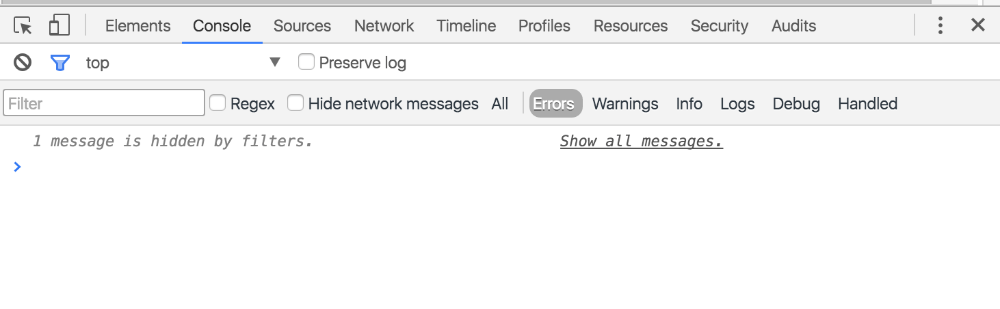

# JavaScript Console

When we're starting to learn JavaScript, one of the most important things is to log a data to the console.

---

## Console Object

Some variety of consoles are to ease the communication between developers.

### `console.log`

The standard log.

```js
console.log('Hello World')
```

It is also possible to have more than one text.

```js
console.log('Hello World', 'Hello Universe')
```

Other data types.

```js
console.log(100, true, { key: 'value' })
```

Interpolated string.

```js
console.log('Hello %s', 'World') // string
console.log('%d times', 100) // decimal number
console.log('This is %o', { key: 'value' }) // object
```

Using CSS.

```js
console.log('Hello %cworld', 'color: blue; font-size: 20px;')
```

### `console.warn`

Warning if something risky happened.

```js
console.warn('This is a warning text')
```

### `console.error`

Error if something bad happened.

```js
console.error('This is an error text')
```

### `console.info`

Info if something is important.

```js
console.info('This is an info text')
```

### `console.debug`

Debug if something is in debugging.

```js
console.debug('This is a debug text')
```

### `console.table`

```js
console.table(['Alpha', 'Betty', 'Classified'])
```

| (index) | Value        |
| ------- | ------------ |
| 0       | "Alpha"      |
| 1       | "Betty"      |
| 2       | "Classified" |

```js
Array(3)
```

### `console.assert`

Assert or test if something is `true` or `false`. There will be an error if the result is `false`, but there will be nothing happen if the result is `true`.

```js
const age = 25

console.assert(age === 24, 'Age is not 24')
// Assertion failed: Age is not 24
```

---

## Console Filters

Click the Filter button to filter console output. You can filter by severity level, by a regular expression, or by hiding network messages.



Filtering by severity level is equivalent to the following:

| Option   | Shows                                                           |
| -------- | --------------------------------------------------------------- |
| All      | Shows all console output                                        |
| Logs     | Only show output from `console.log()`                           |
| Warnings | Only show output from `console.warn()`                          |
| Errors   | Only show output from `console.error()`                         |
| Info     | Only show output from `console.info()`                          |
| Debug    | Only show output from `console.debug()` and `console.timeEnd()` |

---

## JavaScript Console References

- [Log Levels and Semantic Methods from @mykola on @eggheadio](https://egghead.io/lessons/javascript-log-levels-and-semantic-methods)
