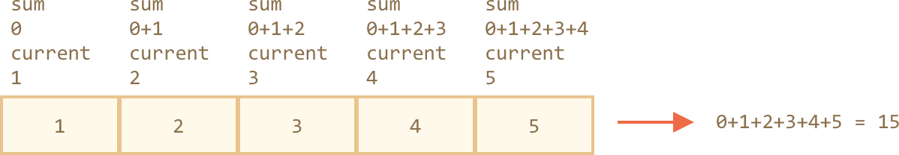

# JavaScript Global Objects `Array` Methods

---

## Array Manage Items

### `array.splice`

The `splice` method is a swiss army knife (or multi-functional) for arrays. It can do everything: add, remove, and insert elements/items.

```js
array.splice(index[, deleteCount, element1, ..., elementN])
```

It starts from the position `index`: removes `deleteCount` elements and then inserts `elem1, ..., elemN` at their place. Returns the array of removed elements.

**Deletion**

```js
const words = ['I', 'study', 'JavaScript']

words.splice(1, 1)
// Starting from the index `1`, it removed `1` element.

console.log(words) // ["I", "JavaScript"]
```

**Replace**

```js
const words = ['I', 'study', 'JavaScript', 'right', 'now']

// remove 3 first elements and replace them with the other two
words.splice(0, 3, "Let's", 'run')

console.log(words) // ["Let's", "run", "right", "now"]
```

**Return Removed Elements**

Here we can see that `splice` returns the array of removed elements:

```js
const words = ['I', 'study', 'JavaScript', 'right', 'now']

const removed = words.splice(0, 2) // we can store them into a variable

console.log(removed) // "I", "study" <-- array of removed elements
```

**Insertion**

The `splice` method is also able to insert the elements without any removals. For that we need to set `deleteCount` to `0`:

```js
let words = ['I', 'study', 'JavaScript']

// from index 2
// delete 0
// then insert "complex" and "language"
words.splice(2, 0, 'complex', 'language')

console.log(words) // "I", "study", "complex", "language", "JavaScript"
```

### `array.slice`

The method `slice` is much simpler than similar-looking `array.splice`.

```js
array.slice(start, end)
```

It returns a new array containing all items from index `"start"` to `"end"` (not including `"end"`). Both `start` and `end` can be negative, in that case position from array end is assumed.

It works like `string.slice`, but makes _subarrays_ instead of _substrings_.

```js
const text = 'test'
const letters = ['t', 'e', 's', 't']

console.log(text.slice(1, 3)) // es
console.log(letters.slice(1, 3)) // ["e", "s"]

console.log(text.slice(-2)) // st
console.log(letters.slice(-2)) // ["s", "t"]
```

### `array.concat`

The method `concat` joins the array with other arrays and/or items.

```js
array.concat(arg1, arg2...)
```

It accepts any number of arguments, either arrays or values. The result is a new array containing items from `array`, then `argument1`, `argument2` etc.

```js
const numbers = [1, 2]

// merge numbers with [3,4]
console.log(numbers.concat([3, 4])) // [1, 2, 3, 4]

// merge numbers with [3,4] and [5,6]
console.log(numbers.concat([3, 4], [5, 6])) // [1, 2, 3, 4, 5, 6]

// merge numbers with [3,4], then add values 5 and 6
console.log(numbers.concat([3, 4], 5, 6)) // [1, 2, 3, 4, 5, 6]
```

Normally, it only copies elements from arrays ("spreads" them). Other objects, even if they look like arrays, added as a whole:

```js
let numbers = [1, 2]

let arrayLike = {
  0: 'something',
  length: 1
}

console.log(numbers.concat(arrayLike)) // 1,2,[object Object]
//[1, 2, arrayLike]
```

---

## Array Loop Methods

### `array.sort`

The method `sort` sorts the array _in place_ directly.

```js
const numbers = [1, 2, 15]

// the method reorders the content of numbers (and returns it)
numbers.sort()

console.log(numbers) // [1, 15, 2]
```

That is strange! The order became `1, 15, 2`. It is incorrect.

Why? **Because the items are sorted as strings by default.**

Literally, all elements are converted to strings and then compared. So, the lexicographic ordering (lexical order, dictionary order, alphabetical order) is applied and indeed `"2" > "15"`.

To use our own sorting order, we need to supply a function of two arguments as the argument of `array.sort()`.

```js
const compare = (a, b) => {
  if (a > b) return 1
  if (a == b) return 0
  if (a < b) return -1
}
```

```js
const numbers = [1, 2, 15]

const compareNumeric = (a, b) => {
  if (a > b) return 1
  if (a == b) return 0
  if (a < b) return -1
}

numbers.sort(compareNumeric)

console.log(numbers) // [1, 2, 15]
```

```js
const numbers = [1, 2, 15]

numbers.sort((a, b) => a - b)

console.log(numbers) // [1, 2, 15]
```

### `array.reverse`

The method `reverse` reverses the order of elements in `array`. The index orders, not the values.

```js
const numbers = [1, 2, 3, 4, 5]

numbers.reverse()

console.log(numbers) // [5, 4, 3, 2, 1]
```

```js
const numbers = [100, 2000, 30, 40, 500]

numbers.reverse()

console.log(numbers) // [500, 40, 30, 2000, 100]
```

It also returns the array `numbers` after the reversal.

### `array.split`

The `split` method does exactly that. It splits the string into an array by the given delimiter `delimeter`.

```js
const charactersString = 'Bilbo, Gandalf, Nazgul'

// split by a comma followed by space
const charactersArray = charactersString.split(', ')

console.log(charactersArray) // ["Bilbo", "Gandalf", "Nazgul"]

for (let character of charactersArray) {
  console.log(`A message to ${character}.`)
}
// A message to Bilbo.
// A message to Gandalf.
// A message to Nazgul.
```

The `split` method has an optional second numeric argument, a limit on the `array`'s `length`. If it is provided, then the extra elements are ignored. In practice it is rarely used though:

```js
const charactersString = 'Bilbo, Gandalf, Nazgul, Saruman'

const charactersArray = charactersString.split(', ', 2)

console.log(charactersArray) // ["Bilbo", "Gandalf"]
```

The call to `split(parameter)` with an empty `parameter` would split the string into an array of letters.

```js
const text = 'test'

console.log(text.split('')) // ["t", "e", "s", "t"]
```

### `array.join`

The call `join` does the reverse to `split`. It creates a string of `array` items combined/glued by `separator` between them.

```js
const characters = ['Bilbo', 'Gandalf', 'Nazgul']

const newCharacters = characters.join(';')

console.log(newCharacters) // Bilbo;Gandalf;Nazgul
```

### `array.forEach`

`forEach` behaves similarly like a traditional `for` loop. It allows to run a function for every element of the array.

```js
array.forEach(function(item) {
  // ... do something with item
})
```

```js
array.forEach(function(item, index, array) {
  // ... do something with item, index, array
})
```

```js
array.forEach((item, index, array) => {
  // ... do something with item, index, array
})
```

```js
array.forEach(item => {
  // ... do something with item
})
```

```js
const characters = ['Bilbo', 'Gandalf', 'Nazgul']

characters.forEach(character => {
  console.log(character)
})
// Bilbo
// Gandalf
// Nazgul
```

```js
const characters = ['Bilbo', 'Gandalf', 'Nazgul']

characters.forEach(character => console.log(character))
// Bilbo
// Gandalf
// Nazgul
```

```js
const characters = ['Bilbo', 'Gandalf', 'Nazgul']

characters.forEach(alert)
```

And this code is more elaborate about their positions in the target array:

```js
const characters = ['Bilbo', 'Gandalf', 'Nazgul']

characters.forEach((item, index, array) => {
  console.log(`${item} is at index ${index} in ${array}`)
})
```

Within `forEach`, we _cannot_ `return` anything. The result of the function (if it returns any) is thrown away and ignored.

### `array.map`

The `map` method is one of the most useful and often used.

```js
const result = array.map(item => {
  // returns the new value instead of item
})
```

Within `map`, we can `return` something. It calls the function for each element of the array and returns the array of results.

```js
const characters = ['Bilbo', 'Gandalf', 'Nazgul']

const charactersAreCool = characters.map(item => {
  return `${item} is cool`
})

console.log(charactersAreCool)
// ["Bilbo is cool", "Gandalf is cool", "Nazgul is cool"]
```

```js
const characters = ['Bilbo', 'Gandalf', 'Nazgul']

const lengths = characters.map(item => item.length)

console.log(lengths) // [5, 7, 6]
```

### `array.indexOf`, `array.lastIndexOf`, `array.includes`

The methods `array.indexOf`, `array.lastIndexOf`, `array.includes` have the same syntax and do essentially the same as their `string` counterparts (`string.indexOf`, `string.lastIndexOf`, `string.includes`). But they operate on _items_ instead of _characters_.

- `array.indexOf(item, from)` looks for `item` starting from index `from`, and returns the index where it was found, otherwise `-1`.
- `array.lastIndexOf(item, from)` is similar, but looks from right to left.
- `array.includes(item, from)` looks for `item` starting from index `from`, returns `true` if found.

```js
const data = [1, 0, false]

console.log(data.indexOf(0)) // 1
console.log(data.indexOf(false)) // 2
console.log(data.indexOf(null)) // -1

console.log(data.includes(1)) // true
```

Note that the methods use `===` comparison. So, if we look for `false`, it finds exactly `false` and not the zero.

If we want to check for inclusion, and do not want to know the exact index, then `array.includes` is preferred.

Also, a very minor difference of `includes` is that it correctly handles `NaN`, unlike `indexOf` or `lastIndexOf`:

```js
const data = [NaN]

console.log(data.indexOf(NaN)) // -1 (should be 0, but === equality doesn't work for NaN)
console.log(data.includes(NaN)) // true (correct)
```

### `array.find`

Here the `find` method can find an object with the specific condition. In some cases, programming languages, or databases, it also called `array.findOne`.

```js
const result = array.find((item, index, array) => {
  // if true is returned, item is returned and iteration is stopped
  // for falsy scenario returns undefined
})
```

The function is called repetitively for each element of the array:

- `item` is the element.
- `index` is its index.
- `array` is the array itself.

If it returns `true`, the search is stopped, the `item` is returned. If nothing found, `undefined` is returned.

```js
const users = [
  { id: 1, name: 'Alpha' },
  { id: 2, name: 'Betty' },
  { id: 3, name: 'Gamma' }
]

// Find the one with id: 1
const user = users.find(item => item.id === 1)

console.log(user) // { id: 1, name: "Alpha" }
console.log(user.name) // "Alpha"
```

In real life, arrays of objects is a common thing, so the `find` method is very useful.

Note that in the example we provide to `find` the function `item => item.id == 1` with one argument. Other arguments of this function are rarely used.

### `array.findIndex`

The `findIndex` method is essentially the same with `find`, but it returns the index where the element was found instead of the element itself and `-1` is returned when nothing is found.

```js
const users = [
  { id: 1, name: 'Alpha' },
  { id: 2, name: 'Betty' },
  { id: 3, name: 'Gamma' }
]

// Find the index of the user with id: 1
const user = users.findIndex(item => item.id === 2)

console.log(user) // 1
```

### `array.filter`

The `find` method looks for a single (first) element that makes the function return `true`.

If there may be many, we can use `filter`.

The syntax is similar to `find`, but filter continues to iterate for all array elements even if `true` is already returned.

```js
const results = array.filter((item, index, array) => {
  // if true item is pushed to results and iteration continues
  // returns empty array for complete falsy scenario
})
```

```js
const users = [
  { id: 1, name: 'John' },
  { id: 2, name: 'Pete' },
  { id: 3, name: 'Mary' }
]

// returns array of the first two users
const newUsers = users.filter(item => item.id < 3)

console.log(newUsers) // [ {id: 1, name: "John"}, {id: 2, name: "Pete"} ]
console.log(newUsers.length) // 2
```

### `array.reduce`, `array.reduceRight`

When we need to iterate over an array, we can use `forEach`, `for` or `for...of`.

When we need to iterate and return the data for each element, we can use `map`.

The methods `reduce` and `reduceRight` also belong to that breed, but are a little bit more intricate. They are used to calculate a single value based on the array.

```js
const finalValue = array.reduce((previousValue, item, index, array) => {
  // return a value
}, initialValue)
```

The function is applied to the elements. You may notice the familiar arguments, starting from the 2nd:

- `item` is the current array item.
- `index` is its position.
- `array` is the array.

So far, like `forEach` or `map`. But there's one more argument:

- `previousValue` is the result of the previous function call, `initial` for the first call.

```js
const numbers = [1, 2, 3, 4, 5]
const initialValue = 0

const sumResult = numbers.reduce((sum, current) => {
  return sum + current
}, initialValue)

console.log(sumResult) // 15
```

```js
const numbers = [1, 2, 3, 4, 5, 6, 7, 8, 9, 10]

// Here we get a sum of array in just one line
const sumResult = numbers.reduce((sum, current) => sum + current, 0)

console.log(sumResult) // 55
```

Here we used the most common variant of `reduce` which uses only 2 arguments.

Let's see the details of what's going on.

- On the 1st run, `sum` is the initial value (the last argument of `reduce`), equals `0`, and `current` is the first array element, equals `1`. So the result is `1`.
- On the 2nd run, `sum = 1`, we add the second array element (`2`) to it and return.
- On the 3rd run, `sum = 3` and we add one more element to it, and so on.

The calculation flow:



Or in the form of a table, where each row represents a function call on the next array element:

| Iteration Call | `sum` | `current` | `result` |
| -------------- | ----- | --------- | -------- |
| 1st            | `0`   | `1`       | `1`      |
| 2nd            | `1`   | `2`       | `3`      |
| 3rd            | `3`   | `3`       | `6`      |
| 4th            | `6`   | `4`       | `10`     |
| 5th            | `10`  | `5`       | `15`     |

As we can see, the result of the previous call becomes the first argument of the next one.

We also can omit the `initialValue`:

```js
const numbers = [1, 2, 3, 4, 5]

// removed initial value from reduce
const result = numbers.reduce((sum, current) => sum + current) // there is no 0

console.log(result) // 15
```

The result is the same. That's because if there's no initial, then `reduce` takes the first element of the array as the initial value and starts the iteration from the 2nd element.

The calculation table is the same as above, minus the first row.

But such use requires an extreme care. If the array is empty, then `reduce` call without initial value gives an `Error`.

```js
const data = []

// Error: Reduce of empty array with no initial value
// if the initial value existed, reduce would return it for the empty array
data.reduce((sum, current) => sum + current)
// Uncaught TypeError: Reduce of empty array with no initial value
```

So it's advised to always specify the initial value.

The method `reduceRight` does the same, but goes in reverse, from right to left.

---

## JavaScript Global Objects `Array` References

- [Arrays](http://javascript.info/array)
- [Array Methods](http://javascript.info/array-methods)
- [Array - JavaScript | MDN](https://developer.mozilla.org/en-US/docs/Web/JavaScript/Reference/Global_Objects/Array)
