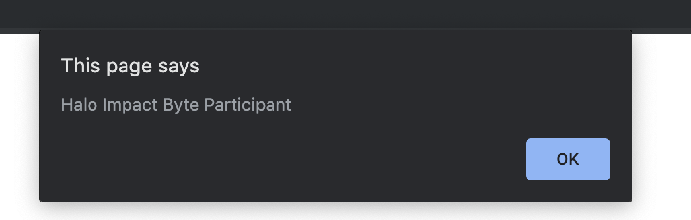

# JavaScript Interaction: Alert, Prompt & Confirm

In this chapter, we’ll get familiar with the browser functions alert, prompt and confirm.

## Alert

Syntax

```
alert(message)
```

This shows a message and pauses script execution until the user presses “OK”.

The mini-window with the message is called a `modal window`. The word “modal” means that the visitor can’t interact with the rest of the page, press other buttons, etc. until they have dealt with the window. In this case – until they press “OK”.



## Prompt

The function prompt accepts two arguments:

```js
let result = prompt(title, [default]);

```

It shows a modal window with a text message, an input field for the visitor, and the buttons OK/Cancel.

**title**
The text to show the visitor.

**default**
An optional second parameter, the initial value for the input field.
The visitor may type something in the prompt input field and press OK. Or they can cancel the input by pressing Cancel or hitting the Esc key.

The call to prompt returns the text from the input field or null if the input was canceled.

For instance:

```js
let age = prompt("How old are you?", 100);

alert(`You are ${age} years old!`); // You are 100 years old!
```

## Confirm

Syntax

```
let result = confirm(question);
```

The function confirm shows a modal window with a question and two buttons: OK and Cancel.

The result is true if OK is pressed and false otherwise.

For example:

```js
let isBoss = confirm("Are you the boss?");

alert(isBoss); // true if OK is pressed
```

---

## References

- [JavaScript Info](http://javascript.info/alert-prompt-confirm)
