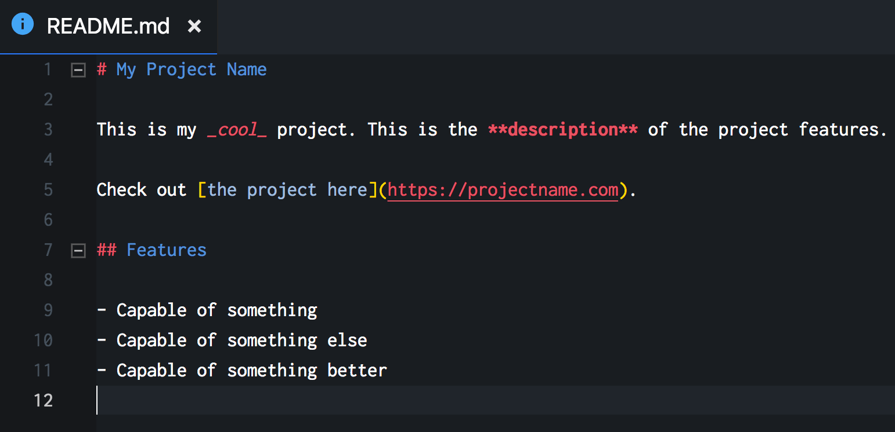
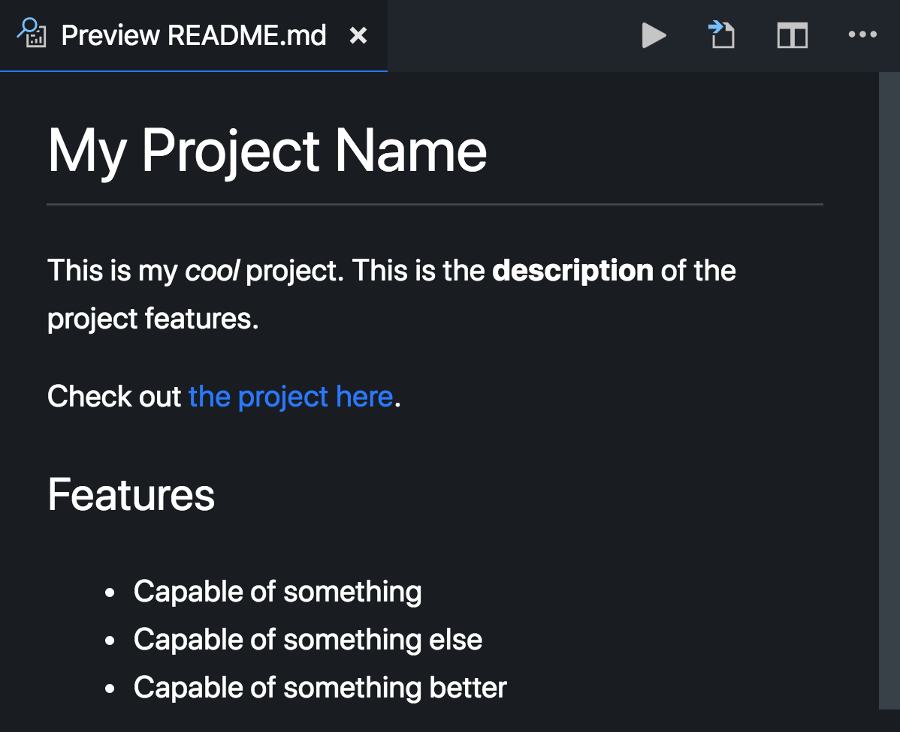

# Markdown Basic

Markdown is a simple way to format text that looks great on any device. It doesn’t do anything fancy like change the font size, color, or type — just the essentials, using keyboard symbols you already know.

## Markdown File

- Markdown file have `.md` extension
- Most of the Markdown files is named as `README.md`
- Most of the files are being used as documentation

## Markdown Elements and Syntax

### Headings

```md
# Heading 1

## Heading 2

## Heading 3
```

### Paragraphs

```md
This is a paragraph.

This is another paragraph.
With more text.
```

### Text Formats

```md
**bold**

_italic_

`code`
```

### Lists

```md
- Item A
- Item B
- Item C

1. Item One
2. Item Two
3. Item Three
```

### Links

```md
[Google](https://google.com)
```

### Images

```md

```

## Markdown Previewer





- [Built In Preview in VS Code](https://code.visualstudio.com/docs/languages/markdown)
- [Markdown Viewer](https://chrome.google.com/webstore/detail/markdown-viewer/ckkdlimhmcjmikdlpkmbgfkaikojcbjk)
- [Markdown Preview Plus](https://chrome.google.com/webstore/detail/markdown-preview-plus/febilkbfcbhebfnokafefeacimjdckgl)

## Markdown References

- https://commonmark.org/help
