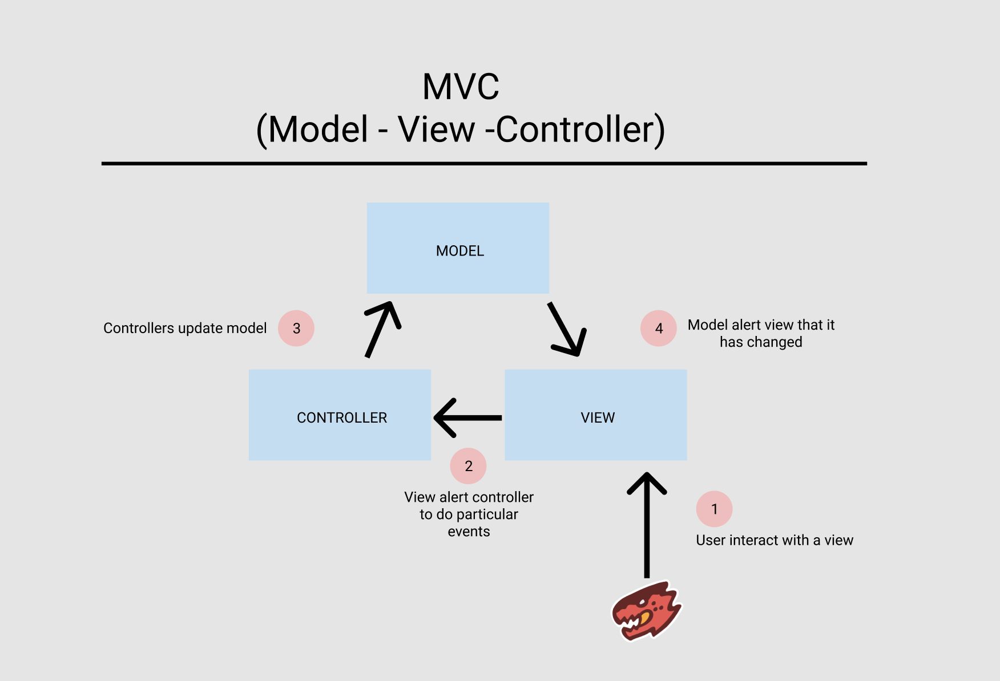

# MVC (Model - View - Controller)

## MVC Architecture

Model-View-Controller (MVC) is one of the most widespread and influential patterns in software architecture.



Three important MVC the components are:

1. **_Model_**: It includes all the data and its related logic
2. **_View_**: Present data to the user or handles user interaction
3. **_Controller_**: An interface between Model and View components

## View

A View is that part of the application that represents the presentation of data.

Views are created by the data collected from the model data. A view requests the model to give information so that it resents the output presentation to the user.

The view also represents the data from chats, diagrams, and table. For example, any customer view will include all the UI components like text boxes, drop downs, etc.

## Controller

The Controller is that part of the application that handles the user interaction. The controller interprets the mouse and keyboard inputs from the user, informing model and the view to change as appropriate.

A Controller send's commands to the model to update its state(E.g., Saving a specific document). The controller also sends commands to its associated view to change the view's presentation (For example scrolling a particular document).

## Model

The model component stores data and its related logic. It represents data that is being transferred between controller components or any other related business logic. For example, a Controller object will retrieve the customer info from the database. It manipulates data and send back to the database or use it to render the same data.

It responds to the request from the views and also responds to instructions from the controller to update itself. It is also the lowest level of the pattern which is responsible for maintaining data.

Project structure:

```sh
.
├── README.md
├── .gitignore
├── index.js
├── package.json
├── model
    ├── users.js
    └── product.js
├── views
    └── index.pug
├── routes
    ├── user
        └── controller.js
        └── index.js
    ├── product
        └── controller.js
        └── index.js


```

or we split controller into another folder

```sh
.
├── README.md
├── .gitignore
├── index.js
├── package.json
├── model
    ├── users.js
    └── product.js
├── views
    └── index.pug
├── controllers
    └── user.js
    └── product.js
├── routes
    └── user.js
    └── product.js
```

---

### Example

First we have to create index.js to run our express application

```js
// index.js

const express = require("express");
const createError = require("http-errors");
const path = require("path");
const bodyParser = require("body-parser");
const app = express();

const PORT = process.env.PORT || 3000;

const todoRouter = require("./routes/todo");

app.set("view engine", "pug");
app.set("views", path.join(__dirname, "views"));

app.use(bodyParser.urlencoded({ extended: false }));
app.use(bodyParser.json());

// routing
app.use("/todo", todoRouter);

// catch 404 and forward to error handler
app.use(function(req, res, next) {
  next(createError(404));
});

// error handler
app.use(function(err, req, res, next) {
  // set locals, only providing error in development
  res.locals.message = err.message;
  res.locals.error = req.app.get("env") === "development" ? err : {};

  // render the error page
  res.status(err.status || 500);
  res.send("error");
});

app.listen(PORT, () => {
  console.log(`You listen on server ${PORT}`);
});
```

And then we create our todos model

```js
// models/todos.js

const todos = [
  { id: 1, todo: "learn expresss" },
  { id: 2, todo: "learn backend" },
  { id: 3, todo: "learn nodejs" }
];

module.exports = todos;
```

Now, import todo model to controller so we can update the data

```js
const todos = require("../data/todos");

module.exports = {
  // ~get all todo~
  getAll: (req, res) => {
    res.send(todos);
  },

  // ~get todo by id~
  getById: (req, res) => {
    try {
      const filteredTodo = todos.find(item => item.id == req.params.id);
      res.send({
        message: "Here is what you looking for",
        filteredTodo
      });
    } catch (error) {
      res.send({
        message: `error get todo by id`,
        error
      });
    }
  },

  // ~add new todo~
  addTodo: (req, res) => {
    try {
      let newId = todos.length + 1;
      let newTodo = {
        id: newId,
        todo: req.body.todo
      };

      todos.push(newTodo);

      res.status(200).send({
        message: "todo successfully added",
        todos
      });
    } catch (error) {
      res.send({
        message: `error add todo`,
        error
      });
    }
  },

  // ~delete todo by its id~
  deleteTodo: (req, res) => {
    try {
      const idToDelete = req.params.id;
      let newTodo = todos.filter(item => item.id !== parseInt(idToDelete));

      todos = newTodo;

      res.status(200).send(todos);
    } catch (error) {
      res.send({
        message: `error delete todo`,
        error
      });
    }
  },

  // ~update a todo by its id~
  updateTodo: (req, res) => {
    try {
      let getTodoToUpdate = todos.findIndex(data => data.id == req.params.id);

      todos.map(data => {
        if (data.id == req.params.id) {
          todos[getTodoToUpdate].todo = req.body.todo;
        }
      });
      res.send({
        message: "data successfully updated",
        todos
      });
    } catch (error) {
      res.send({
        message: `error update todo`,
        error
      });
    }
  }
};
```

And now, import our controller to our routes

```js
// routes/todo/index.js

const express = require("express");
const route = express.Router();

const todoController = require("./controller.js");

// ~get all todo~
route.get("/", todoController.getAll);
// ~get todo by id~
route.get("/:id", todoController.getById);
// ~add new todo~
route.post("/", todoController.addTodo);
// ~delete todo by its id~
route.delete("/:id", todoController.deleteTodo);
// ~update a todo by its id~
route.put("/:id", todoController.updateTodo);

module.exports = route;
```

## References

- [Routes and Controller | MDN](https://developer.mozilla.org/en-US/docs/Learn/Server-side/Express_Nodejs/routes)
- [Geeksforgeeks](https://www.geeksforgeeks.org/model-view-controllermvc-architecture-for-node-applications/)
