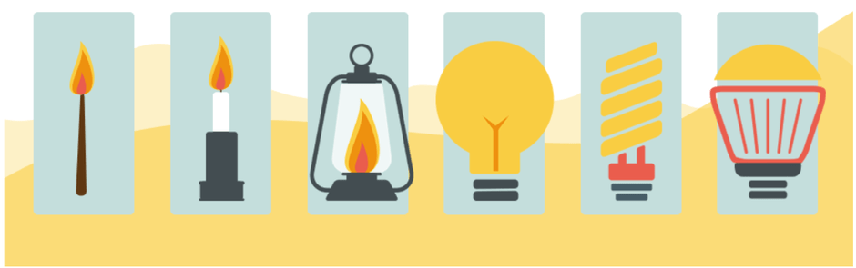
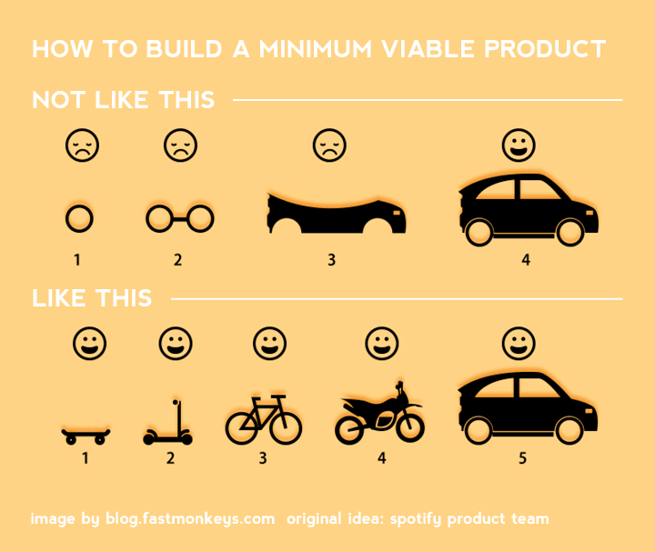
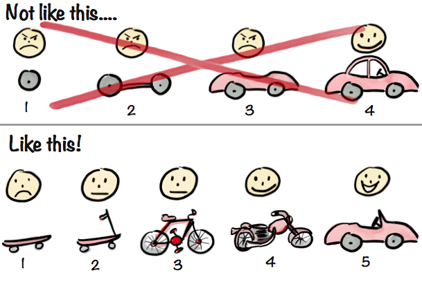
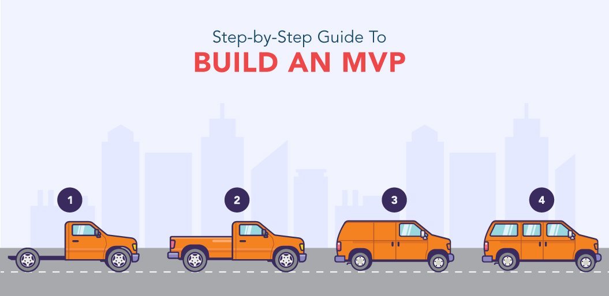
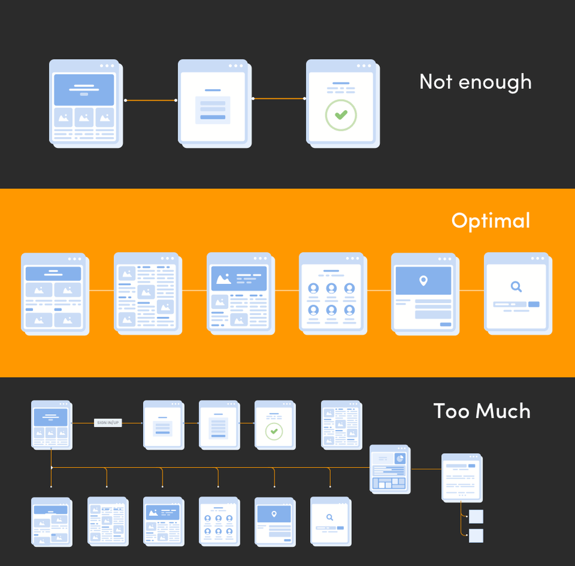
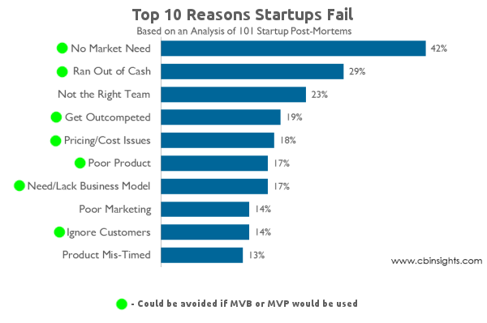
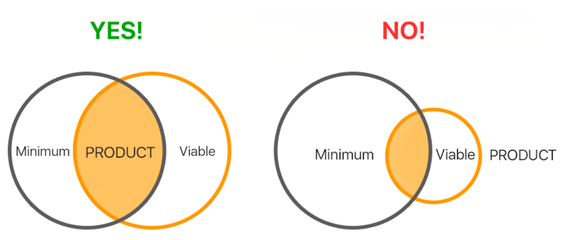
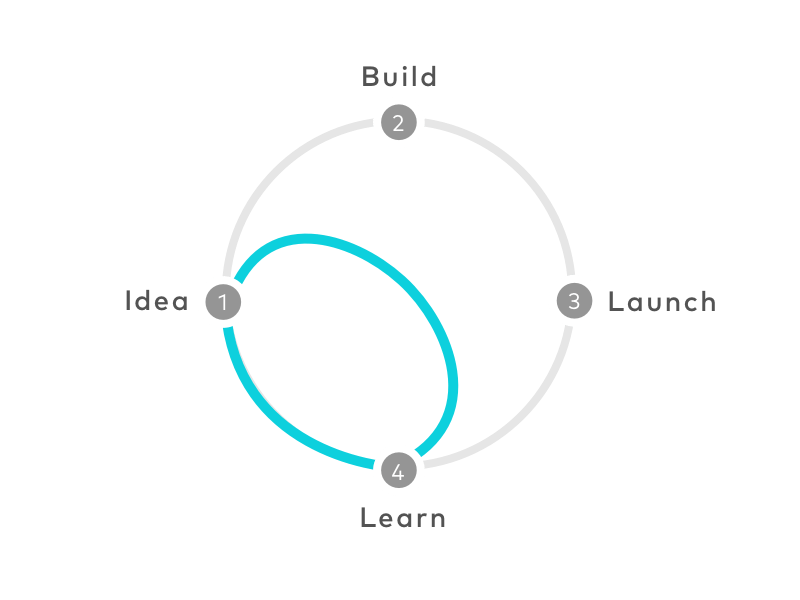
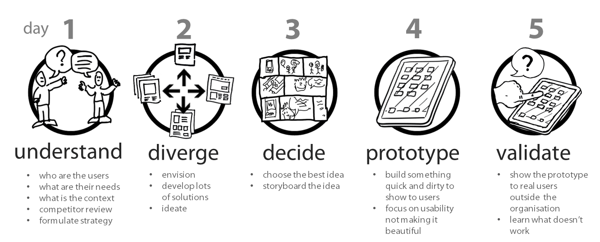
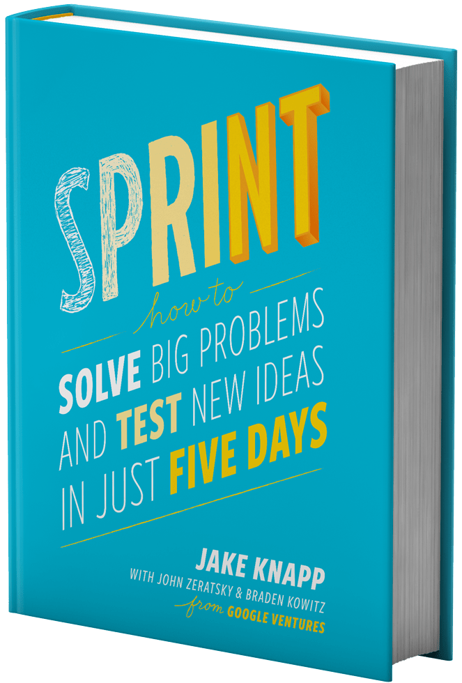

# Product Design

## Minimum Viable Product (MVP)

"The minimum viable product is that version of a new product a team uses to collect the maximum amount of validated learning about customers with the least effort." - Eric Reis

### Examples of Earliest MVPs

- Instagram: Initially, the MVP was focused on photo filters only. Users could take pictures, apply one of the suggested filters, and save them in an album on their device. Users liked the application and it has since been updated to include videos, geolocation, tagging other users, adding hashtags, and integrating with other social networks.
- Facebook, Snapchat, Spotify, Airbnb, Dropbox, Foursquare, etc

### Principles:

- Build something small, because small things are predictable and inexpensive (cheap) to test.
- Get it into the market quickly, because real learning occurs only when real customers are using a real product.
- Trash it if it's just a hype (flop), or invest if it’s a seedling with potential.

### Possibilities

Those that create and test a minimum viable product can:

- Save time and resources by making sure they are investing in a project which is likely to be successful
- Check whether the project is appealing to potential users
- Find out which trend will be optimal for full product development, with the help of integrations
- Aсquire a potential client base and find the product’s early adopters
- Save time and money in end product development by not needing to conduct expensive market research
- Attract investors earlier

### DO's and DON'TS

#### DO

- Maintain minimal functionality at a high quality
- Be oriented towards big markets
- Keep a monetization model in mind
- Monitor and apply user behaviour
- Get into the market as soon as possible
- Study competitors
- Come up with a marketing plan and strategy that attracts a large number of users.

#### DON’T

- Add unnecessary functionality
- Delay market entry by trying to add features again and again
- Forget about the product’s overall viability
- Be afraid to start again if MVP results aren’t favourable.

---

## Simple, Lovable, Complete (SLC)

"The Key to Startup Success? Get Out of the Building" - Steve Blank

The problem is that most customers hate MVPs. Startups are encouraged by the great Reid Hoffman to "launch early enough that you’re embarrassed by your v1.0 release." But no customer wants to use an unfinished product that the creators are embarrassed by. Customers want great products they can use _now_.

Loveable products are ones that people enjoy using. Viable products may be functional, but not something people enjoy. When we think about a project’s MVP, we rarely focus on a users wants, but much more on a users needs. Remembering to make a project lovable, helps us refocus, and deliver something the client needs to use, but also in a way that they want to use or interact with it.

---

## Design Sprint

The sprint is a five-day process for answering critical business questions through design, prototyping, and testing ideas with customers. Developed at GV, it’s a “greatest hits” of business strategy, innovation, behavior science, design thinking, and more—packaged into a battle-tested process that any team can use.

The sprint gives teams a shortcut to learning without building and launching.

The Sprint book: “Read this book and do what it says if you want to build better products faster.” —Ev Williams, founder of Medium and Twitter

---

## Product Design References

- MVP
  - [What does MVP mean? Minimum Viable Product Example and Benefits](https://www.youtube.com/watch?v=ixpphYTDiOM) 📺
  - [What is MVP and why is it necessary?](https://steelkiwi.com/blog/what-mvp-and-why-it-necessary)
  - [Steps to build a successful MVP as soon as possible](https://www.netsolutions.com/insights/how-to-build-an-mvp-minimum-viable-product-a-step-by-step-guide)
  - [MVP Paradox And Here’s How To Fix Your MVP Before Its Too Late!](https://hackernoon.com/mvp-paradox-and-what-most-founders-need-to-be-aware-of-3a5f8c3acb76)
  - [Making sense of MVP (Minimum Viable Product) – and why I prefer Earliest Testable/Usable/Lovable](https://blog.crisp.se/2016/01/25/henrikkniberg/making-sense-of-mvp)
  - [Mindset Change: MVP vs. SLC. – Hacker Noon](https://hackernoon.com/mindset-change-mvp-vs-slc-d087a7f87be3)
  - [I hate MVPs. So do your customers. Make it SLC instead.](https://blog.asmartbear.com/slc.html)
  - [Minimum viable product - Wikipedia](https://en.wikipedia.org/wiki/Minimum_viable_product)
- SLC
  - [Inside Product: Introduction to Simple, Lovable and Complete (SLC) Prototyping](https://medium.com/@nimay/shifting-prototyping-mindsets-from-mvp-to-slc-eab5bc42b6b2)
- Design Sprint
  - [The Design Sprint](https://www.gv.com/sprint)
  - [Design Sprint Kit - Share and engage with the Design Sprint Community](https://designsprintkit.withgoogle.com)
  - [How Google Design Sprint works – Product Management 101 – Medium](https://medium.com/productmanagement101/design-sprints-at-google-85ff62fed5f8)
  - [Sprint Stories](https://sprintstories.com)
