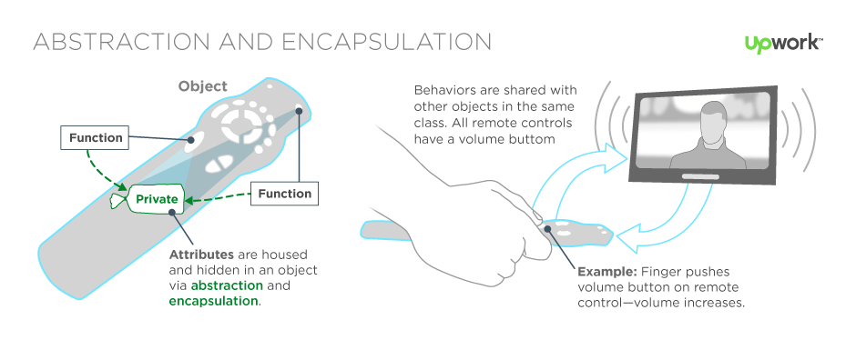
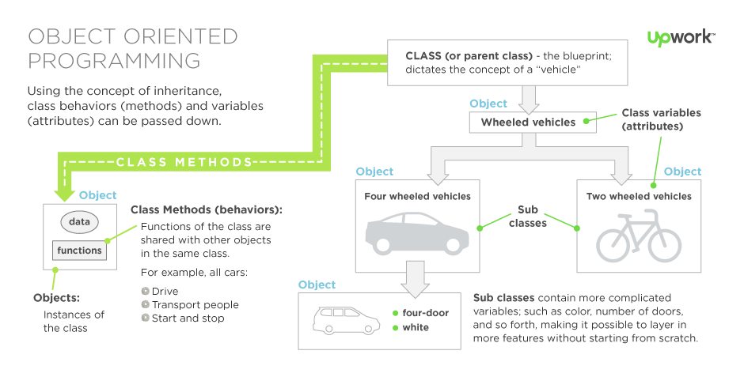

# Programming Paradigms

---

The word "paradigm" is used a great deal when talking about programming languages. What does it mean?

A **programming paradigm** is a _style_, or _way_ of programming.

Also means programming paradigms are a way to classify programming languages based on their features.

Languages can be classified into multiple paradigms.
Some languages make it easy to write in some paradigms but not others.

Never use the phrase "programming language paradigm".
A paradigm is a way of doing something (like programming), not a concrete thing (like a language).
So in the end, it is not black and white.

Here are some common paradigms:

- **Imperative**: Programming with an explicit sequence of commands that update state.
- **Declarative**: Programming by specifying the result you want, not how to get it.
- **Structured**: Programming with clean, goto-free, nested control structures.
- **Procedural**: Imperative programming with procedure calls.
- **Functional (Applicative)**: Programming with function calls that avoid any global state.
- **Function-Level (Combinator)**: Programming with no variables at all.
- **Object-Oriented**: Programming by defining objects that send messages to each other. Objects have their own internal (encapsulated) state and public interfaces. Object orientation can be:
- **Class-based**: Objects get state and behavior based on membership in a class.
- **Prototype-based**: Objects get behavior from a prototype object.
- **Event-Driven**: Programming with emitters and listeners of asynchronous actions.
- **Flow-Driven**: Programming processes communicating with each other over predefined channels.
- **Logic (Rule-based)**: Programming by specifying a set of facts and rules. An engine infers the answers to questions.
- **Constraint**: Programming by specifying a set of constraints. An engine finds the values that meet the constraints.
- **Aspect-Oriented**: Programming cross-cutting concerns applied transparently.
- **Reflective**: Programming by manipulating the program elements themselves.
- **Array**: Programming with powerful array operators that usually make loops unnecessary.

Paradigms are not meant to be mutually exclusive; a single program can feature multiple paradigms, not just one!

---

## OOP (Object Oriented Programming)

At its core, it is a natural logic, the one we use in daily life.
We naturally think of things as objects with attributes and behaviors, and that determines how we interact with them.
It is interacting in the abstract, not in the details, so we do not have to know completely about how things work inside the abstraction.
That is why OOP can boost speed and efficiency.

OOP is based on the sending of **messages** to **objects**.
Objects respond to messages by performing operations, generally called **methods** (or functions).
Messages themselves can have arguments or parameters.
A group or society of objects, each with their own local memory and own set of operations.

The "objects", which can contain data (fields/attributes) and code (procedures/methods/functions). A feature of objects is an object's procedures that can access and often modify the data fields of the object with which they are associated (objects have a notion of "this" or "self").

There are dozens of languages with object-oriented features:

- C#
- C++
- Cecil
- Common Lisp
- Delphi
- Dylan
- Eiffel
- Java
- JavaScript
- Julia
- Lua
- NewtonScript
- Objective-C
- Perl
- PHP
- Python
- R
- Ruby
- Simula, the first OOP language
- Smalltalk
- Visual Basic .NET

### Abstract Interaction

If you want to change the television channel from your seat, you use a remote control. That remote control is an **object** with a number of **attributes** and **behaviors** hidden inside of it. Without an understanding of those hidden attributes (the microchips, wiring, etc), you still know and expect that pressing a button will perform that particular function. You have interacted with the remote control in the abstract, skipping the steps the remote was designed to carry out. That is the beauty of OOP, the focus is on how the objects behave, not the code required to tell them how to behave.

### Building Blocks

#### Objects

An **object** is the core unit of OOP. Objects are uniquely named and represent an instance of a class. Each object houses different states (attributes), and shared behaviors, called methods. For example, a Tesla car is an object in the class of "cars" in a subclass of "electric cars" Its attributes include anything from the number of doors it has to how its electric component is charged. It is similar to other cars by its behavior, both can drives on the road, but its attributes are what set it apart.

#### Classes

A **class** is a blueprint for how an object is built, as well as being a sort of "parent category" for objects. Using the previous example, a class dictates the concept of a car (four wheels, an engine, a body, brakes, etc). It allows certain set criteria to be passed down to all objects in the class. All varieties of cars behave relatively the same on a basic level, but its their attributes and methods that make them unique.

#### Inheritance

The **inheritance** is an important aspect of OOP, hinted at above. By deriving classes from parent classes, behaviors can be passed down to objects, then more complicated attributes can be added the deeper you go. For example, breaking a car into subclasses (car → sports car → V8 sports car) makes it possible to layer in more features without starting from scratch.

#### Abstraction & Encapsulation

Both **abstraction** & **encapsulation** describes how attributes are housed (scoped) and hidden within an object, including its data. Objects are designed to only reveal the necessary data, allowing software to interact with the object on a higher level. It’s equal parts security and simplicity. In the case of car parts, by safely stowing them within the body of an assembled car, things are less likely to get broken, and users can interact with the big picture: pressing the gas means go, no questions asked.

---

## FP (Functional Programming)

In functional programming, control flow is expressed by combining function calls, rather than by assigning values to variables.

There are dozens of languages with functional features:

- Agda
- Charity
- Clean
- Clojure
- Coq (Gallina)
- Cuneiform
- Curry
- Elixir
- Elm
- Erlang
- Haskell
- Hope
- Idris
- Java
- JavaScript
- Joy
- Kotlin
- KRC
- Lisp
- Mathematica (Wolfram language)
- Mercury
- Miranda
- OCAML
- Perl 6
- PHP
- PureScript
- Python
- Ruby
- SAC
- SASL
- SequenceL
- Swift
- Tcl

---

## Programming Paradigms References

- [Programming Paradigms](https://cs.lmu.edu/~ray/notes/paradigms)
- [Programming paradigm - Wikipedia](https://en.wikipedia.org/wiki/Programming_paradigm)
- [What Is Object-Oriented Programming?](https://www.upwork.com/hiring/development/object-oriented-programming)
- [Object-oriented programming - Wikipedia](https://en.wikipedia.org/wiki/Object-oriented_programming)
- [List of object-oriented programming languages - Wikipedia](https://en.wikipedia.org/wiki/List_of_object-oriented_programming_languages)
- [Functional programming - Wikipedia](https://en.wikipedia.org/wiki/Functional_programming)
- [List of programming languages by type - Wikipedia](https://en.wikipedia.org/wiki/List_of_programming_languages_by_type#Functional_languages)
- [Functional Programming Introduction](https://www.tutorialspoint.com/functional_programming/functional_programming_introduction.htm)
- [4 Programming Paradigms In 40 Minutes](https://www.youtube.com/watch?v=cgVVZMfLjEI) 📺
