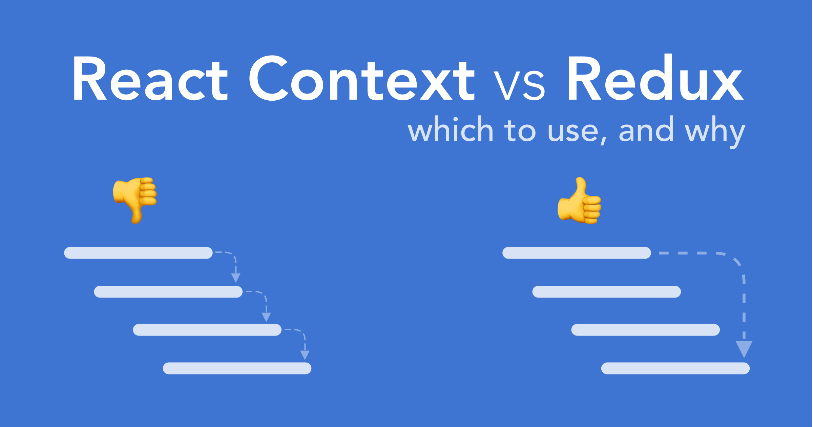

# React Context

Before getting into using Redux in React, it's important to know about `Context` first, because React Redux use it under the hood.

---

## React Context API

React itself has its own solution to manage complex state, called `Context`. Context provides a way to pass data through the component tree without having to pass props down manually at every level.



(**Left:** `props` Drilling. **Right:** Context `Provider` to `Consumer`)

In a typical React application, data is passed top-down (parent to child) via props, but this can be cumbersome for certain types of `props` (e.g. configuration, logged in user data, locale preference, UI theme) that are required by many components within an application. `Context` provides a way to share values like these between components without having to explicitly pass a prop through every level of the tree.

### `props` Drilling

For example, consider a `Page` component that passes a `user` and `avatarSize` prop several levels down so that deeply nested `Link` and `Avatar` components can read it:

```jsx
<Page user={user} avatarSize={avatarSize} />
// ... which renders ...
<PageLayout user={user} avatarSize={avatarSize} />
// ... which renders ...
<NavigationBar user={user} avatarSize={avatarSize} />
// ... which renders ...
<Link href={user.permalink}>
  <Avatar user={user} size={avatarSize} />
</Link>
```

It might feel redundant to pass down the `user` and `avatarSize` props through many levels if in the end only the `Avatar` component really needs it. It's also annoying that whenever the `Avatar` component needs more props from the top, you have to add them at all the intermediate levels too.

### Context `Provider` to `Consumer`

`Context` is just a set of a function and a component. With some few steps:

1. `React.createContext`
2. Use `Context.Provider` in the top
3. Use `Context.Consumer` in the childrens
4. Consume data from `Provider` to `Consumer`

```jsx
// Context lets us pass a value deep into the component tree
// without explicitly threading it through every component.
// Create a context for the current theme (with "light" as the default).
const ThemeContext = React.createContext('light')
// You can name it as you want, such as AppContext or MyContext

class App extends React.Component {
  render() {
    // Use a Provider to pass the current theme to the tree below.
    // Any component can read it, no matter how deep it is.
    // In this example, we're passing "dark" as the current value.
    // ThemeContext.Provider is a component
    return (
      <ThemeContext.Provider value='dark'>
        <Toolbar />
      </ThemeContext.Provider>
    )
  }
}

// A component in the middle doesn't have to
// pass the theme down explicitly anymore.
const Toolbar = props => {
  return (
    <div>
      <ThemedButton />
    </div>
  )
}

class ThemedButton extends React.Component {
  // Assign a contextType to read the current theme context.
  // React will find the closest theme Provider above and use its value.
  // In this example, the current theme is "dark".
  static contextType = ThemeContext

  // We can use the context anywhere
  render() {
    return <Button theme={this.context} />
  }
}
```

### `React.createContext`

```jsx
const MyContext = React.createContext(defaultValue)
```

Creates a `Context` object. When React renders a component that subscribes to this `Context` object it will read the current context value from the closest matching `Provider` above it in the tree.

### `Context.Provider`

```jsx
<MyContext.Provider value={/* some value */}>
```

Every `Context` object comes with a `<Provider>` React component that allows consuming components to subscribe to context changes.

Accepts a `value` prop to be passed to consuming components that are descendants (childrens) of this Provider. One Provider can be connected to many "consumers". Providers can be nested to override values deeper within the tree.

All consumers that are descendants of a Provider will re-render whenever the Provider's `value` prop changes. The propagation (distribution of data) from Provider to its descendant consumers is not subject to the `shouldComponentUpdate` method, so the consumer is updated even when an ancestor component bails out of the update.

```jsx
// Make a new context
const MyContext = React.createContext()

// Create a Provider component
class MyProvider extends React.Component {
  state = {
    name: 'Wes',
    age: 100,
    cool: true
  }

  // The state would be stored in the Provider
  render() {
    return (
      <MyContext.Provider
        value={{
          state: this.state,
          growAYearOlder: () =>
            this.setState({
              age: this.state.age + 1
            })
        }}
      >
        {this.props.children}
      </MyContext.Provider>
    )
  }
}
```

```jsx
const App = props => {
  return (
    <MyProvider>
      <div>
        <p>I am the actual App</p>
        <Family />
      </div>
    </MyProvider>
  )
}
```

### `Context.Consumer`

```jsx
const Family = props => {
  return (
    <section>
      <Person />
      <Person />
      <Person />
    </section>
  )
}
```

```jsx
const Person = props => {
  // Look! No props passed
  // We can just use the data inside the Consumer
  return (
    <div className='person'>
      <MyContext.Consumer>
        {context => (
          <React.Fragment>
            <p>Age: {context.state.age}</p>
            <p>Name: {context.state.name}</p>
            <button onClick={context.growAYearOlder}>🍰🎂🍰</button>
          </React.Fragment>
        )}
      </MyContext.Consumer>
    </div>
  )
}
```

Finally the component can access the context data anywhere through `Consumer`, that was previously given by the `Provider`.

---

## React Context References

### Essentials

- [Context - React](https://reactjs.org/docs/context.html)
- [Redux vs. The React Context API](https://daveceddia.com/context-api-vs-redux)
- [Here's how React's New Context API Works - YouTube](https://www.youtube.com/watch?v=XLJN4JfniH4)
  - [`wesbos/React-Context` - Quick demo of how to use React's new Context API](https://github.com/wesbos/React-Context)
- [React Context for State Management from @dceddia on @eggheadio](https://egghead.io/courses/react-context-for-state-management)
  - [Pass Data through a Component Tree using Context Providers and Consumers in React 16.3 - egghead.io](https://egghead.io/lessons/react-pass-data-through-a-component-tree-using-context-providers-and-consumers-in-react-16-3)
  - [Use React Context to Manage Application State Through Routes from @avanslaars on @eggheadio](https://egghead.io/lessons/react-use-react-context-to-manage-application-state-through-routes)
- [React’s ⚛️ new Context API – DailyJS – Medium](https://medium.com/dailyjs/reacts-%EF%B8%8F-new-context-api-70c9fe01596b)
- [Exploring the React Context API with Provider and Consumer - RWieruch](https://www.robinwieruch.de/react-context-api)
