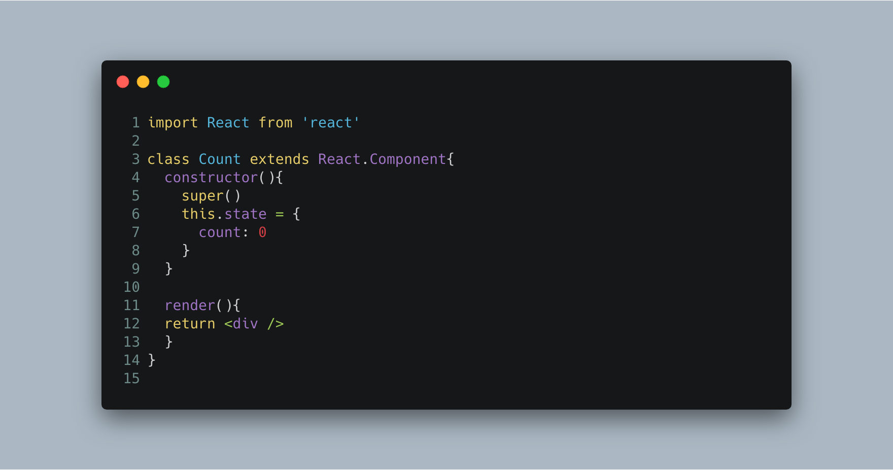
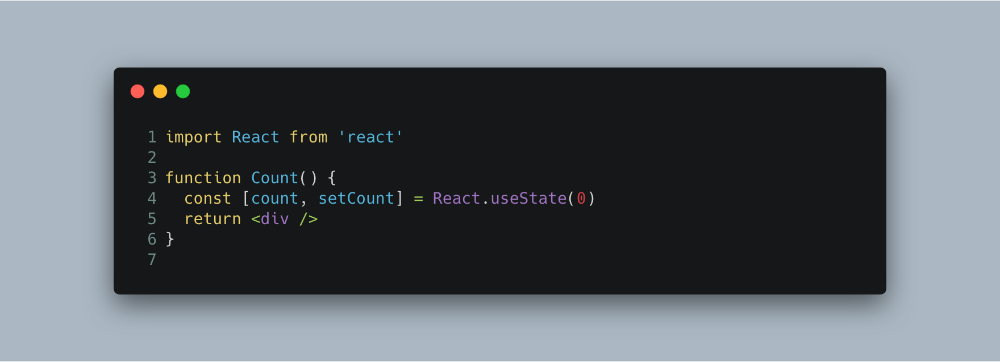
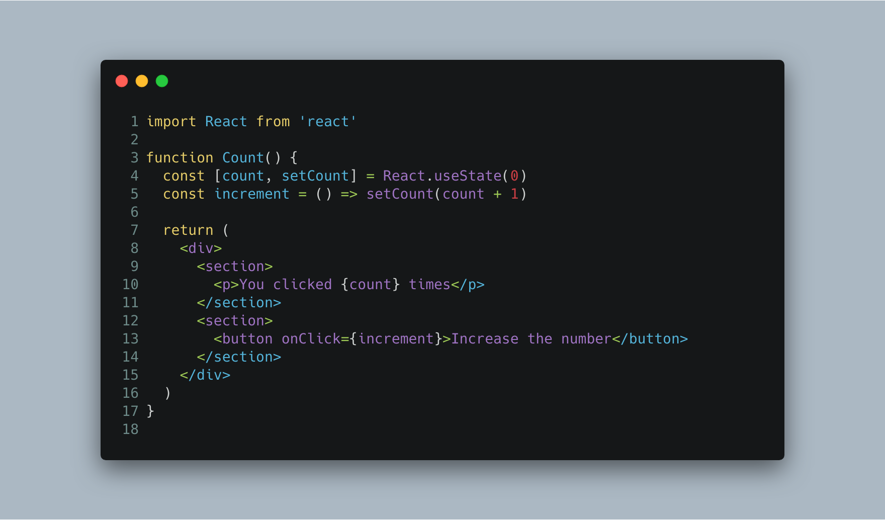
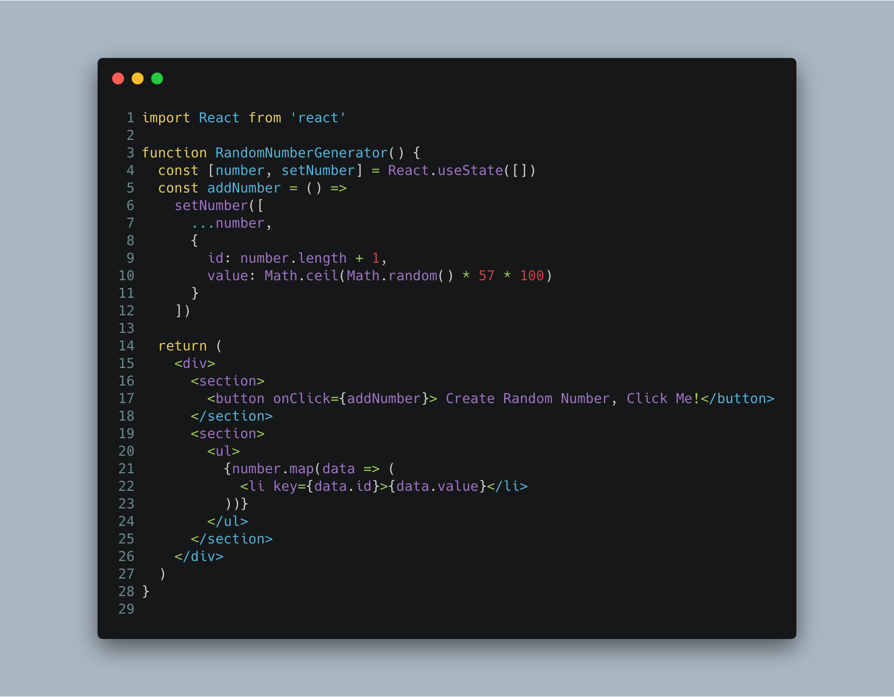
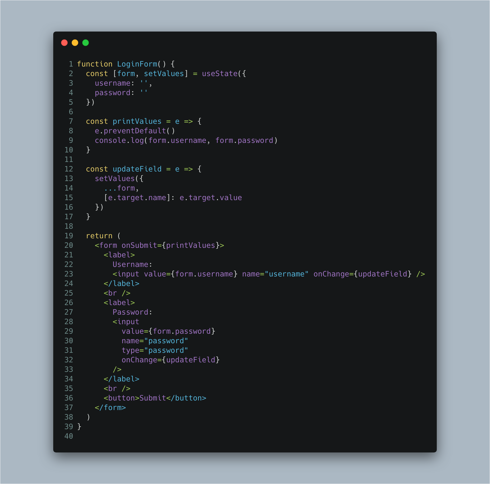

# React Hooks useSTate

Up until now, when you write a `function component` and then ran into a situation where you needed to add state, so you had to convert your component using `class component`

But now, you don't have to do that beacuse `useState`

## useState

---

The `useState` hook lets you add state to your `function component`

At line 4, here we declare a state called count and set the value to 0 using `useState`.
So, by calling `useState` inside a function component, you’re creating a single piece of state.

In classes, the state is always an object. You can store properties on that object.

With `hooks`, the state doesn’t have to be an object. It can be any type you want – an `array`, a `number`, a `boolean`, a `string`, etc. Each call to `useState` creates a single piece of state, holding a single value.

## Changing State

---

In `class component` `this.setState` is the way when we want to change our current state. But, how to do that in `function component` using `hooks`

`useState` returns an array with 2 elements, and we’re using `ES6` destructuring to assign names to them.
If you see the image above at line 4, we have 2 elements inside an array.
The first element is the current value of the state, and the second element is a state `setter function` – just call it with a new value, and the state will be set and the component will re-render.

### State as an array

Notice that we initializing the state to an empty array. <small>see line 4</small>

The state updater function (`setNumber`, here) doesn’t “merge” new values with old – it overwrites the state with the new value. This is a departure from the way this.setState worked in classes.

So in order to add an number to the array, we’re using the `ES6 spread operator ...` to copy the existing items into the new array, and inserting the new number at the end.

### State as an object

The `updateField` function is more interesting. It uses setValues (which is what we called the state updater) and passes an object, but it must be sure to include the existing state with `...form` if it doesn’t want to overwrite it. Try taking out the `...form` line and see how the form behaves.

At the bottom we have a pretty standard-looking chunk of JSX to render the form and its inputs. Since we’ve passed a name prop to the inputs, the updateField function can use it to update the appropriate state. This way you can avoid having to write a handler function for each field.

---

## References

- [Hooks setState](https://daveceddia.com/usestate-hook-examples/)
- [Hooks State](https://reactjs.org/docs/hooks-state.html)
