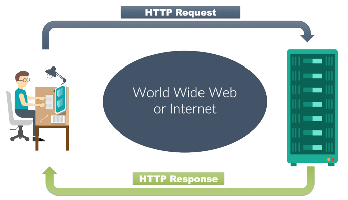
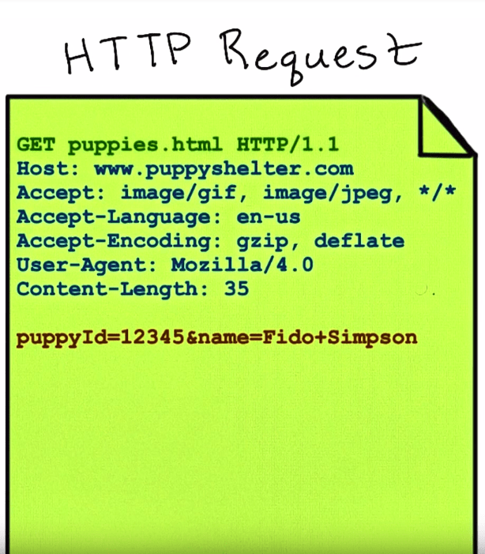
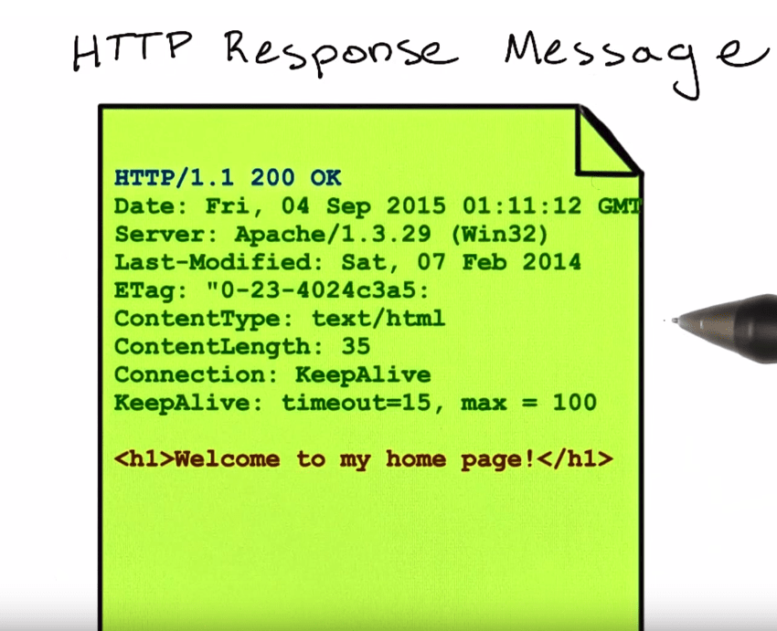
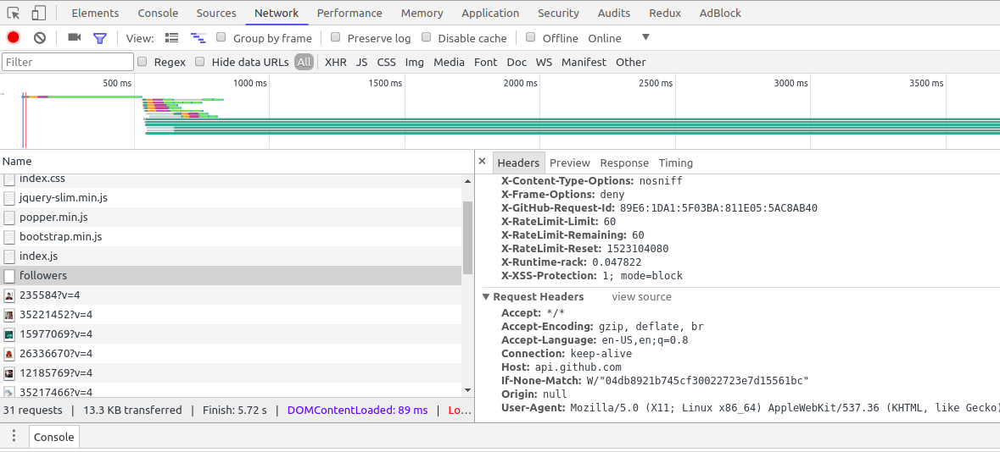
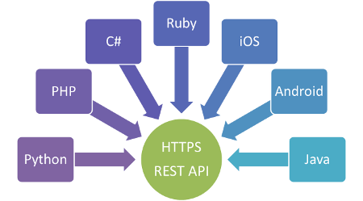

# REST API Basic

---

## HTTP

HTTP is a protocol which allows the fetching of resources, such as HTML documents. It is the foundation of any data exchange on the Web and a client-server protocol, which means requests are initiated by the recipient, usually the Web browser.

### HTTP Communication Process



### HTTP Request Structure

- Request line: First line of HTTP Request, consist of HTTP Verb, URI, and HTTP version number.
- Header: Describe specific property of a request.
- Body: Additional information about request.



### HTTP Response Structure

- Status line: First line of HTTP Response, consist of HTTP version, status code, and reason parse.
- Header: Optional response header.
- Body: Requested resource



### HTTP header

HTTP headers allow the client and the server to pass additional information with the request or the response. A request header consists of its case-insensitive name followed by a colon ':', then by its value (without line breaks). You can see it through you browser by using developer tools (Network tab).



### HTTP verbs

HTTP defines a set of request methods to indicate the desired action to be performed for a given resource.

**HTTP Verb & Description**

- `GET` = The GET method requests a representation of the specified resource. Requests using `GET` should only retrieve data, not creating a new data.
- `POST` = The `POST` method is used to submit an entity to the specified resource, often causing a change in state or side effects on the server.
- `PUT` = The `PUT` method replaces all current representations of the target resource with the request payload.
- `DELETE` = The `DELETE` method deletes the specified resource.
- `CONNECT` = The `CONNECT` method establishes a tunnel to the server identified by the target resource.
- `OPTIONS` = The `OPTIONS` method is used to describe the communication options for the target resource.
- `HEAD` = The `HEAD` method asks for a response identical to that of a `GET` request, but without the response body.

### HTTP Status Codes

HTTP response status codes indicate whether a specific HTTP request has been successfully completed. Responses are grouped in five classes: informational responses, successful responses, redirects, client errors, and servers errors.

- `1××` Informational
- `2××` Success
  - `200` OK
  - `201` Created
- `3××` Redirection
  - `300` Multiple Choices
  - `301` Moved Permanently
  - `307` Temporary Redirect
  - `308` Permanent Redirect
- `4××` Client Error
  - `400` Bad Request
  - `401` Unauthorized
  - `403` Forbidden
  - `404` Not Found
  - `405` Method Not Allowed
  - `408` Request Timeout
  - `418` I'm a teapot
  - `429` Too Many Requests
- `5××` Server Error
  - `500` Internal Server Error
  - `501` Not Implemented
  - `502` Bad Gateway
  - `503` Service Unavailable
  - `504` Gateway Timeout

---

## Restful APIs

API (Application Programming Interface) itself is just a term for describing how a programs communicate and exchange data in certain format.

Meanwhile, REST (**RE**presentational **S**tate **T**ransfer) is a one of many architectural style of an API. A RESTful API is an API that uses HTTP requests/verbs to `GET`, `PUT`, `POST`, and `DELETE` data.



### Other API Architectures

- SOAP
- GraphQL
- gRPC

---

## Example of RESTful API designs

| Route                       | HTTP Verb | Description                  |
| --------------------------- | --------- | ---------------------------- |
| `example.com/api/items`     | `GET`     | Get all the items            |
| `example.com/api/items/:id` | `GET`     | Get a single item            |
| `example.com/api/items`     | `POST`    | Save an item                 |
| `example.com/api/items`     | `DELETE`  | Remove all the items         |
| `example.com/api/items/:id` | `DELETE`  | Remove an item               |
| `example.com/api/items/:id` | `PUT`     | Update an item with new info |

## Example of GitHub RESTful API

| Route                                              | HTTP Verb | Description             |
| -------------------------------------------------- | --------- | ----------------------- |
| `https://api.github.com/users`                     | `GET`     | Get all users (limited) |
| `https://api.github.com/users/:username`           | `GET`     | Get a single user       |
| `https://api.github.com/users/:username/followers` | `GET`     | Get user followers      |
| `https://api.github.com/users/:username/following` | `GET`     | Get following users     |

## REST API Client

In order to access REST API for experiment or learning, before using it inside a programming language, we can use a REST API client apps:

CLI:

- [cURL](https://curl.haxx.se)
- [HTTPie](https://httpie.org)

GUI:

- [Postman](https://getpostman.com)
- [Insomnia](https://insomnia.rest)

## REST API `XHR`

The classic way of getting data from API is using `XHR` or `XMLHttpRequest`, sometimes called `AJAX`. Although we don't use this anymore.

```js
function requestListener() {
  console.log(this.response)
}

var xhr = new XMLHttpRequest()
xhr.addEventListener('load', requestListener)
xhr.open('GET', 'http://example.org/example.json')
xhr.send()
```

## REST API `fetch`

The built-in `window.fetch()` browser API provides a JavaScript interface for accessing and manipulating parts of the HTTP pipeline, such as requests and responses. Keep in mind that `fetch` is natively only available on the browser, not server side (such as Node.js).

A request to API will return as a javascript response object. We can use `.json()` built in method to returns a promise that resolves with the result of parsing the body text as JSON.

```js
fetch('https://api.github.com/users/username')
  .then(response => {
    // We have to convert the response manually
    return response.json()
  })
  .then(data => {
    console.log(data)
  })
  .catch(error => {
    console.log(error)
  })
```

## REST API `axios`

We can also use packages like [`axios`](https://www.npmjs.com/package/axios) to handle it better.

```js
const axios = require('axios')

axios
  .get('https://api.github.com/users/username')
  .then(response => console.log(response.data))
  .catch(error => console.log(error))
```

---

## REST API Basic References

## Essentials

- [REST - MDN Web Docs Glossary: Definitions of Web-related terms | MDN](https://developer.mozilla.org/en-US/docs/Glossary/REST)
- [HTTP Status Codes — httpstatuses.com](https://httpstatuses.com)
- [HTTP response status codes - HTTP | MDN](https://developer.mozilla.org/en-US/docs/Web/HTTP/Status)
- [REST API Tutorial - What is a REST API? - YouTube](https://www.youtube.com/watch?v=BRdcRFvuqsE&list=PL4cUxeGkcC9jBcybHMTIia56aV21o2cZ8)
- [Understanding And Using REST APIs — Smashing Magazine](https://www.smashingmagazine.com/2018/01/understanding-using-rest-api)
- [HTTP Status Codes](https://httpstatuses.com)
- [Learn REST | A RESTful Tutorial | REST API Tutorial](http://www.restapitutorial.com)
- [How to Use the JavaScript Fetch API to Get Data ― Scotch.io](https://scotch.io/tutorials/how-to-use-the-javascript-fetch-api-to-get-data)
- [Using Fetch - Web APIs | MDN](https://developer.mozilla.org/en-US/docs/Web/API/Fetch_API/Using_Fetch)
- [API Glossary & Acronyms](http://apiglossary.com)
- [Best Practices for Designing a Pragmatic RESTful API | Vinay Sahni](https://www.vinaysahni.com/best-practices-for-a-pragmatic-restful-api)
- [HTTP API Design Guide](https://geemus.gitbooks.io/http-api-design/content/en)
- [`lambda2/rapis`: A specification proposal for API's](https://github.com/lambda2/rapis)
- [Parts of HTTP Request - Udemy](https://www.youtube.com/watch?v=pHFWGN-upGM)

## In Bahasa Indonesia

- [REST API #1 APA ITU API?](https://www.youtube.com/watch?v=vQJJ_K1JbEA)
- [REST API #2 REST dan HTTP](https://www.youtube.com/watch?v=dtpm5wwXEIY)

### Additionals

- [GraphQL vs. REST – Apollo GraphQL](https://dev-blog.apollodata.com/graphql-vs-rest-5d425123e34b)
- [Websocket - Mozilla Developer Network](https://developer.mozilla.org/en-US/docs/Web/API/WebSockets_API)
