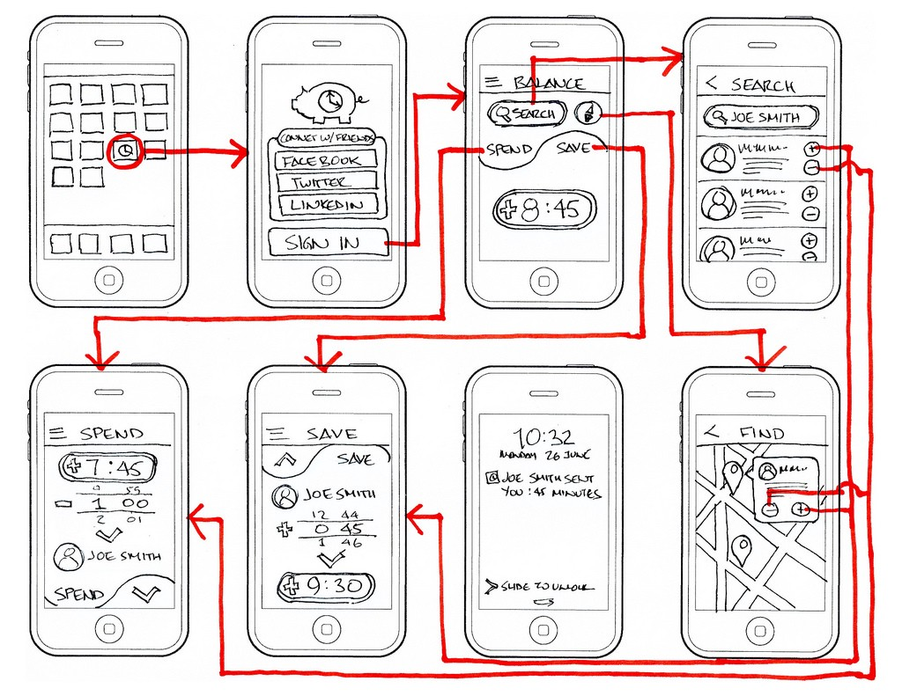

# UI Design Basic

## UI Design Terminologies

### Wireframe

### Mockup

### Prototype

## UI Design References

- [Checklist Design - Best UI elements for the best UX practice](https://www.checklist.design)
