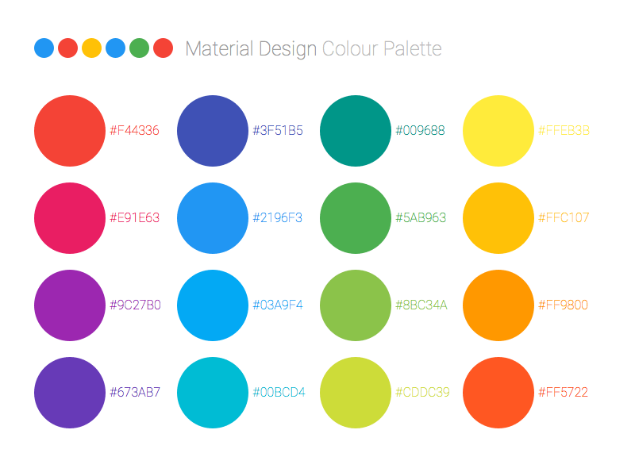
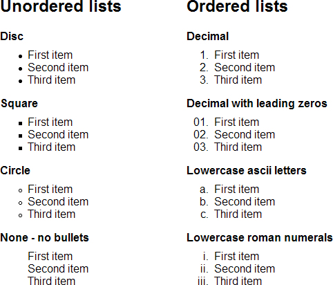

# UI Design Elements

## Text

- Font Weight
  - Bold
  - Italic
  - Weight Unit: `100`-`900`
- Font Size Unit
  - `px` (pixel)
  - `em`
  - `rem`

Read more on [Guide: EM vs REM vs PX. Which should you use?](https://engageinteractive.co.uk/blog/em-vs-rem-vs-px)

## Typography

- Serif
- Sans Serif
- Display
- Handwriting

## Image Format

- Raster or Bitmap
  - JPG
  - PNG
  - GIF
- Vector
  - SVG
  - PDF
  - AI

## Video Format

- MP4
- MOV
- AVI

## Audio

- MP3
- OGG
- WAV
- AAC

## Color

### Common Color Names and Swatches

- `black`
- `white`
- `red`
- `green`
- `blue`

### Color Hexacode (Hexadecimal 16-Bit / 16-Based Number)

- `0...9...a...f`
- `#000` / `#000000`
- `#fff` / `#ffffff`
- `#f00` / `#ff0000`
- `#0f0` / `#00ff00`
- `#00f` / `#0000ff`

### Color RGB/RGBA (Red, Green, Blue, Alpha)

- `rgb(0,0,0)`
- `rgb(255,255,255)`
- `rgb(255,0,0)`
- `rgb(0,255,0)`
- `rgb(0,0,255)`

### Color HSL/HSLA (Hue, Saturation, Lightness, Alpha)

- hsl(0,0%,0%)
- hsl(0,0%,100%)
- hsl(0,100%,50%)
- hsl(120,100%,50%)
- hsl(240,100%,50%)

Learn more on [ColorHexa.com](https://colorhexa.com)

## Layout or Item Placing

- Inline
- Inline Block
- Block

## Button

- Priorities: Primary, Secondary, Tertiary
- States: Normal, Hover, Active, Foxus
- Conditions: Enabled, Disabled
- Styles: Color, Press, Icon, Switch

Learn more on [Designing Button States](https://cloudfour.com/thinks/designing-button-states).

## List of Items

- Unordered with symbols
- Ordered
  - 1, 2, 3, ...
  - a, b, c, ...

## Form and Input

- Label
- Input
  - State: Normal, Placeholder, Disabled
  - Text
  - Number
  - Email
  - Password
  - Date
  - Time
  - File
- Text Area
- Radio Button
- Checkbox
- Option Select

Learn more on [The UX behind designing better forms – UX Collective](https://uxdesign.cc/the-ux-behind-designing-better-forms-d6ebe7a817d2)

## Table

- Table Header
- Table Body
- Table Footer
- Table Row
- Table Column
- Table Data or Cell

## Template or UI Kit

- Hero
- Navigation
- Header
- Content
- Footer
- Logo
- Menu
- Button
- Slider
- Form
- Frame
- Images
- Icons
- etc

## UI Design Elements References

- [User Interface Elements | Usability.gov](https://www.usability.gov/how-to-and-tools/methods/user-interface-elements.html)
- [32 User Interface (UI) Elements Designers Need To Know](https://careerfoundry.com/en/blog/ui-design/ui-element-glossary)
- [UI/UX Design Glossary. Navigation Elements | Tubik Studio](https://tubikstudio.com/uiux-design-glossary-navigation-elements)
