# Web Design

In today's web, the design is either adaptive or responsive to the device screen, viewport, or browser size.

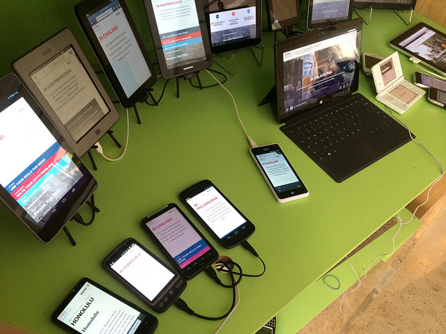

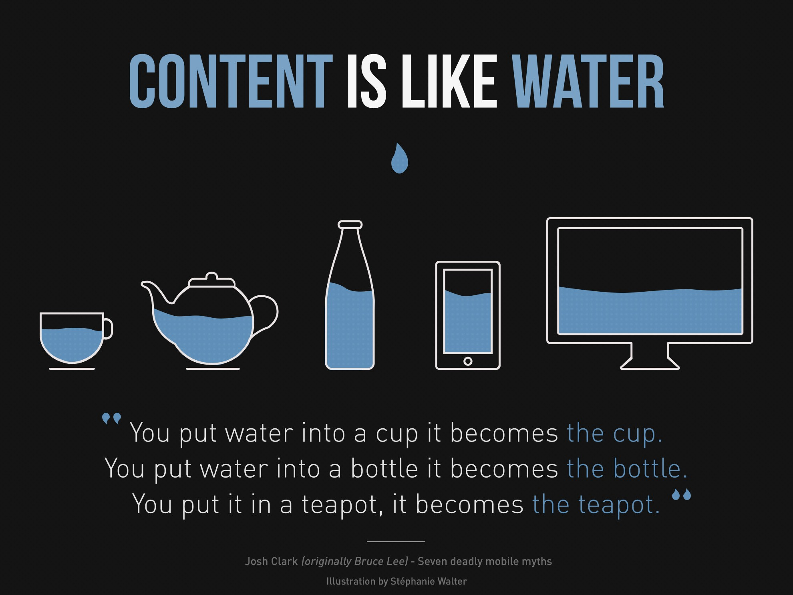

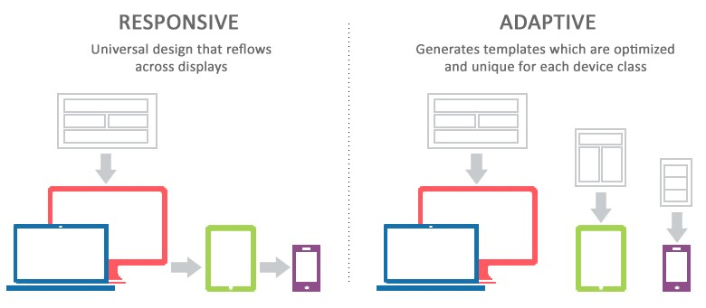

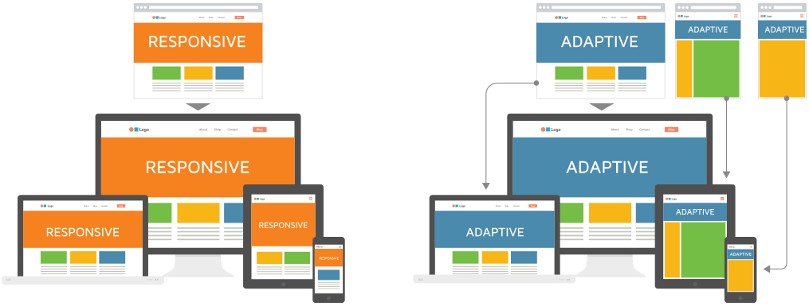

## Adaptive Web Design (AWD)

Adaptive Web Design is fixed, separating more than one web design implementation, like between desktop and mobile.

[Adaptive Example via @CodePen](https://codepen.io/team/css-tricks/pen/RWYoYB)

## Responsive Web Design (RWD)

Responsive Web Design is fluid, a way of making the page responsive to browser size, regarding the device type. So the design works automatically across desktop, mobile, and other screens that is even not defined yet.

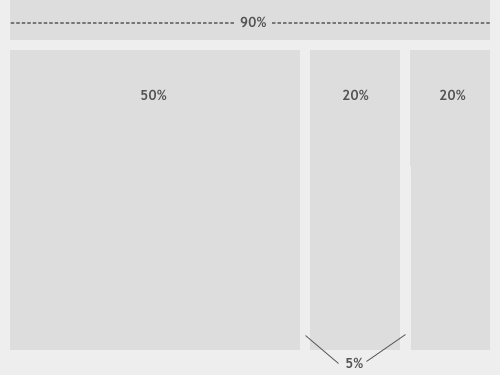

[Responsive web design, animated](https://media.giphy.com/media/b2CD0Qrq2ulwY/giphy.gif)

[Responsive Example via @CodePen](https://codepen.io/team/css-tricks/pen/meGOWx)

## Web Design Performance

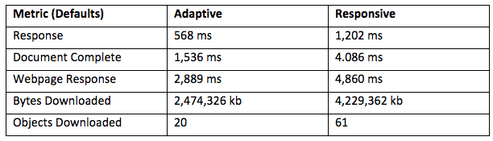

## Web Design Examples

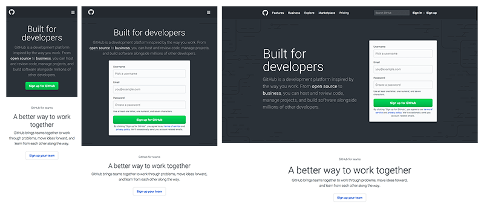

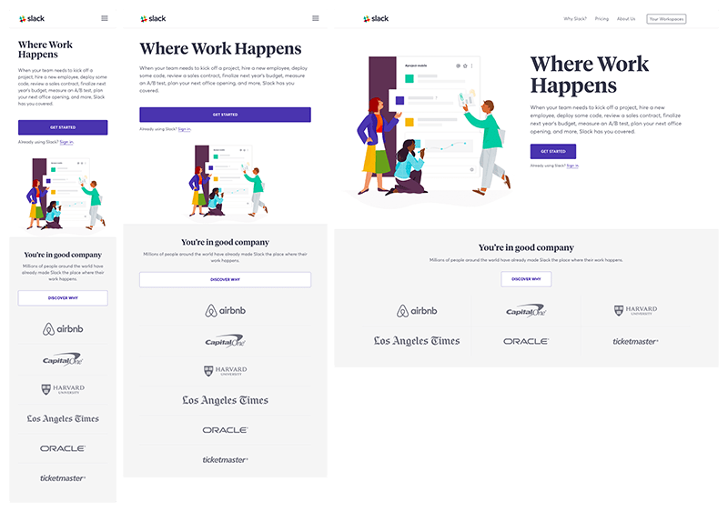

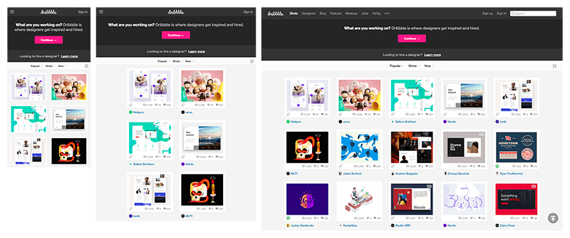

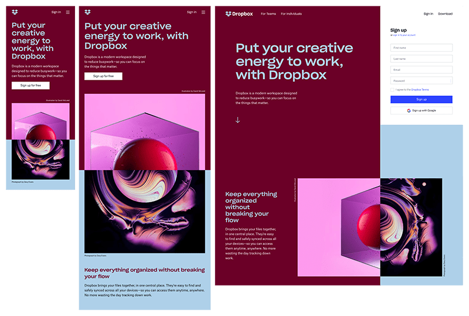

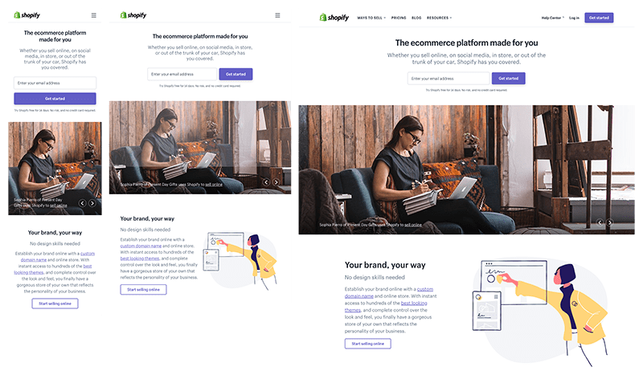

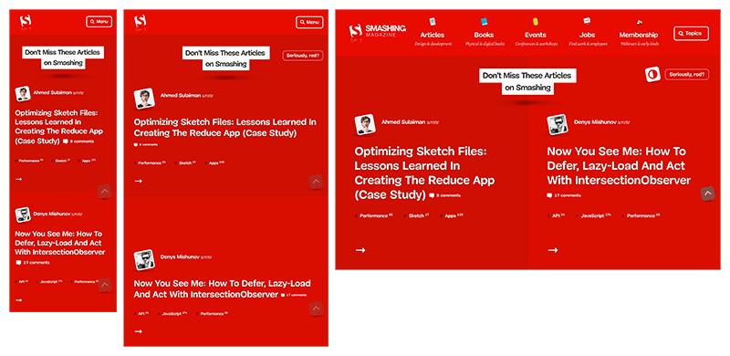

## Web Design References

- [The Difference Between Responsive and Adaptive Design | CSS-Tricks](https://css-tricks.com/the-difference-between-responsive-and-adaptive-design)
- [Responsive vs. Adaptive Design: What’s the Best Choice?](https://www.uxpin.com/studio/blog/responsive-vs-adaptive-design-whats-best-choice-designers)
- [11 Powerful Examples of Responsive Web Design](https://www.invisionapp.com/inside-design/examples-responsive-web-design)
- [Adaptive vs responsive web design – UX Planet](https://uxplanet.org/adaptive-vs-responsive-web-design-eead0c2c28a8)
- [What is Responsive Web Design? - Small Business Trends](https://smallbiztrends.com/2013/05/what-is-responsive-web-design.html)
- [What is AWD? 5 Great Adaptive Web Design Examples for Inspiration](https://medium.muz.li/what-is-awd-5-great-adaptive-web-design-examples-for-inspiration-3218e9f624ea)
- [Adaptive atau Responsive Web Design ? – Blibli.com Tech Blog – Medium](https://medium.com/bliblidotcom-techblog/adaptive-atau-responsive-web-design-f138bfebdd97)
- [Responsive Web Design | Knowledge Hub](https://responsivedesign.is)
- [This Is Responsive | Patterns and Resources for Responsive Web Design](http://bradfrost.github.io/this-is-responsive)
- [A Responsive Web Design Podcast — Responsive Web Design](https://responsivewebdesign.com/podcast)
- [A Book Apart, Responsive Web Design](https://abookapart.com/products/responsive-web-design)
