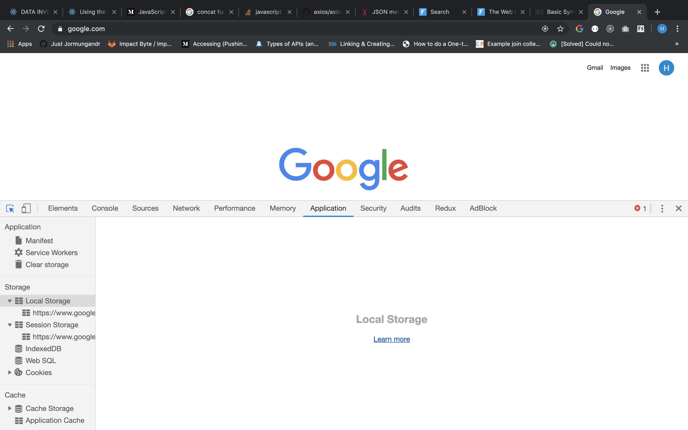
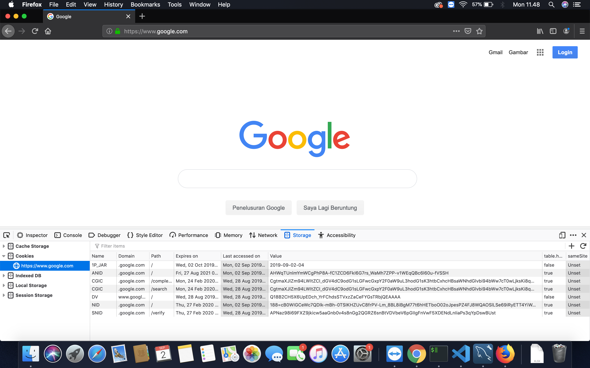

# The Web Storage API: local storage and session storage

The Web Storage API provides a way to store data in the browser. It defines two storage mechanisms which are very important: Session Storage and Local Storage, part of the set of storage options available on the Web Platform

The two mechanisms within Web Storage are as follows:

- sessionStorage: maintains a separate storage area for each given origin that's available for the duration of the page session (as long as the browser is open, including page reloads and restores)

  - Stores data only for a session, meaning that the data is stored until the browser (or tab) is closed.
  - Data is never transferred to the server.
  - Storage limit is larger than a cookie (at most 5MB).

- localStorage does the same thing, but persists even when the browser is closed and reopened.
  - Stores data with no expiration date, and gets cleared only through JavaScript, or clearing the Browser cache / Locally Stored Data.
  - Storage limit is the maximum amongst the three.

They are part of the set of storage options available on the Web Platform, which includes:

- [Cookies](https://flaviocopes.com/cookies/)
- [IndexedDB](https://flaviocopes.com/indexeddb/)
- [The cache API](https://flaviocopes.com/cache-api/)

> Both Session Storage and Local Storage provide a private area for your data. Any data you store cannot be accessed by other websites.

---

## Session Storage

Session Storage maintains the data stored into it for the duration of the page session. If multiple windows or tabs visit the same site, they will have two different Session Storage instances.

When a tab/window is closed, the Session Storage for that particular tab/window is cleared.

> Session storage is meant to allow the scenario of handling different processes happening on the same site independently, something not possible with cookies for example, which are shared in all sessions.

## Local Storage

Local Storage instead persists the data until it’s explicitly removed, either by you or by the user. It’s never cleaned up automatically, and it’s shared in all the sessions that access a site.

Both Local Storage and Session Storage are protocol specific: data stored when the page is accessed using http is not available when the page is served with https, and vice versa.

Web Storage is only accessible in the browser. It’s not sent to the server like cookies do.

---

## How to access the storage

### Basic concepts

Storage objects are simple key-value stores, similar to objects, but they stay intact through page loads. The keys and the values are always strings (note that, as with objects, integer keys will be automatically converted to strings). You can access these values like an object, or with the `Storage.getItem()` and `Storage.setItem()` methods. These three lines all set the colorSetting entry in the same way:

Their set of properties and methods is exactly the same, because they return the same object, a Storage object.

The Storage Object has a single property, length, which is the number of data items stored into it.

```js
localStorage.colorSetting = "#a4509b";
localStorage["colorSetting"] = "#a4509b";
localStorage.setItem("colorSetting", "#a4509b");
```

### Methods

`setItem(key, value)`

`setItem()` adds an item to the storage. Accepts a string as key, and a string as a value:

```js
localStorage.setItem("username", "impact byte");
localStorage.setItem("id", "1jhdjfbsb1231313");
```

If you pass any value that’s not a string, it will be converted to string:

```js
localStorage.setItem("test", 123); //stored as the '123' string
localStorage.setItem("test", { test: 1 }); //stored as "[object Object]"
```

`getItem(key)`
`getItem()` is the way to retrieve a string value from the storage, by using the key string that was used to store it:

```js
localStorage.getItem("username"); /// "impact byte"
localStorage.getItem("id"); ///"1jhdjfbsb1231313"
```

`removeItem(key)`

`removeItem()` removes the item identified by key from the storage, returning nothing (an undefined value):

```js
localStorage.removeItem("id");
```

`clear()`
`clear()` removes everything from the storage object you are manipulating:

```js
localStorage.clear()
sessionStorage.clear()
```

---

## Developer Tools

The DevTools of the major browsers all offer a nice interface to inspect and manipulate the data stored in the Local and Session Storage.

### CHROME



### Firefox



---

## Web Storage References

- [Flaviocopes](https://flaviocopes.com/web-storage-api/#introduction)
- [MDN](https://developer.mozilla.org/en-US/docs/Web/API/Web_Storage_API)